# Tutorials on Mermaid

>   基于 Mermaid 的[官方文档](https://mermaid-js.github.io/mermaid/#/)。
>
>   只挑了典型的。

## What is Mermaid?

*Mermaid 允许您使用文本和代码创建图表和可视化。*

*它是一个基于 JavaScript 的图表和图表工具，可以呈现受 Markdown 启发的文本定义，以动态创建和修改图表。*

简而言之就是在 Markdown 中插入图表的。

## いきますよ！

### Flowchart

```markdown
graph TD;
    A-->B;
    A-->C;
    B-->D;
    C-->D;
```


------

```markdown
graph LR;
	A --> B;
	A --> C;
	B --> D;
	C --> D;
```

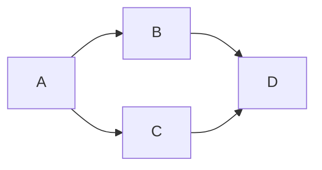

------

Flowchart 最常用，多来点 syntax。

#### Node

```markdown
flowchart LR
    id
```

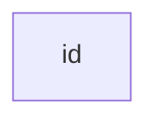

##### A node with text

```markdown
flowchart LR
    id[This is the text in the box]
```

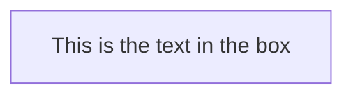

##### A node with round edges

```markdown
flowchart LR
    id1(This is the text in the box)
```

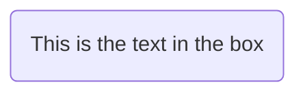

##### A stadium-shaped node

```markdown
flowchart LR
    id1([This is the text in the box])
```


##### A node in a subroutine shape

```markdown
flowchart LR
    id1[[This is the text in the box]]
```

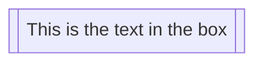

##### A node in a cylindrical shape

```markdown
flowchart LR
    id1[(Database)]
```

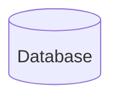

##### A node in the form of a circle

```markdown
flowchart LR
    id1((This is the text in the circle))
```

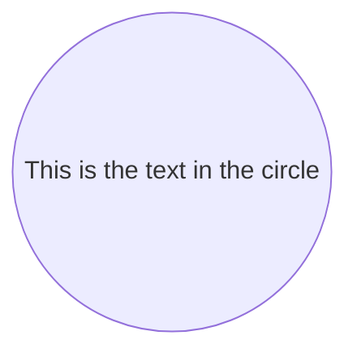

##### A hexagon node

```markdown
flowchart LR
    id1{{This is the text in the box}}
```


##### Special characters

```markdown
flowchart LR
    id1["This is the (text) in the box"]
```


```markdown
flowchart LR
    A["A double quote:#quot;"] -->B["A dec char:#9829;"]
```


#### Links

##### Arrow head

```markdown
flowchart LR
    A-->B
```


##### Open link

```markdown
flowchart LR
    A --- B
```

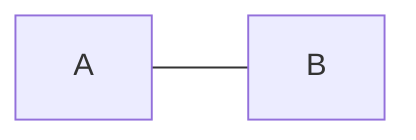

##### Text on links

```markdown
flowchart LR
    A-- This is the text! ---B
```
```markdown
flowchart LR
    A---|This is the text|B
```

Both okay.

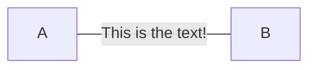

##### A link with arrow head and text

```markdown
flowchart LR
    A-->|text|B
```

```markdown
flowchart LR
    A-- text -->B
```

Both okay.

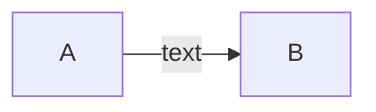

##### Dotted link

```markdown
flowchart LR;
   A-.->B;
```

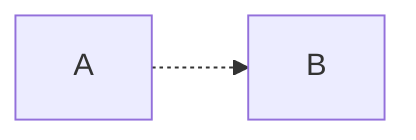

##### Dotted link with text

```markdown
flowchart LR
   A-. text .-> B
```

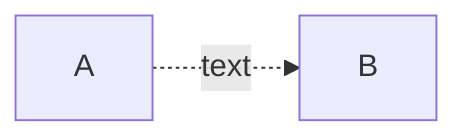

##### Chaining of links

```markdown
flowchart LR
   A -- text --> B -- text2 --> C
```

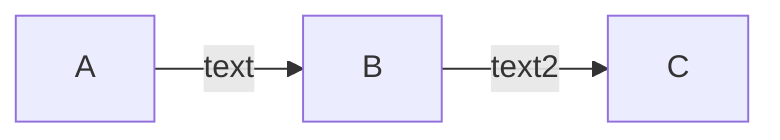

```markdown
flowchart LR
   a --> b & c--> d
```

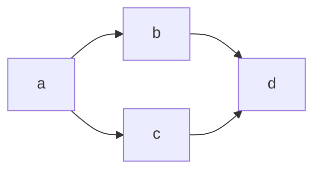

```markdown
flowchart TB
    A & B--> C & D
```

```mermaid
flowchart TB
    A & B--> C & D
```

我的评价是：语法糖差不多得了，老老实实拆开了写就行了。

>   If you describe the same diagram using the the basic syntax, it will take four lines. A word of warning, one could go overboard with this making the flowchart harder to read in markdown form. The Swedish word `lagom` comes to mind. It means, not too much and not too little. This goes for expressive syntaxes as well.

##### New types of arrow

```markdown
flowchart LR
    A --o B
    B --x C
```

```mermaid
flowchart LR
    A --o B
    B --x C
```

See also:

```markdown
flowchart LR
    A o--o B
    B <--> C
    C x--x D
```

```mermaid
flowchart LR
    A o--o B
    B <--> C
    C x--x D
```


#### Flowchart orientation

```markdown
flowchart BT
	A --> B;
```

```mermaid
flowchart BT
	A --> B;
```

等等。支持：

-   TB - top to bottom
-   TD - top-down/ same as top to bottom
-   BT - bottom to top
-   RL - right to left
-   LR - left to right

#### Subgraphs

Generally like:

```markdown
subgraph title
    graph definition
end
```

```markdown
flowchart TB
    c1-->a2
    subgraph one
    a1-->a2
    end
    subgraph two
    b1-->b2
    end
    subgraph three
    c1-->c2
    end
```

```mermaid
flowchart TB
    c1-->a2
    subgraph one
    a1-->a2
    end
    subgraph two
    b1-->b2
    end
    subgraph three
    c1-->c2
    end
```

```markdown
flowchart TB
    c1-->a2
    subgraph one
    a1-->a2
    end
    subgraph two
    b1-->b2
    end
    subgraph three
    c1-->c2
    end
    one --> two
    three --> two
    two --> c2
```

```mermaid
flowchart TB
    c1-->a2
    subgraph one
    a1-->a2
    end
    subgraph two
    b1-->b2
    end
    subgraph three
    c1-->c2
    end
    one --> two
    three --> two
    two --> c2
```

### Gantt diagram

```markdown
gantt
dateFormat  YYYY-MM-DD
title Adding GANTT diagram to mermaid
excludes weekdays 2014-01-10

section A section
Completed task            :done,    des1, 2014-01-06,2014-01-08
Active task               :active,  des2, 2014-01-09, 3d
Future task               :         des3, after des2, 5d
Future task2              :         des4, after des3, 5d
```

```mermaid
gantt
dateFormat  YYYY-MM-DD
title Adding GANTT diagram to mermaid
excludes weekdays 2014-01-10

section A section
Completed task            :done,    des1, 2014-01-06,2014-01-08
Active task               :active,  des2, 2014-01-09, 3d
Future task               :         des3, after des2, 5d
Future task2               :         des4, after des3, 5d
```

