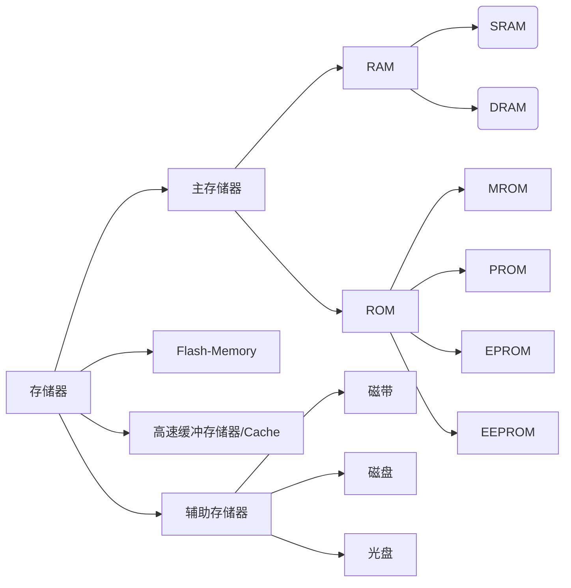

## 考试题型

### 计算题

- [ ] 原码反码和补码的转换
- [ ] 浮点数的表示和规格化及最大表示范围
- [ ] 原码、补码加减法
- [ ] 原码、补码的乘法
- [ ] 原码除法（不恢复余数法）
- [ ] 计算有效地址和相对寻址

### 简答题

- [ ] 怎样区分指令和数据（空间和时间两个层面）
- [ ] 讨论DMA，分析并比较DMA和程序中断方式，DMA能能否替代程序中断
- [ ] 寻址方式，各个寻址方式的示意图（解释寄存器间接寻址）
- [ ] 多重中断流程和屏蔽字
- [ ] 卡诺图和最简逻辑表达式
- [ ] 画图并说明微程序控制器中如何根据操作码形成相应微程序入口地址
- [ ] 举例说明扩展操作码技术
- [ ] 寻找中断服务程序入口地址的两种方法

### 分析题

- [ ] 组相联地址映射，主存地址格式、Cache地址格式，主存映射到哪一块
- [ ] 完成微操作及节拍安排
- [ ] 计算有效地址

### 设计题

- [ ] 设计映射结构

## 第一章: 计算机系统概论

Key point：

- [x] 冯诺依曼计算机的特点
- [x] 计算机的主要技术指标

### 冯·诺伊曼机（P8）

冯诺依曼计算机的特点：

1. 计算机由**运算器，存储器，控制器，输入设备和输出设备**五部分组成
2. 指令和数据以**同等地位**存放于存储器中，并可按地址寻访（区分方式见下面问题）
3. 指令和数据均由**二进制数**表示
4. 指令由**操作码**和**地址码**构成，操作码用来表示操作的性质，地址码用来表示操作数在存储器的位置
5. 指令在存储器内*按顺序存放*，通常是按顺序执行，特定条件下可根据运算结果或特定条件改变执行顺序（使用跳转类指令）
5. **机器以运算器为中心**。

> 计算机是如何区分存储器中的指令和数据的：
>
> 1. **时间层面**：在取指周期（或运行取指微程序）内，由 PC 提供访存地址，取来的即为指令；在执行周期（或运行执行周期相对应的微程序段）内，由指令的地址码部分提供访存地址，取来的即为操作数，也就是数据
> 2. **空间层面**：取来的机器指令应存放在**指令寄存器**，而取来的数据（或操作数）则应该存放在以累加器为代表的**通用寄存器**内。

### 计算机的工作步骤（P13）


现代计算机可以认为由三大部分组成：CPU 、I/O 设备及主存储器。其中，CPU 与主存储器合起来，称为主机，I/O 设备又可称为外部设备。

### 计算机的主要技术指标（P17）

- **机器字长**：CPU *一次能处理数据的位数*，通常与 CPU **寄存器位数**有关。
- **存储容量**：主存容量和辅存容量。
- **运算速度**：与许多因素有关，主频，操作类型，主存速度等。

## 第四章：存储器

Key point：

- [x] 存储系统的**层次结构**
- [x] **静态RAM和动态RAM**的不同点
- [ ] 动态RAM为什么要**刷新**？各种**刷新方式**的特点，说明各种**刷新方法的过程**
- [x] 半导体存储器的**扩展**（设计题：连线或补充连线，会分析地址译码过程）
- [x] **主存地址、Cache地址个字段**的划分，**Cache地址映射**，给你一个特定的主存地址映射成具体的Cache地址

> 存储器使用**带宽**衡量速度，带宽指单位时间内存储器存取的信息量。需要注意$1s = 10^3 ms = 10^3 \mu s = 10^3 ns$

### 字、字节

计算机进行数据处理时，**一次存取、加工和传送的数据长度称为字**。一个字通常由多个字节组成。字长又称作“机器字长”，顾名思义，就是字的长度，这里的长度用位来表示。

在信息处理中，一群字作为一个单元来处理的称为“字块”．也称“字组”。

Big endian（大端，高位字节地址作为字地址） 认为第一个字节是最高位字节（按照从低地址到高地址的顺序存放数据的高位字节到低位字节）；而 Little endian 则相反，它认为第一个字节是最低位字节（按照从低地址到高地址的顺序存放据的低位字节到高位字节）。

### 分类（P68）

按**存取方式**分类：

- 存取时间与物理地址顺序无关（**随机访问**）
  - 随机访问存储器（RAM，Random-Access-Memory），在程序的执行过程中可读可写
  - 只读存储器（ROM，Read/Random-Only-Memory），在程序的执行过程中只读。用于工业控制的固化程序。
- 存取时间与物理地址顺序有关（**串行访问**）
  - 顺序存取存储器：磁带
  - 直接存取（串行访问）存储器：磁盘

> 叠瓦盘的最顶和最底部的两个盘面是不用的，例如10个盘片只有18个有效盘面。

按照**作用**进行分类：



RAM中：静态RAM更快，集成度更高，成本更高（详见下面”DRAM与SRAM“）。

根据*原始数据的进入方式*，ROM被分成了几类：

- MROM（Mask - ROM）：生产过程里写入数据。
- PROM（Programmable - ROM）：使用烧录设备烧写进去，只能烧录一次（微程序控制器一般使用PROM保存微程序）。
- EPROM（Erasable Programmable - ROM）：使用紫外线擦除的可编程ROM，一般会有一个用于擦除的窗口，擦除的耗时比较长。
- EEPROM（Electrically Erasable Programmable - ROM）：电擦除的可编程ROM，一般能擦写十几万次。

Flash：使用半导体结构模拟磁盘结构，**逻辑上和磁盘一样**。

### 关于主存（P73）

#### DRAM与SRAM（P77）

- SRAM为**双稳态触发器原理**，读出后仍保持原状态，不需要再生，电源断电时丢失信息，做实验用的 MM214 就是静态存储器。功耗较大，集成度较低，速度快，每位价格高，适合于作 Cache 或存取速度要求较高的小容量主存。
- DRAM为靠**电容存储电荷**原理，不断电也会丢失，需要刷新，比静态集成度高，能耗低，各类计算机广泛使用。但是存取速度慢于静态的。功耗小，集成度高，每位价格低，适合于作大容量主存。

DRAM的行列地址按先后顺序传送，相比SRAM减少了引脚。

#### DRAM的刷新（P86）

需要刷新的原因有两点：

1. **主要原因**：由于*电容极板漏抗*的存在，存储于电容中的电荷存在泄漏的情况，这会导致动态 RAM 存储单元中的原存信息丢失。
2. 最常用的*单管动态 RAM* 的读出为**破坏性读出**。

因此需要按照一定周期进行刷新，通常这个时间为 $2ms$，称为**刷新周期或再生周期**。刷新是一行行进行的。刷新方式有三种：

1. **集中刷新**：规定的刷新周期内集中一段时间对所有存储单元逐行刷新，死时间连续易发生冲突。
2. **分散刷新**：*每行的刷新*分散到每个存取周期，但每个存储周期长了，拖慢了系统速度。
3. **异步刷新**：用*最大刷新间隔除以单元行数算出每个存储单元行的最大刷新时问问隔*，以这个间隔为刷新周期。降低了冲突的概率。

### 层次结构（P70）


三级存储体系：


> 图中所示的缓存是一个**片外缓存**，也就是CPU外部的缓存，位于主板上。通常来讲，我们所讨论的都是CPU内的缓存。

高速缓存用于解决主存和CPU之间IO能力的差异，显然，当CPU的访问命中率高的时候缓存可以有效拉高访问效率。

存储系统的层次**主要体现**在：

- Cache-主存：解决速度不匹配的问题，靠**硬件自动实现**。主要解决 CPU 和主存速度不匹配的问题，在存储系统中主要对 CPU 访存起加速作用。从 CPU 的角度看，该层次的速度接近于 Cache，而容量和每位价格却接近于主存。这就解决了**存储器的高速度和低成本之间的矛盾**。
- 主存-辅存：解决容量问题，硬件和操作系统共同实现。逐渐形成了**虚拟存储系统**，*将操作系统的寻址范围映射到主存和辅存上*。该层次解决了**大容量和低成本之间的矛盾**。

主存与 Cache 之间的数据调度是由硬件**自动完成**的，对程序员是*透明*的。而主存—辅存之间的数据调度，是**由硬件和操作系统**（采用虚拟存储技术）共同完成的。

### 存储器扩展（P91）


存储器扩展有三种方式：

- 位扩展：增加存储字长，如让 2 个 1K\*4 扩展为 1K\*8，本质上就是*让一个地址同时选中两片芯片，两片芯片分别存储这个数据的前后部分（高低位）*。
  > 太简单，没有考过
- 字扩展：增加存储器字的数量，如让 2 个 1K\*4 扩展为 2K\*4，本质上就是*把译码前的信号当作地址扩展，译码片选后的信号控制多个芯片的使能端，使一个“地址”只选中一个芯片*，因为这时的“地址”位数扩大了（多了片选译码的输入位），实现了存储字的扩展。
  > 字扩展一定需要译码器辅助转换地址。通常将**高位地址接到译码器输入，输出接到片选线上**。
- 字、位扩展：结合起来，一个扩展地址通过译码片选出一个输出位，让这一位同时接两个位扩展芯片的使能端，实现字位扩展结合。

#### 多体存储器(P103)

基本思想是在不提高存储器速率、不扩展数据通路位数的前提下，通过存储芯片的交叉组织，提高CPU单位时间内访问的数据量，从而缓解 快速的CPU与慢速的主存之间的速度差异。

> 一个**4体低位交叉**的存储器，假设存取周期为 T，CPU **每隔 1/4 存取周期启动一个**存储体，试问依次访问 64 个字需多少个存取周期？
>
> 需要的存储周期数：$T+(64-1)T/4=16.75T$，存取周期数取整，为 17 个。

### Cache（P109）

Cache的出现建立在程序访问的局部性上。一般Cache 采用高速的 **SRAM** 制作， 其价格比主存费，但因其容量远小于主存，因此能很好地解决速度和成本的矛盾。


> 以全相联映射技术为例，说明在带有 Cache 的存储系统中，“读”操作是怎样完成的：
>
> 当 CPU 发出主存地址后，地址映射机构按照全相联映射方式将主存地址标记与 Cache 所有字块的标记进行比较，以判断出所访主存字（主存地址的内容）是否已在 Cache 中。若命中，直接访问 Cache，将该字送至 CPU；若未命中，一方面要访问主存，将该字传送给 CPU，与此同时，要按照全相联映射方式转换的 Cache 地址将该字所在的主存块装入 Cache，如果此时 Cache 已装满，就要执行替换算法，腾出空位才能将新的主存块调入。


#### Cache的基本设计

Cache的操作对用户是零感知的，自动进行读写。

将 $n$ 位的低$b$位作为一个**字块**，所有操作都以字块为最小单位。因为主存地址空间大于Cache地址空间，所以Cache需要一部分空间作为“标记”区分具体是哪一块主存字块。

Cache主要需要三个部分：

- Cache存储体：大多采用多体结构提高性能。
- 地址映射变换机构：进行主存块号与Cache块号之间的转换。
- 替换机构

#### Cache的读写

Cache的读操作很简单，但写操作比较复杂，因为对 Cache 块内写人的信息，必须与被映射的主存块内的信息完全一致。当程序运行过程中需对菜个单元进行写操作时，会出现如何使 Cache 与主存内容保特一致的问题。日前主要采用以下几种方法。

- **写直达法**：写操作时既写入Cache也写入主存，会增加访存次数。
- **写回法**：先写入Cache，使用一个标志位表示数据是否“脏”，在替换该字块时根据情况写回主存。

#### Cache-主存地址映射

##### 直接映射


> 设主存容量为 1MB，采用直接映射方式的 Cache 容量为 16KB，块长为 4，每字 32 位。试问主存地址为 ABCDEH 的存储单元在 Cache 中的什么位置？
>
> 主存地址 ABCDEH，Cache 的地址为 14 位，其中字块内地址为 4 位，Cache 字块地址为 10 位。采用直接映射方式，只要将主存地址后 14 位地址与 Cache的 14 位地址相同就行了。因此：`ABCDEH = 1010 1011 1100 1101 1110B`，其中，后 14 位地址为 `11 1100 1101 1110`，用十六进制描述为 `3CDEH`，这就是指定的主存单元在 Cache 中的位置。

##### 全相联映射


##### 组相联映射

可以理解为通过编组将直接映射的Cache块减少；对于一组内的字块按照全相联方式进行动态的映射。


## 第五章：输入输出系统

Key point：

- [x] 主机和外设之间的信息传递的**控制方式，各自的特点**
- [x] I/O设备可以不看
- [x] **程序查询方式**的特点
- [x] **程序中断**的概念
- [x] I/O中断**处理过程**，CUP响**应中断的条件**，*中断服务程序的流程*，单重中断和多重中断的区别
- [x] DMA方式访存有**哪几种方法**，DMA的工作工程（几个阶段，分别做什么），DMA和程序中断有什么不同点（比较）具体一点，程序中断和 DMA二者的**响应过程**有何不同

### 组成（P156）

输入输出系统由I/O软件和I/O硬件两部分组成。

I/O软件的主要任务为：

1. 将用户编制的程序(或数据）輪人主机内。
2. 将运算结果输送给用户。
3. 实现输人输出系统与主机工作的协调等

I/O软件包括**I/O指令**和**通道指令**。

I/O指令是机器指令的一类，由操作码、命令码、设备码组成。其中，命令码体现I/O设备的具体操作，例如：

- 将数据从I/O设备输入主机。
- 将数据从主机输出至I/O设备。
- 状态测试，检查I/O设备处于Busy还是Ready状态。
- 形成某些操作命令。

通道指令是具有通道的I/O系统专门设置的指令。

在带有接口的I/O系统，其I/O硬件一般包括接口模块及I/O设备两大部分。

### I/O设备与主机的联系方式

#### I/O设备编址方式

根据是否在主存地址空间内编入I/O设备地址，可以区分为：

- 统一编址
- 不统一（单独）编址：对I/O设备的访问必须使用专门的I/O指令。

I/O采用统一编址，进行输入输出操作的指令是**访存指令**；I/O采用不统一编制，进行输入输出操作指令是**输入输出指令**。

#### 设备寻址

根据设备码即可得到设备号。

#### 传送方式

传送方式可以分为：

- 并行传送：对于n位地址的数据并行传送，需要使用n根数据线
- 串行传送：只需要一根数据线嗯和一根地线。

当I/O设备与主机距离很远时，采用串行传送较为合适。

#### 联络方式

**立即响应方式**：

对于十分缓慢的设备，当其与CPU联系时往往已经处于等待状态，因此只要指令一到就可以响应。

**异步工作采用应答信号联络**：

在工作速度不匹配的情况下按照异步方式工作。

对于串行信号，往往使用“Ready”和“Strobe”信号来进行应答工作。

并行信号则需要设定一组特殊标记，用“起始”和“终止”来建立联系。

**同步工作采用同步时标联络**：

同步工作场景下要求CPU和I/O设备速度完全同步，此时需要专门的同步时标控制。

#### 连接方式

包括辐射式和总线式。

### I/O设备与主机信息传送的控制方式（P161）

I/O 设备与主机交换信息时，共有 5 种控制方式：程序查询方式、程序中断
方式、DMA 方式、*I/O 通道方式和 I/O 处理机方式*。其中前 3 种方式是基本的且广泛应用的控制方式。


三种方式的工作特点：

|       项目       |    程序中断方式    |            DMA方式             |
| :--------------: | :----------------: | :----------------------------: |
|     数据传送     |      程序传送      |            硬件传送            |
|   CPU响应时间    | 一条指令结束时响应 | 指令周期内的任一存取周期结束时 |
|     处理异常     |        可以        |             不可以             |
| 是否中断现行程序 | 是（需要保护现场） |               否               |
|      优先级      |         低         |               高               |

> DMA方式主要用于大批数据的传送，例如读写磁盘、图像处理、高速数据采集系统，提高系统吞吐量。

#### 程序查询方式

CPU 通过程序不断查询 I/O 设备是否已做好准备，若设备未准备就绪，就继续查询，直到查得设备准备就绪，就将数据从 IO 接口送至 CPU。这种方式下 CPU 和 IO 设备处于串行工作状态，在反复的查询过程中 CPU 不能执行原程序，相当于原地踏步，工作效率不高。程序查询方式中，CPU与设备串行工作，传送与主程序串行工作。


#### 程序中断方式

CPU 启动 I/O 设备后，继续执行自身程序，只是当 I/O 设备准备就绪并向CPU 发出中断请求后才子以响应。这种方式解决了 CPU 原地踏步的问题。CPU与设备并行工作，传送与主程序串行工作。


#### 直接存储器存取（DMA）

主存与 IO 设备之问有一条数据通路，不需要调用中断服务程序就可以直接访问主存。当这种访问与 CPU 访问主存发生冲突时，CPU 总是将总线占有权让给DMA，通常这个时长是一个读取周期，此时称为窃取周期。

### I/O接口（P185）

总线方式的 I/O 接口包括：数据线＋设备选择线＋命令线＋状态线

接口的功能和组成：

1. 选址
2. 传送命令
3. 传送数据
4. 反映I/O设备工作状态

接口按照不同的标准可以分为不同的类型，包括：

- 数据传送方式：串行接口、并行接口
- 功能选择的灵活性：可编程接口、不可编程接口
- 通用性：通用接口、专用接口
- 数据传送控制方式：程序性接口、DMA接口

### 程序查询方式（P189）

程序查询方式的核心问题在于每时每刻不断查询 IO 设备是否准备就绪。


根据例题的计算，程序查询方式对于鼠标的响应还算可以，但频繁的查询完全无法应对磁盘IO。

### 程序中断方式（P192）

在I/O设备与主机交换信息时，由于设备本身机电特性的影响，其工作速度较低，与 CPU 无法匹配，因此，CPU 启动设备后，，往往需要等待一段时间才能实现主机与I/O设备之间的信息交换。如果在设备准备的同时，CPU 不作无谓的等待，而继续执行现行程序，只有当I/O设备备就绪向 CPU 提出请求后，再暂时中断 CPU 现行程序转I/O服务程序，这便产生了IO中断。

程序中断的响应条件可以归纳为三条：

1. 有中断请求
2. CPU允许中断，即`EINT = 1`
3. 一条**指令结束**

#### 程序中断的接口电路


为了实现I/O中断，其接口电路中需要配置相关的硬件：

1. 中断请求触发器（INTR）和中断屏蔽触发器（MASK）
   
2. 排队器：当多个中断源同时向 CPU 提出请求时，CPU 只能按中断源的不同性质对其排队，给予不同等级的优先权，并按优先等级的高低子以啊应。就I/O中断而言，速度越高的I/O设备，优先级越高。
   
3. 中断向量地址形成部件（设备编码器）
   
   > **向量地址**和**中断服务程序的入口地址**是两个不同的概念

> CPU 总是在统一的时间，即每条指令执行阶段的最后时刻，查询所有的设备是否有中断请求

#### 程序中断的处理过程

大致可以划分为如下阶段：

1. 中断请求
2. **中断判优**
3. 中断响应
4. 中断服务
5. 中断返回

#### 中断服务程序


大致可以划为如下几个阶段：

1. 保护现场：由**中断隐指令**保护程序的断点；中断服务程序保护通用寄存器和状态寄存器的内容。
2. 中断服务（设备服务）
3. 恢复现场
4. 中断返回

根据能否在中断中处理新的中断可以划分为多重中断（中断嵌套）和单重终端，二者处理关中断的时机有区别。

### DMA方式（P200）

DMA方式下主存与I/O设备之问有一条数据通路不需要调用中断服务程序就可以直接访问主存。


由于DMA接口和CPU共享主存，这有可能导致访问的冲突，为此有三种解决方法：

- 停止CPU访问主存：适合数据传输率很高的I/O设备，但还是会浪费很多时间在准备数据上。
  > 因此DMA可以设置一个小存储器，先将数据写入小存储器，再和主存交换数据，提高单次传输的数据吞吐。
- 周期挪用（周期窃取）：在这种方法中，每当I/O设备发出 DMA 请求时，I/O设备便挪用或窃取总线占用权一个或几个主存周期，而 DMA 不请求时，CPU 仍继续访问主存。
  > 应该指出，I/O设备每挪用一个主存周期都要申请总线控制权、建立总线控制权和归还总线控制权。因此，*尽管传送一个字对主存而言只占用一个主存周期，但对 DMA 接口而言，实质上要占2-5个主存周期(由逻辑线路的延迟特性而定)*。因此周期挪用的方法比较适合于I/O设备的读/写周期大于主存周期的情况。
- DMA与CPU交替访问


> DMA 方式能取代程序中断方式吗？请说明理由。
>
> 不能。因为：
>
> 1. DMA 只能用于高速外设与主存之间的简单数据传输，却不能像中断方式那样处理**复杂的随机事件**
> 2. 在DMA方式的数据传送过程中，本身需要*利用中断方式来完成DMA传送的后处理*。

#### DMA接口

DMA 接口的功能：

- 向 CPU 申请DMA传送
- 处理总线控制权的转交
- 在DMA期间管理系统总线
- 确定传送的起始地址和数据长度
- 数据传送完成后发出 DMA 完成信号


DMA接口中也有一系列硬件提供支持，例如：

- 主存地址寄存器（Addr Reg， AR）：在开始传送数据前由CPU写入，每交换一次+1指向下一块主存。
- 字计数器（Word Counter，WC）：记录总字数，通常以交换字数的**补码值**预置，每传送一个字+1，直到全部传送完毕到高位溢出。
- 数据缓冲寄存器（BR）
- DMA控制逻辑
- 中断机构
- 设备地址寄存器（DAR）

#### DMA的工作过程


DMA的**工作划分**为三个阶段：

1. 预处理：向DMA传输主存起始地址、设备地址、**传送数据个数**并启动设备。
2. 数据传送：分批传送数据，结束后向CPU申请中断。
3. 后处理：**中断服务程序**做DMA结束处理。中断处理程序判断传送的正误，对写入主存的数据进行校验，完成善后工作。

> 以硬盘读写为例，说明在主机和外设之间进行数据传送，**为什么**需要采用DMA方式？
>
> 一些高速外设，如硬盘、光盘等I/O设备，经常需要和主存进行**大批量的数据交换**；若采用程序查询方式或程序中断方式来完成，即通过CPU执行程序来完成数据交换，数据交换都是以字或字节为单位，速度较慢，极可能造成数据的丢失，因而不能满足批量数据的高速传递需求。因此，需要借助于硬件，比如DMA控制器来实现主存和高速外设之间的直接数据传送。

## 第六章：计算机的运算方法

Key point：

- [x] **进位计数制之间的转换**（包括整数部分和小数部分）
- [x] 定点数：**原、反、补码**之间的转换
- [ ] 浮点数：给你一个给定格式的浮点数代码，能否写出其真值
- [ ] 二进制**补码的加减运算及溢出判断**
- [ ] 给定**原码一位乘法和定点补码一位乘法**的计算过程（步骤）
- [ ] **浮点数的加减运算**
- [ ] ALU的功能和组成

### 原码、补码和反码

设$x$为真值，$x^*$为绝对值，说明$[-x^*]_补 = [-x]_补$能否成立？

> 当$x$为真值，$x^*$为绝对值时，$[-x^*]_补 = [-x]_补$不能成立。$[-x^*]_补 = [-x]_补$的结论只在$x>0$时成立。当$x<0$时，由于$[-x^*]_补$是一个负值，而$[-x]_补$是一个正值，因此此时$[-x^*]_补$不等于$[-x]_补$。

讨论若$[x]_补>[y]_补$，是否有$x>y$？

> 若$[x]_补 > [y]_补$，不一定有$x > y$。 $[x]_补 > [y]_补$时 $x > y$的结论只在 $x > 0、y > 0$，及 $x<0、y<0$时成立。当$x>0、 y<0$时，有$x>y$，但由于负数补码的符号位为1，则$[x]_补<[y]_补$。同样，当$x<0、 y >0$时，有$x < y$，但$[x]_补>[y]_补$。

**注意**：

- 绝对值小的负数其值反而大，且负数的绝对值越小，其补码值越大。因此， 当$x<0、y<0$时，若$[x]_补>[y]_补$，必有$x < y$。
- 补码的符号位和数值位为一体，**不可分开分析**。
- 完整的答案应分四种情况分析，但也可通过充分分析一种不成立的情况获得正确答案。
- 由于**补码0的符号位为0**，因此x、y=0可归纳到>0的一类情况讨论。

什么是机器零？若要求全0表示机器零，浮点数的阶码和尾数应采取什么机器数形式？

> 机器零指机器数所表示的零的形式，它与真值零的区别是：机器零在数轴上表示为“0”点及其附近的一段区域，即在计算机中小到机器数的精度达不到的数均视为“机器零”，而真零对应数轴上的一点（0点）。若要求用“全0”表示浮点机器零，则浮点数的阶码应用移码、尾数用补码表示（此时阶码为最小阶、尾数为零，而移码的最小码值正好为“0”，补码的零的形式也为“0”，拼起来正好为一串0的形式）。

#### 规格化数

规格化数的定义为：

$$
r = 2, \frac{1}{2} \leq |S| \leq 1
$$

基数不同，规格化形式不同（指原码或真值）：

- $基数r = 2$，尾数最高位为1；尾数左移一位，阶码-1
  > 对于补码，要求的是符号位和第一数位不同
- $基数r = 4$，尾数最高两位不全为0；尾数左移两位，阶码-1
- $基数r = 8$，尾数最高三位不全为0；尾数左移三位，阶码-1

基数 $r$ 越大，所能表示的浮点数范围越大，但精度越低。

详细比较参照该表：

|  S>0  | 规格化形式 |  S<0  | 规格化形式  |
| :---: | :--------: | :---: | :---------: |
| 真值  | `0.1xxxxx` | 真值  | `-0.1xxxxx` |
| 原码  | `0.1xxxxx` | 原码  | `1.1xxxxx`  |
| 补码  | `0.1xxxxx` | 补码  | `1.0xxxxx`  |
| 反码  | `0.1xxxxx` | 反码  | `1.0xxxxx`  |

有两个**特例**：

- $S = - \frac{1}{2} = -0.1000...0$时，$[S]_原 = 1.100...0，[S]_补 = 1.100...0$，不符合要求，所以$[-\frac{1}{2}]_补$不是规格化数
- $S = -1$，$[S]_补 = 1.000...0$符号条件，所以$[-1]_补$是规格化数

### 移位运算

逻辑移位和算术移位的区别：

- 逻辑移位是对逻辑数或无符号数进行的移位，其特点是不论左移还是右移，空出位均补0，移位时不考虑符号位。
- 算术移位是对带符号数进行的移位操作，其关键规则是移位时符号位保持不变，空出位的补入值与数的正负、移位方向、采用的码制等有关。补码或反码右移时具有符号延伸特性。左移时可能产生溢出错误，右移时可能丢失精度。

### 定点加减法

连同符号位一起相加，符号位产生的进位自然丢掉。

小数加法示例：

```dart
var A = "0.1011", B = "-0.0101"
// 求A+B的补码
var A_ = "0.1011", B_ = "1.1011"

  0.1011
+ 1.1011
//------
 10.0110
// A+B的补码为0.0110
// A+B就为0.0110
```

整数加法示例：

```dart
var A = -9, B = -5
A = "1,1001", B = "1,0101"
A_ = "1,0111", B = "1,1011"

  1,0111
+ 1,1011
//------
 11,0010
// 所以A+B的补码为1,0010
// A+B= 1,1110 = -14
```

#### 溢出判断

由于数的表示能力有限，有时会出现符号位溢出的情况，有两种判断溢出的方式：

- 一位符号位判溢出：参加操作的两个数（减法时即为被减数和“求补”以后的减数）符号相同，其结果的符号与原操作数的符号不同，即为溢出。
  > 最高有效位的进位和符号位的进位进行异或，若为1，则为溢出
- 两位符号位判溢出：结果的双符号位相同表示未溢出，不同为溢出。最高符号位表示真正的符号。

#### 硬件框图


### 定点乘法

乘法运算可用**加和移位**实现，若位数$n = 4$，就是加 4 次，移 4 次。

由乘数的末位决定被乘数是否与原部分积相加，然后右移 1 位形成新的部分积，同时乘数右移1　位（末位移丢），空出高位存放部分积的低位。**被乘数只与部分积的高位相加**。

用**移位的次数(n次)**判断乘法是否结束。

#### 原码一位乘法

乘积的符号位单独处理，数值部分为绝对值相乘。移位为逻辑移位。

已知$x = -0.1110, y = 0.1101$，求$[x\cdot y]_原$：

|  部分积 | 乘数  |            说明             |
| ------: | :---- | :-------------------------: |
|  0.0000 | !1101 |       部分积一开始为0       |
| +0.1110 |       |  乘数最后一位为1，加被乘数  |
|  0.1110 |       |                             |
|  0.0111 | 0!110 |          右移一位           |
| +0.0000 |       | 乘数最后一位为0，不加被乘数 |
|  0.0111 | 0!    |                             |
|  0.0011 | 10!11 |          右移一位           |
| +0.1110 |       |           $+x^*$            |
|  1.0001 | 10!   |                             |
|  0.1000 | 110!1 |          右移一位           |
| +0.1110 |       |           $+x^*$            |
|  1.0110 | 110!  |                             |
|  0.1011 | 0110! |       右移一位，结束        |


#### 补码乘(Booth算法)

Booth算法不是唯一的补码乘法算法。


Booth算法的计算步骤主要依靠判断$y_i和y_{i+1}$的关系，可以总结为下表：

| ${y_i}{y_{i+1}}$ | ${y_{i+1} - {y_i}}$ |                操作 |
| :--------------: | :-----------------: | ------------------: |
|       `00`       |         `0`         |            右移一位 |
|       `01`       |         `1`         |  $+[x]_补$,右移一位 |
|       `10`       |        `-1`         | $+[-x]_补$,右移一位 |
|       `11`       |         `0`         |            右移一位 |

已知$x = +0.0011, y = -0.1011$，求$[x+y]_补$：

先计算补码，得到$[x]_补 = 0.0011, [-x]_补 = 1.1101, [y]_补 = 1.0101$。

|   部分积 | 乘数         |              操作              |
| -------: | :----------- | :----------------------------: |
|  00.0000 | 1.010**10**  |     最后一个0是补充上去的      |
| +11.1101 |              | 乘数最后两位为`10` ,$+[-x]_补$ |
|  11.1101 |              |                                |
|  11.1110 | 1!1.01**01** |        右移一位（1/4）         |
| +00.0011 |              | 乘数最后两位为`01` ,$+[x]_补$  |
|  00.0001 | 1!           |                                |
|  00.0000 | 11!1.0**10** |        右移一位（2/4）         |
| +11.1101 |              | 乘数最后两位为`10` ,$+[-x]_补$ |
|  11.1101 | 11!          |                                |
|  11.1110 | 111!1.**01** |        右移一位（3/4）         |
| +00.0011 |              | 乘数最后两位为`01` ,$+[x]_补$  |
|  00.0001 | 111!         |                                |
|  00.0000 | 1111!**1.0** |        右移一位（4/4）         |
| +11.1101 |              | 乘数最后两位为`10` ,$+[-x]_补$ |
|  11.1101 | 1111!        |              结束              |


### 定点除法

#### 不恢复余数法（加减交替法）

余数为正（够减），上商”1“，$+[-y^*]_补$；余数为负，上商“0”，$+[y^*]_补$。

已知$x = -0.1011, y = -0.1101$，求$[\frac{x}{y}]_原$:

先计算需要的补码：$[x^*]_补 = 1.0101, [y^*]_补 = 0.1101, [-y^*]_补 = 1.0011$。

|    余数 |     商 |          操作          |
| ------: | -----: | :--------------------: |
|  0.1011 | 0.0000 |                        |
| +1.0011 |        | 余数为正，$+[-y^*]_补$ |
|  1.1110 |      0 |     余数为负，上0      |
|  1.1100 |      0 |        左移一位        |
| +0.1101 |        | 余数为负，$+[y^*]_补$  |
|  0.1001 |     01 |     余数为正，上1      |
|  1.0010 |     01 |        左移一位        |
| +1.0011 |        | 余数为正，$+[-y^*]_补$ |
|  0.0101 |    011 |     余数为正，上1      |
|  0.1010 |    011 |        左移一位        |
| +1.0011 |        | 余数为正，$+[-y^*]_补$ |
|  1.1101 |   0110 |     余数为负，上0      |
|  1.1010 |   0110 |        左移一位        |
| +0.1101 |        | 余数为负，$+[y^*]_补$  |
|  0.0111 |  01101 |     余数为正，上1      |

#### 补码除法

根据余数和$[y]_补$的符号位判断上商和计算新余数：

| $[R_i]_补和[y]_补$ |  商   |       新余数        |
| :----------------: | :---: | :-----------------: |
|        同号        |   1   | $2[R_i]_补+[-y]_补$ |
|        异号        |   0   | $2[R_i]_补+[y]_补$  |

已知$x = -0.1011, y=0.1101$，求$[\frac{x}{y}]_补$:

计算出$[x]_补 = 1.0101， [y]_补 = 0.1101, [-y]_补 = 1.0011$

|    余数 |     商 |     操作     |
| ------: | -----: | :----------: |
|  1.0101 | 0.0000 |              |
| +0.1101 |        | 异号，做加法 |
|  0.0010 |      1 |   同号上1    |
|  0.0100 |      1 |   左移一位   |
| +1.0011 |        | 同号，做减法 |
|  1.0111 |     10 |  异号，上0   |
|  0.1110 |     10 |   左移一位   |
| +0.1101 |        | 异号，做加法 |
|  1.1011 |    100 |  异号，上0   |
|  1.0110 |    100 |   左移一位   |
| +0.1101 |        | 异号，做加法 |
|  0.0011 |   1001 |   同号上1    |
|  0.0110 |  10011 |  末位恒置1   |

### 浮点加减法

浮点加减法分两步：

- 对阶（小阶向大阶看齐）
- 尾数求和

## 第七章：指令系统

Key point：

- [x] 指令的基本格式
- [x] **操作码的扩展**
- [x] 寻址方式的含义及有效地址的计算（基址寻址和变址寻址的异同点）

### 指令的基本格式（P300）

**指令**是计算机执行某种操作的命令，也就是常说的机器指令。一台机器中所有机器指令的集合，称这台计算机的指令系统。指令由操作码和地址码构成，其中操作码的长度可以是固定的也可以是变化的。通常使用**扩展操作码**技术，使操作码的长度随地址数的减少而增加。

> 例如以 $4$ 为一段的地址码，每少一个地址就会多出 $2^4$ 个空的状态，这些状态就可以保存新的指令；但是，需要注意在扩展操作码方式下，例如 $2^4=16$ 个状态只能使用其中的 $15$ 个，另一个状态需要用来留作标识是否启用低位的扩展操作码。

地址码的变化可以用如下表格来归纳：

|            |    第一地址    |    第二地址    | 第三地址 |   第四地址   |                     特点                      |
| :--------: | :------------: | :------------: | :------: | :----------: | :-------------------------------------------: |
| 四地址指令 | 第一操作数地址 | 第二操作数地址 | 结果地址 | 下个指令地址 |                共需要四次访存                 |
| 三地址指令 | 第一操作数地址 | 第二操作数地址 | 结果地址 |      --      |          使用PC指向下一个指令的地址           |
| 二地址指令 | 第一操作数地址 | 第二操作数地址 |    --    |      --      | 使用CPU内寄存器保存中间结果，减少一次访存操作 |
| 一地址指令 |       --       | 第二操作数地址 |    --    |      --      |       其中一个操作数地址隐含在寄存器内        |
| 零地址指令 |       --       |       --       |    --    |      --      |      空操作等指令，或者隐藏在堆栈指针中       |

通过**使用硬件资源（PC、ACC寄存器）可以减少访存次数，扩大寻址空间**。

> 设指令字长为 16 位，采用扩展操作码技术，每个操作数的地址为 6 位。如果定义了 13 条二地址指令，试问还可安排多少条一地址指令？
>
> 

另一个题：

> 某机指令字长 16 位，每个操作数的地址码为 6 位，设操作码长度固定，指令分为零地址、一地址和二地址三种格式。若零地址指令有 M 种，一地址指令有 N 种，则二地址指令最多有几种？若操作码位数可变，则二地址指令最多允许有几种？
>
> 操作码定长：二地址指令条数=16-M-N
> 操作码变长（采用操作码扩展技术）：
> 设二地址指令有 $X$ 种，则有如下的等式：$((16 - X) *(26 - N))* 26 = M$则 $X=16 -（M/212+ N/26 ）$，其中 M/212+ N/26 取上整数。

#### 指令字长

在早期计算机中，指令字长、存储字长和机器字长往往是相等的；现在一台机器的指令系统可以采用位数不同的指令，即**指令系统是可以变长**的。

### 操作数和操作（P304）

### 访存次数

### 数据寻址（P310）

> 指令寻址比较简单，分为顺序寻址和跳跃寻址，其中跳跃寻址通过转移类指令实现。

指令字中有专门的一段用来标识寻址方式，通常指令字中的地址也并不是真实地址，被称为形式地址（用$A$表示），通过寻址方式确定的地址为有效地址（用$EA$表示）。

|    寻址方式    |               寻址特点               |    地址关系     |
| :------------: | :----------------------------------: | :-------------: |
| 立即（数）寻址 |    A就是操作数本身，使用补码格式     |       --        |
|    直接寻址    |               A就是EA                |     $EA=A$      |
|    隐含寻址    | 操作数地址隐藏在操作码或某个寄存器里 |       --        |
|    间接寻址    |   形式地址为保存有效地址的字的地址   |   $EA = (A)$    |
|   寄存器寻址   |                                      |    $EA =R_i$    |
| 寄存器间接寻址 |                                      |  $EA = (R_i)$   |
|    基址寻址    |                                      | $EA = A + (BR)$ |
|    变址寻址    |                                      | $EA = A + (IX)$ |
|    相对寻址    |                                      | $EA = (PC) + A$ |
|    堆栈寻址    |                                      |                 |

#### 立即（数）寻址

形式地址本身就是操作数，使用补码表示。

#### 直接寻址

形式地址本身就是有效地址。


#### 隐含寻址

隐含寻址是指指令字中不明显地给出操作数的地址，其操作数的地址隐含在操作码或某个寄存器中。例如，一地址格式的加法指令只给出一个操作数的地址，另一个操作数隱含在累加器 ACC 中，这样累加器 ACC 成了另一个数的地址。


#### 间接寻址

指令字中的形式地址不直接指出操作数的地址，而足指出探作数有效地址所在的存储单元地址，也就是说，有效地址是由形式地址间接提供的


对于一个指令字长为16位的指令，一次间接寻址的寻址范围为$2^16 = 64K$
字，也就是说间接取了一个完整的16位作为地址；多次间址的寻址范围为$2^15 = 32K$字，因为其中一个被用来表示是否为最后一次间址。

#### 寄存器寻址

在奇存器寻址的指令宇中，地址码字段直接指出了奇存器的编号。其操作数在由R，所指的寄存器内。由于操作数不在主存中，故寄存器寻址在指令执行阶段无需访存，减少了执行时间。


#### 寄存器间接寻址

因有效地址不足存放在仔储单元中，而是存放在寄存器中，故称其为寄存器间接寻址，它比间接寻址少访存一次。


#### 基址寻址

基址寻址需设有基址寄存器 BR。其操作数的有效地址 EA 等于指令字中的形式地址与基址寄存器中的内容(称为基地址）相加。


基址奇存器可采用隐式的和显式的两种。

- 隐式：在计算机内专门设有一个基址寄存器BR，使用时用户不必明显指出该基址奇存器，只需由指令的寻址特征位反映出基址寻址即可。
- 显式：在一组通用寄存器里，由用户明确指出哪个寄存器用做基址寄存器，存放基地址。

基址寻址可以**扩大操作数的导址范国**，因基址寄存器的位数可以大于形式地址 A 的位数。

> 当主存容量较大时，若采用直接寻址，因受A的位数限制，无法对主存所有单元进行访问，但采用基址寻址便可实现对主存空间的更大范国寻访。例如，将主存空间分为若干段，每段首地址存于基址奇存器中，段内的位移量由指令字中形式地址 A指出，这样操作数的有效地址就等于基址奇存器内容与段内位移量之和，只要对基址寄存器的内容作修改，便可访问主存的任一单元。

基址寻址在多道程序中极为有用。用户可不必考虑自己的程序存于主存的哪一空间区域。完全可由操作系统或管理程序根据主存的使用状况，赋予基址寄存器内一个初始值(即基地址），便可**将用户程序的逻辑地址转化为主存的物理地址(实际地址）**，把用户程序安置于主存的某一空间区域。

> 例如，对于一个具有多个寄存器的机器来说，用户只黹指出哪一个寄存器作为基址寄存器即可，至于这个基址寄存器应斌子何值，完全由操作系统或管理程序根据主存空间状况来确定。在程序认行过程中，用户不知道自己的程序在主存的哪个空间，用户也不可終改基址寄存器的内容，以确保系统安全可岸地运行。

#### 变址寻址

变址寻址与基址寻址的有效地址形成过程极为相似。由于两者的应用场合不同，因此从本质来认识，它们还是有较大的区别。

- 基址寻址主要用于**为程序或数据分配存储空间**，故基址寄存器的内容通常由操作系统或管理程序确定，在程序的执行过程中*其值是不可变的，而指令字中的A是可变的*。
- 在变址寻址中，**变址奇存器的内容是由用户设定的**，在程序执行过程中*其值可变，而指令字中的A 是不可变的*。

变址寻址主要用于处理**数组问题**，在数组处理过程中，可设定A为数组的首地址，不断改变变址寄存器1的内容，便可很容易形成数组中任一数据的地址，特别适合编制循环程序。

比较基址寻址和变址寻址：

- 相同点：二者都可有效地扩大指令寻址范围。
- 不同点：
  1. 二者的使用方式不同。变址寻址方式：指令提供基准量不变， R提供修改量可变；适于处理一维数组。基址寻址方式：基址指令提供位移量(不变)， R 提供基准量(可变)；适用于扩大有限字长指令的访存空间。
  2. 二者的应用目的不同。*变址寻址方式面向用户*，用于对成批数据的连续的便捷访问；基址寻址方式面向系统，用来解决程序在实际主存中重定位问题（为程序分配存储空间）及扩大访存空间。

#### 相对寻址

相对寻址的有效地址是将程序计数器PC 的内容（即当前指令的地址）与指令字中的形式地址 A 相加而成。


相对寻址常被用于转移类指令，转移后的目标地址与当前指令有一段距离，称为相**对位移量**，它由指令字的形式地址 A 给出，故A 又称位移量。位移量A可正可负，通常用补码表示。

#### 堆栈寻址

可被视为一种隐含寻址。

### 指令设计（P323）

## 第八章：CPU的结构和功能

Key point：

- [ ] CPU的**功能和组成**
- [ ] **指令周期**的概念
- [ ] 中断周期内CPU要完成哪几项操作
- [ ] 借助中断屏蔽技术改变中断处理的优先级，绘制CPU运行轨迹图

### CPU的结构（P337）

CPU包括控制器和运算器。

控制器的基本功能：

- 取指令
- （间址）
- 分析指令
- 执行指令


CPU的结构包括：

- ALU
- 寄存器
- 中断系统
- CU：提供完成全部指令操作的微操作命令序列部件。
- 系统、内部总线

#### CPU的寄存器

寄存器可以大致分为几类：

- 用户可见寄存器：通用寄存器、数据寄存器、地址寄存器、条件码寄存器
- 控制和状态寄存器：MAR、MDR、PC和IR

其中四个寄存器非常重要，分别用于：

- MAR：存储器地址寄存器，用于存放将被访问的存储单元的内存地址
- MDR：存储器数据寄存器，用于存储将要存入或者读出的数据
- PC：程序计数器
- IR：指令寄存器

### 指令周期

CPU**取出并执行完一个指令的全部时间**被称为一个指令周期。指令周期的长度取决于指令，并不是固定的，并且指令周期的子周期也不固定，可以包括取指周期、间址周期、执行周期、中断周期。为了区分这四个周期，CPU内设置了相应的标志触发器。

> 指令周期的长度固定吗？
>
> 不固定。由于计算机中各种指令执行所需的时间差异很大，因此为了提高 CPU运行效率，即使在同步控制的机器中，不同指令的指令周期长度都是不一致的，也就是说指令周期对于不同的指令来说不是一个固定值。
> 指令周期长度不一致的根本原因在于设计人员，为了提高CPU运行效率而这样安排的，指令功能不同，需完成的微操作复杂程度亦不同，因此，不同指令的指令周期也不同。

|  子周期  |   访存目的   | 标志触发器 |        触发条件        |     功能     |
| :------: | :----------: | :--------: | :--------------------: | :----------: |
| 取值周期 |    取指令    |     FE     |          总是          |   取出指令   |
| 间址周期 | 获取有效地址 |    IND     |  当使用间接方式寻址时  | 取出有效地址 |
| 执行周期 |   取操作数   |     EX     |      绝大多数指令      | 执行指令内容 |
| 中断周期 | 保存程序断点 |    INT     | 有中断请求且处于开中断 |   处理中断   |

> 在中断周期中，CPU应完成关中断、保存断点和转中断服务程序入口三个操作

#### 数据流


### 中断系统（P359）

#### 中断的基本问题

引起中断的各种因素：

- 人为设置的中断（自愿中断）
- 程序性事故
- 硬件故障
- I/O设备
- 外部事件

能引起中断的各个因素都被称为中断源，中断源包括：

- 不可屏蔽中断：比如电源掉电
- 可屏蔽中断：使用屏蔽机构屏蔽

在完整设置的中断系统下，需要满足**中断请求&没有屏蔽&允许中断**的条件才能响应中断。

中断周期的操作由**中断隐指令**（也就是硬件自动完成）完成，包括三箱操作：

1. 关中断
2. 保存程序断点（PC的内容）
3. 寻找中断服务程序的入口地址值

计算机为了管理中断，在硬件上通常有哪些设置：

- 中断请求触发器（INTR）：对中断源发来的中断请求信号进行登记
- 中断优先级排队器：对同时提出的多个中断请求信号进行裁决，选择一个最紧迫的进行响应
- 向量编码器：向量中断时产生向量地址
- 中断允许触发器（EINT）：CPU的中断总开关
- 中断标记触发器（INT）：用来建立中断周期状态（出现在指令周期附近，四个指令周期有各自的标记触发器）
  > 当INT=1时，进入中断周期，执行中断隐指令的操作
- 中断屏蔽触发器（MASK）：对可屏蔽的中断源进行开、关中断操作。

采用程序中断技术时，指令系统中往往需要有相关指令支持，例如开中断、关中断和中断返回。

#### 单重中断和多重中断

单重中断和多重中断主要区别在“开中断”的时间，单重中断在中断服务程序的最后中断返回时才开中断，多重中断在进入中断服务程序完成保护现场后就开中断。

#### 中断请求和中断判优

为了判断中断源，需要为每个中断源设置中断请求（标记）触发器，INTR。若干个INTR组合到一起，设置在CPU内可以构成一个中断请求标记寄存器。INTR也可以不设置在CPU内，而是各个中断源内，例如I/O设备的中断就是在各个接口电路内的。

任何中断系统都需要保证在一个时刻只响应一个中断源的请求，这就需要对中断请求进行判优，可以通过硬件排队和软件排队实现。

硬件排队也分为两种，分贝时链式排队器和CPU内的排队器。

#### 形成中断服务程序入口地址

入口地址的寻找也可以分别通过硬件向量法和软件查询法实现，绝大多数情况下使用硬件向量法实现。

硬件向量法的实现有包括两种，分别是：

- 在向量地址内存内存放一条无条件转移指令
- 设置向量地址表，存放在存储器内。

#### 中断响应

通常来讲，CPU固定在指令周期的最后处理中断请求。但是在一些情况下，一个指令周期可能很长，导致一些中断请求会被错过，这时可以在指令执行过程中添加一系列“查询断点”。

CPU进入中断周期时，需要进行保护程序断点、寻找中断服务程序的入口地址和关中断的操作，这是由一条中断隐指令实现的。中断隐指令是计算机指令系统中没有的指令，他是CPU在中断周期内有硬件自动完成的一条指令。

#### 中断屏蔽

中断屏蔽技术适用于解决多重中断的场景。

要实现多重中断，需要确保两个条件：

- 提前设置“开中断”指令
- 优先级别高的中断源有权中断优先级别低的中断源
  > 为了保证这一点，引入了屏蔽技术

为了实现屏蔽，设备需要配备抓们的**屏蔽触发器MASK**。将若干屏蔽触发器组合在一起构成的也就是一个屏蔽寄存器，其中保存的内容被称为屏蔽字。通过在中断服务恒旭中设置适当的屏蔽字，能够对优先级别不同的中断源起到屏蔽作用。


严格来讲，优先级包括响应优先级和处理优先级。其中响应优先级是由排队器上的物理连接顺序决定的，屏蔽字可以改变的是处理优先级。


因此，在中断服务程序的相应位置还需要进行“**置屏蔽字**”和“**恢复屏蔽字**”的操作。


## 第九章：控制单元的功能

Key point：

- [ ] **周期、机器周期和时钟周期（节拍）**三者之间的关系
- [ ] 给定数据通路结构，给定指令（具有特定的寻址方式），写出来**操作流程图**，结合时序信号）
- [ ] 了解一下控制方式

三种周期：

- CPU 每取出并执行一条指令所需的全部时间叫**指令周期**
- **机器周期**是在同步控制的机器中，所有指令执行过程中（执行一步相对完整的操作）的一个基准时间，通常以访问一次存储器所需的时间（访存周期）作为一个机器周期
- **时钟周期**是指计算机主工作时钟的周期时间，它是计算机运行时最基本的时序单位，通常时钟周期等于计算机主频的倒数。

> 指令周期常常用若干个机器周期数来表示，机器周期也叫 CPU 周期；而一个机器周期又包含若干个时钟周期。

### 多级时序系统

机器周期是所有指令执行过程中的一个基准时间，机器周期取决于指令的功能及组件的速度。通常，以访问一次存储器的时间定为基准时间比较合适。

在**一个周期里又可以完成若干个微操作**，每个微操作也需要一定的时间。通过时钟发生器，可以产生时钟信号，通过节拍发生器就可以产生**节拍**，一个节拍的宽度就是一个时钟周期。在一个节拍内可以完成**一个**或**几个同时执行**的操作。节拍是计算机操作的最小时间单位。


总的来讲，一个指令完成的指令周期内包含若干个机器周期，每个机器周期包含若干时钟周期（节拍）。


### 各种周期（375）

取值周期：

1. (PC) -> MAR
2. M(R), M(MAR) -> MDR
3. MDR -> IR
4. (PC) +1 -> PC

间址周期：

1. IR(AD) -> MAR
2. M(R), M(MAR) -> MDR
3. MDR -> IR(AD)

> 此处指令寄存器的数据地址字段比 MDR 的长度要小，这样写会有错误，此处是为了突出间址

#### 执行周期

### 控制单元（CU）

控制单元具有发出各种微操作命令（即控制信号）序列的功能。


## 第十章：控制单元的设计

Key point:

- [ ] **组合逻辑**控制器和**微程序**控制器的比较，各自的优缺点
- [ ] 说明**微程序控制器的基本原理和工作过程**
- [ ] 微程序控制器**后继微地址**的形成，尤其是如何根据操作码形成相应微程序入口地址

### 组合逻辑电路和微程序控制器

试比较组合逻辑控制器和微程序控制器的特点：

- **产生方法及器件**：组合逻辑控制器由**组合逻辑电路**提供微命令，其核心器件是由各种门电路构成的复杂树形网络；微程序控制器由存储逻辑(微指令)提供微命令，其核心器件是**控制存储器**。
- **规整性**：组合逻辑控制器设计不规整，微程序控制器设计规整
- **可扩展性**：组合逻辑控制器不易修改和扩充，后者则易于修改和扩充
- **速度**：组合逻辑控制器执行指令快，微程序控制器执行指令速度慢

说明组合逻辑控制器和微程序控制器在组成和原理上的异同：

- 相同：
  1. **基本功能**相同，提供计算机各个部件**协同运行所需的控制信号**。
  2. **基本组成**也相同，PC、IR及几个步骤完成一条指令的具体功能。
- 不同：
  1. 处理指令执行步骤方法不同。组合逻辑控制器是利用**节拍发生器的节拍信号**区分指令执行步骤；微程序控制器通过**微指令地址的衔接**区分指令执行步骤
  2. 提供控制信号的方案不同。组合逻辑控制器采用**组合逻辑电路直接产生控制信号**；微程序控制器是通过微地址译码期找到控存单元，取出的微指令经过解码才是控制信号。

### 微程序设计（P403）

使用组合电路涉及的 CU 会十分复杂，因此我们将CPU内的各个**控制信号组合成一条条微指令**，每个**微指令包括若干微操作命令**，这些微操作命令通过改变CPU的状态来实现一个指令。

微程序控制器的**基本工作原理**：将控制器所需要的微操作命令，以微代码的形式编成微指令，存在专门的控制存储器中，CPU执行机器指令时，从控制存储器中取出微指令，对微指令中的操作控制字段进行解释，即产生执行机器指令所需的微操作命令序列。其具体的工作过程如下：

0. 将用户程序的首地址送到PC，然后进入取值阶段。
1. **取机器指令**：从控制存储器中读取“取指微指令”，用产生的微命令控制CPU访存，读取机器指令，并送入指令寄存器IR。
2. **形成微程序入口地址**：根据机器指令的操作码，通过微地址形成电路，产生与该机器指令对应的微程序入口地址，并送入CMAR。
3. 逐条取出机器指令对应的微程序并执行。
4. 返回取指微指令，开始又一条机器指令的执行。如此不断重复，直到整个程序执行完为止。

微程序的实现核心是一个**只读的高速存储器**，并针对每一个指令编写对应的**微程序**，微程序保存到存储器上，包含了**若干条微操作命令**。

> 说明微程序控制器的基本工作原理：
>
> 将控制器所需要的微操作命令，以**微代码**的形式编成微指令，存在专门的控制存储器中。CPU执行机器指令时，从控制存储器中取出微指令，对微指令中的操作控制字段进行解释，即产生执行机器指令所需的微操作命令序列


#### 微程序控制单元


- **控制存储器**（控存）是核心部件，用来存放全部的微程序
- CMAR是控存地址寄存器
- CMDR是控存数据寄存器
- 顺序逻辑用来控制微指令序列，生成下一条微指令

一条微指令包含两个字段，分别是操作控制字段和顺序控制字段（指出下条微指令的地址）

### 微指令的编码（控制）方式

1. **直接编码方式**
2. **字段直接编码（显示编码）**方式：将所有控制字段分成若干段，例如需要并发8个命令时分为8段。
   
3. **字段间接编码（隐式编码）**方式：一个字段的一些微命令需要另一个字段来解释。
   
4. **混合编码**
5. 其他

### 微指令序列地址的形成

多种形成方式，前两种为主：

1. 直接由微指令的下地址字段指出（**断定方式**）
2. 根据机器指令的**操作码**形成。机器指令写入指令寄存器时，由操作码经** **形成，可以使用 PROM 实现。
3. 增量计数器。类似PC的实现。
4. 分支转移
5. 通过测试网络形成
6. 由硬件产生微程序入口地址。例如机器冷启动和中断。

一个CU内也可以通过**多路选择器**配合外部的状态来实现多种方式的选择。


### 微指令的格式

微指令格式与微指令的编码方式有关，通常分为水平型微指令和垂直型微指令。

1. 水平型微指令比垂直型微指令**并行操作能力强、效率高、灵活性强**。
2. 水平型微指令执行一条机器指令所需的微指令数目少，因此速度比垂直型微指令的**速度快**。
3. 水平型微指令用较短的微程序结构换取较长的微指令结构，垂直型微指令正相反，它以较长的微程序结构换取较短的徽指令结构。
4. 水平型微指令与机器指令差别较大，垂直型徽指令与机器指令相似。

微命令在微指令中的位置也会有区别：

- 微命令部分放在微指令的后半部分 ：可以充分利用存储空间。
- 微命令部分放在微指令的前半部分：不能可以充分利用存储空间，造成空间浪费
