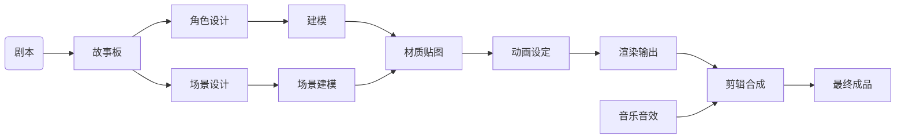
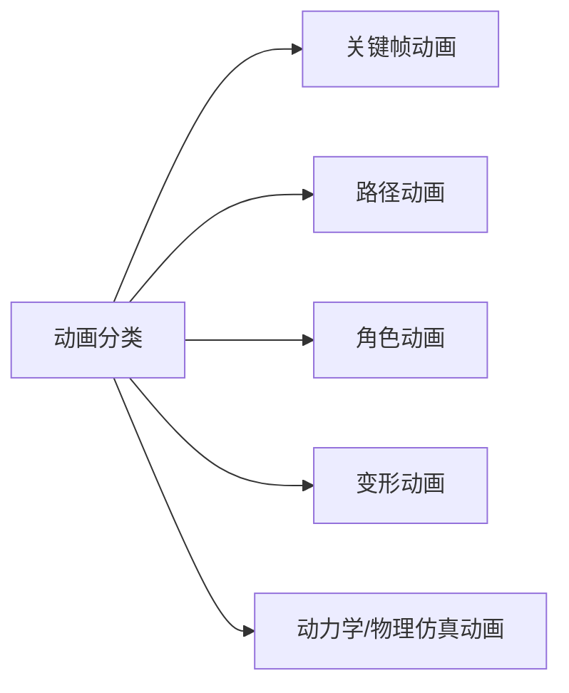
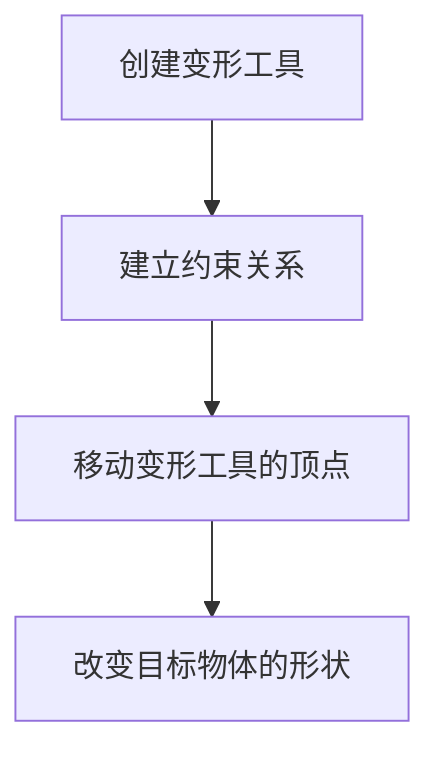
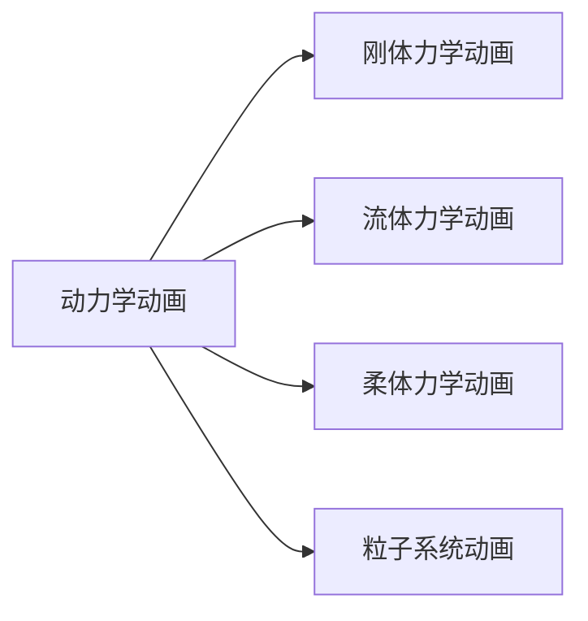

# Notes on Computer Animation Technology

> 「不能逃避……不能逃避……」
>
> 「不能逃避。」
>
> 「不能逃避！」
>
> 「真嗣，不可以逃避！」

## Course Info

- 考试 60%
- Project 30%
- 作业 / 考勤 10%

文档中标了 QA 的都是来自幻灯片的问题，答案仅供参考。

## Chapter 1 绪论

<details>
<summary>大约不会考的东西</summary>
<p>课程主要内容：</p>
<ul>
<li><strong>动画定义与分类</strong></li>
<li>常用动画制作软件</li>
<li>发展历史与趋势</li>
<li>研究内容</li>
<li>应用领域</li>
</ul>
<p>媒体类型：</p>
<ul>
<li>文本</li>
<li>图形</li>
<li>图像</li>
<li>声音</li>
<li>视频</li>
</ul>
<p>图形图像：</p>
<ul>
<li>自然景物</li>
<li>照片和图片</li>
<li>美术绘画雕塑品</li>
<li>用数学方法描述的图形</li>
<li>工程图设计图</li>
</ul>
<p>广义的说，凡是能够在人的视觉系统中形成视觉印象的<strong>客观对象</strong>都称为<strong>图形</strong>。</p>
<p>特别地，<strong>图形</strong>指是指由<strong>点</strong>、<strong>线</strong>、<strong>面</strong>、<strong>体</strong>等<em>几何要素</em>和<strong>明暗</strong>、<strong>灰度（亮度）</strong>、<strong>色彩</strong>等<em>非几何要素</em>构成的，从现实世界中抽象出来的带有灰度、色彩及形状的图或形。</p>
<p>艺术形式：诗歌、雕塑、戏剧、音乐、舞蹈、绘画、建筑、电影、电视、<strong>动画</strong>。</p>
<p>关于动画：</p>
<ul>
<li><strong>对动画的早期认识</strong> 动画是会“活动”的画</li>
<li><strong>世界著名动画艺术家John Halas</strong> “动画的本质是运动”</li>
<li><strong>一个类似的说法</strong> “动画是运动中的艺术”</li>
</ul>
<p>随着20世纪电视、计算机以及数字科技成果带给动画制作以及传播途径的革命性变革，动画的定义也更广泛：</p>
<ul>
<li>它利用<strong>视觉暂留原理</strong>，运用美术等艺术表现手段，将无生命的画面形象或客观物体进行逐格制作、逐格处理、逐格拍摄、连续放映，或运用计算机直接生成虚拟的活动影像；</li>
<li>并通过电影放映机、电视、网络、图形显示器等进行传播，从而赋予其以活动的生命形态，或运动自如的动态艺术视觉效果。</li>
</ul>
<p>动画片是动画的一种，也是电影的一种。影片按制作方式一般分成三种：</p>
<ol>
<li><strong>电影</strong> 主要通过对人或动物等真实物体或场景进行拍摄而得到的影片</li>
<li><strong>木偶片</strong> 主要采用实物模型拍摄而得到的影片</li>
<li><strong>动画片</strong> 主要通过绘制画面而得到的影片</li>
</ol>
<p>又将木偶片与动画片统称为“卡通片”。</p>
<p>按照动画制作技术分类动画片，有：</p>
<ul>
<li><strong>传统手绘动画</strong> 完全通过手工绘制每一幅图像，然后在赛璐珞片上描绘上色，并拍摄成影片</li>
<li><strong>定格动画</strong> 用木偶、泥塑、金属、剪纸等制作微型模型，将模型摆放成各种姿势并拍摄成影片</li>
<li><strong>计算机辅助动画</strong> 或者说<strong>计算机二维动画</strong>，指手工绘制图像的线稿，然后输入计算机上色，通过计算机图像处理技术合成影片</li>
<li><strong>三维动画</strong> 在计算机中创建虚拟模型，并由计算机控制模型的运动，最后使用计算机图形渲染技术获得最终的影像</li>
<li><strong>四维动画</strong> 借助立体眼镜等特殊设备产生身临其境感觉</li>
</ul>
<p>其中，传统2D手绘动画有多种风格，如外国的迪斯尼、中国的水墨、剪纸动画等，其造型、绘制和动态各有其自己的艺术风格。其制作流程如下：</p>
<p></p>
<p><strong>前期策划</strong></p>
<p>从形成创意、组织摄制组到正式绘制之前的所有工作均属于前期策划阶段。在这一阶段，由制作负责人召集电视台、制作厂家、发行公司和剧本作者作充分的沟通。</p>
<ul>
<li>了解投资方期望和观众动向</li>
<li>共同讨论并编写故事大纲</li>
<li>考证故事的时代背景和内容</li>
<li>确定影片风格</li>
<li>设计有特色、有个性，能够与市场结合的角色造型</li>
<li>确定作品的方针和放映时间，并评估制作费用等</li>
</ul>
<p>聊聊分镜头设计。分镜头本，也称为分镜头台本，是将剧本以可供拍摄的镜头来表达的一种方法。一般由导演及助手对剧本进行二次创作，按影视表现手法把剧本分成连续的镜头，每个镜头依次标号，写出内容和处理手法。</p>
<p>分镜头本：</p>
<ul>
<li>可能仅由文字描述，称为文字分镜头本</li>
<li>但更为常见的是，配以每个镜头草图的分镜头本，称为画面分镜头本</li>
<li>有的动画公司要求更高，将画面分镜头制作成彩色稿，称为<strong>故事板</strong>（多用于欧美商业动画片）</li>
</ul>
<hr />
<p>聊聊角色造型设计。如果作品是改编自漫画，则人物造型已由原作者设计好，造型设计只要在原造型的基础上进行省略和修饰即可；如果作品是原创的，则需根据剧本描述的角色性格、特征进行角色的造型设计，造型设计不但要符合动画片的动作要求，而且要符合动画片整体美术风格，有强烈的个性特点，能给观众留下深刻印象。</p>
<p>造型设计的任务包括：</p>
<ul>
<li>角色的标准造型、转面图（通常都有正面、侧面、背景）</li>
<li>结构图</li>
<li>比例图（角色与角色、角色与景物、角色与道具间的比例）、</li>
<li>服饰道具分解图</li>
<li>形体特征说明图（角色所特有的表情和习惯动作）</li>
<li>口型图</li>
</ul>
<p>角色造型设计关系到影片制作过程中保持角色形象的<strong>一致性</strong>，对于角色性格塑造的准确性，动作描绘的合理性都具有指导性作用。一部分画片的人物造型一经确定，角色在任何场合下的活动与表演都要保持其特征与形象的统一。</p>
<p>动画中的每个角色都以几个角度画在一张纸上，叫做标准页，供其他动画师参考。</p>
<hr />
<p>聊聊动作风格设计。根据角色视觉设计、剧本提供的人物性格设计角色的主要动作姿态（包括口型）或习惯性动作，以便建立起统一的人物个性动态感觉以及影片的动作风格。此时需要考虑到整体美术风格的限制。对于重要的场面，还需要单独进行设计，例如大调度镜头以及武打等场面。 </p>
<hr />
<p>聊聊美术风格设计。美术风格主要指整体视觉效果及其给观众造成的心理感受，美术风格设计主要包括综合运用色彩、明暗、透视、线条等手段。在日本动画的制作当中，通常专门设有作画监督一职，就是为了负责协调影片的整体美术风格。</p>
<hr />
<p>聊聊场景和道具设计。场景设计是根据剧本内容和导演构思创作的动画片场景设计稿（线稿）。包括影片中各个主场景色彩气氛图、平面坐标图、立体鸟瞰图及景物结构分解图。</p>
<p>它是提供给导演镜头调度、运动主体调度、视点、视距、视角的选择以及画面构图、景物透视关系、光影变化、空间想象的依据，同时也是镜头设计稿和背景绘制的直接参考，起到保证叙事合理性和情境动作准确性的作用。 </p>
<hr />
<p>聊聊声音和音效设计。声音和音效设计指根据影片要求确定主题音乐的风格（欢快、舒缓或者其他）、根据情节需要拟定背景音乐的风格（例如20世纪30年代的故事需要该年代的歌曲或音乐）、音效统筹、角色声音形象（根据人物特点考虑每个角色的说话方式和音色）、重要分场情节的声音形象处理的设计及构思等等。</p>
<p><strong>中期创作</strong></p>
<p>中期创作的主要工作是根据前期的设想完成素材的创作。素材主要有三类：</p>
<ol>
<li>角色动画</li>
<li>背景</li>
<li>声音素材</li>
</ol>
<p>为了指导这些素材的制作，并作统筹安排，需要先完成镜头设计稿，并确定分场美术气氛。</p>
<hr />
<p>聊聊镜头设计稿。镜头设计稿是分镜头的台本的进一步细化和具体化。镜头设计稿在后续的动画制作过程中要为原画、背景绘制、音乐音效甚至后期制作提供依据，其重要性不容忽视。镜头设计稿包括画框的定位、镜头的运动要求、背景的具体设计图、角色的动作要求、角色与背景的透视和比例关系等。 </p>
<hr />
<p>聊聊分场美术气氛。美术师为每一个环境绘制的美术气氛设计图，该图为背景设计、原画光影处理、拍摄合成工作提供参考。</p>
<hr />
<p>聊聊角色原画。原画（keys）是指示角色动作的关键画面，通过原画就应能让观众理解角色的动作。 中间画（Inbetweens）是插补在原画之间的画，作用是丰富动作的细节、让动作更流畅。</p>
<p>原画和中间画的划分并非必需，只是为了便于动画制作的分工合作。在动画制作过程中，首先由原画人员按照导演的意图、根据镜头设计稿的要求，设计每个镜头的关键动作，给动画人员画出运动的要点、标出中间加几张动画，同时填写拍摄表（Exposure Sheet，也称律表）。其余的工作就由助手（包括修形和动画人员）按照指示完成，这样工作室的工作人员就可以各司其职，协同工作。</p>
<p>按照原画指示，绘制中间画，完成角色动画中间画对动作的表现有影响，张数比较少时，动作会转换得比较快；张数多，就会显得平稳、柔顺。进行动检，即检查原画和中间画的完成质量。</p>
<hr />
<p>聊聊描上。描上是描线和上色的合称。传统二维动画需要用透明的赛璐珞片（即胶片的塑料底）来拍摄，这就需要将绘制在白纸上的铅笔画稿转描到赛璐珞片上并上色。</p>
<p>描线：描线时，将每一幅铅笔画稿用同样规格的透明片套在定位尺上，然后根据画稿在透明片上描绘线条。手工描线是一件非常细致而且技术要求很高的工作，所描的线条要求清晰、准确、均匀。</p>
<p>上色：上色，就是在描好线条的透明片背面，用不透明的特殊水溶性颜料，一块一块地涂上颜色。手工上色也是一项繁杂的技术工作，要求也是只能涂在线条范围之内，不能出线、漏缝，颜色还必须涂得厚薄均匀。</p>
<hr />
<p>聊聊背景绘制。背景人员按照场景设计稿，根据美术设计提供的分场美术气氛图，逐个镜头绘制出角色活动的背景画面。背景绘制接近绘画，需要工作人员有良好的水彩和水粉功底。</p>
<hr />
<p>聊聊音乐、音效和角色配音。因为动画无法做同期配音，所以要么前期配音，要么后期配音。美式动画的角色配音通常为前期配音，前期配音须以对位法准确地将动作配合声音演出。日式多为后期配音，配乐即片中的音乐部分，也有事前事后之别，音效则通常都是后期配。无论是采用何种配音，这一阶段需要根据镜头设计稿制作好所有的声音素材。 </p>
<p><strong>后期制作</strong></p>
<p>素材都创作好以后，就进入后期制作阶段。后期制作的主要工作是将各种素材合成为一部合格的影片，并作必要的包装。</p>
<hr />
<p>聊聊拍摄和剪辑。动画片的拍摄和一般电影不同，其特点是逐格拍摄。摄影师按照拍摄表（律表）的指示，一格一格将印在赛璐珞片上的图形拍摄下来。为了保障拍摄的准确性，设置了特殊的动画拍摄台，台面上装有定位尺（安放动画画面）和移动轨道（安放背景画面）。机架四周放置照明灯具。摄影机被固定在机架上，拍摄时可以上下移动。另外动画拍摄台可进行多层拍摄和吊台拍摄，还有透光拍摄及各种各样的特技拍摄。</p>
<p>经过拍摄并且冲洗好的胶片，只有画面没有声音，而且有些画面的顺序还需调整，有些画面可能被删去，所以将此时的胶片称为“毛片”。对“毛片”画面的调整称为剪辑，剪辑人员先要会同导演按照分镜头本的次序进行全片的剪接工作，经过初剪，去掉多余的画格，把分散的胶片按符号顺序连接起来。然后再根据导演的要求反复精剪，力求使画面连接顺畅，节奏鲜明，达到最理想的效果。动画剪辑与一般电影的剪辑也有很大不同，因为动画的拍摄非常耗时耗力，所以剪辑方案一般在前期分镜头本设计时就已经具体化，像电影中那样拍摄大量镜头，然后后期大规模剪辑改动是不可能的。剪辑好的影片称为“A拷贝毛片”，此时还只有画面，没有声音，也没有字幕。</p>
<hr />
<p>聊聊声音混录。所有创作好的声音素材，包括配音、音乐和音效首先被灌制到一条录音带上，完成声音合成。初步合成好的录音带经过反复试听，微调使之达到理想的效果，之后就可以转换成光学声带（声片）。声片、字幕片和A拷贝毛片一同翻制到一条正片上，这个过程称为“套片”，套片完成就得到了“<strong>B拷贝毛片</strong>”或称“正式拷贝”。<strong>至此整个动画制作流程就顺利完成了</strong>。</p>
<hr />
<p>计算机辅助制作二维动画，可以参与：角色动作原画、角色中间画 / 动画、背景绘制、描上、音乐音效和角色配音，以及数字合成、非线性编辑。</p>
<p>辅助三维动画创作，则参与：角色建模、角色装配、角色动画；场景道具建模、场景设置；灯光、材质渲染，以及音乐音效和角色配音，数字合成和非线性编辑。</p>
<hr />
<p>按绘制效果分，动画可分为真实感和非真实感。</p>
<p>真实感3D动画，在造型、绘制（渲染）以及动态上都是真实的。非真实感3D动画，在造型、绘制（渲染）和动态上有不同组合，如：夸张造型，真实渲染，夸张动态。</p>
<hr />
<p>按应用分，动画可分为：</p>
<ul>
<li>影视动画片</li>
<li>影视特技动画</li>
<li>广告</li>
<li>游戏动画</li>
<li>数据可视化、仿真等</li>
</ul>
<hr />
<p>元宇宙（ Metaverse ）可以笼统的理解为一个平行于现实世界的虚拟世界，现实中人们可以做到的事，都可以在元宇宙中实现。</p>
<p>元宇宙（ Metaverse ）需要各项技术的支撑，可以将元宇宙产业链分为七个各层次。</p>
<ol>
<li><strong>体验层</strong>是我们实际参与的社交、游戏、现场音乐等非物质化的体验。</li>
<li><strong>发现层</strong>是人们了解到体验层的途径，包括各种应用商店等。</li>
<li><strong>创作者经济层</strong>帮助创作者制作并将成果货币化，包括设计工具、货币化技术等。</li>
<li><strong>空间计算层</strong>，3D化层，包括3D引擎、VR/AR/XR等。</li>
<li><strong>去中心化层</strong>，包括边缘计算、区块链等帮助生态系统构建分布式架构。</li>
<li><strong>人机交互层</strong>，指硬件层，包括手机、智能眼镜等可穿戴设备。</li>
<li><strong>基础设施层</strong>，包括网络设施与芯片等。</li>
</ol>
</details>
（第一章我觉得不会考的b东西太多了，不写了）

光栅图形：像素组成的点阵图像。

图形光栅化可以得到数字图像：

- 一个被采样和量化后的二维函数
- 用等距矩形网格采样
- 对幅度等间隔量化
- 是离散的

> 所谓“用等距矩形网格采样”得到数字图像，指将**连续的图像空间**划分为一个个**等大小的矩形区域**，并在每个矩形区域内**选择一个代表该区域的像素值**，从而将连续的图像转换为离散的数字表示。
>
> ---
>
> 对幅度等间隔量化（Uniform Quantization）是一种常用的信号处理技术，用于将连续的信号或数据离散化为一组有限的离散值。
>
> 在信号处理中，幅度等间隔量化是指将连续的信号幅度范围划分为若干个等间隔的区间，并将每个区间映射到一个离散的值。这个过程可以看作是将连续的信号“量化”为离散的数值表示。

关于视觉暂留原理：

- 人眼看到一幅画面或一个物体后，大约在 0.05~0.1 秒内不会消失。
- 利用这个原理，在前一幅画面还没消失前播放下一画面，可使人形成流畅的视觉变化感觉

常见帧率：电影播放 24fps；电视 25fps。因此需降低制作成本，可采取的操作：一拍二（即两帧重复同一画面）；一拍三（日本动画）

------

计算机三维动画制作流程：



------

按技术原理分，动画可分为：

- 关键帧动画
- 路径动画
- 变形动画
- 角色动画
- 动力学动画

参数曲线曲面建模技术有：

- Bezier 曲面
- B 样条曲面
- NURBS 曲面
- Coons 曲面
- etc.

> Bezier 曲面是一种基于 Bezier 曲线的参数曲面建模技术。它使用控制点来定义曲面的形状，通过调整控制点的位置和权重，可以创建平滑的曲面。Bezier 曲面具有良好的局部控制性，可以精确地控制曲面的形状。然而，它的全局控制性相对较差，对整体形状的修改需要调整多个控制点。
>
> B 样条曲面是一种基于 B 样条曲线的参数曲面建模技术。它使用控制点和节点向量来定义曲面的形状。B 样条曲面具有良好的局部和全局控制性，可以灵活地调整曲面的形状。通过调整控制点的位置和权重，以及调整节点向量的位置和间距，可以实现对曲面形状的精确控制。
>
> NURBS（Non-Uniform Rational B-Spline）曲面是一种基于有理 B 样条曲线的参数曲面建模技术。它在 B 样条曲面的基础上引入了有理权重，可以更好地处理曲面形状的变化和控制。NURBS 曲面具有良好的局部和全局控制性，可以创建复杂的曲面形状，并且支持精确的数学表示。
>
> Coons 曲面是一种基于曲线边界插值的参数曲面建模技术。它使用曲线边界和内部网格来定义曲面的形状。Coons 曲面通过插值曲线边界上的点和内部网格上的点来生成曲面。它具有良好的局部控制性和插值性质，可以创建平滑的曲面，特别适用于创建具有特定边界形状的曲面。

细分曲面建模技术有：

- Catmull-Clark 方法
- Doo-Sabin 方法
- Loop 方法
- 蝴蝶法
- etc.

> Catmull-Clark 方法是一种常用的细分曲面建模技术。它通过对曲面进行逐步细分，生成更加平滑的曲面。该方法使用控制网格来定义曲面的形状，并通过计算每个控制点的平均值和插值来生成细分后的曲面。
>
> Doo-Sabin 方法是一种基于控制多边形的细分曲面建模技术。它将曲面细分为一组小的多边形，并通过计算每个多边形的中心点和插值来生成细分后的曲面。
>
> Loop 方法是一种基于控制网格的细分曲面建模技术。它通过对控制网格进行逐步细分，生成更加平滑的曲面。该方法使用控制点和连接边来定义曲面的形状，并通过计算每个控制点的加权平均值和插值来生成细分后的曲面。
>
> 蝴蝶法（Butterfly Subdivision）是一种基于控制网格的细分曲面建模技术。它通过对控制网格进行逐步细分，生成更加平滑的曲面。蝴蝶法使用控制点和连接边来定义曲面的形状，并通过计算每个控制点的加权平均值和插值来生成细分后的曲面。

<div align="center"><i>说实话建模技术这部分我觉得也不是那么重要，不过比较技术</i></div>

<div align="center"><i>倒不如说整个第一章绪论都不是很重要</i></div>

## Chapter 2 数学与图形学基础

主要是：

- 坐标系统
- 向量运算
- 矩阵运算
- 几何变换
- 方位表示
- 颜色空间

### 坐标系统

- 空间直角坐标系$（x,y,z）$_或者说笛卡尔坐标系_
- 极坐标系$(r,\theta)$
- 柱坐标系$(r,\theta,h)$
- 球坐标系$(r,\theta,\Phi)$

~~相信都会判断左/右手系就不说了~~

至于世界坐标、屏幕坐标什么的 GAMES101 都学过了，看一眼就行（

### 向量运算

~~基础的都会，不写了~~

缩放的公式：

$$
\begin{bmatrix}
x'\\
y'\\
z'\\
1
\end{bmatrix}=
\begin{bmatrix}
s_x & 0 & 0 & 0\\
0 & s_y & 0 & 0\\
0 & 0 & s_z & 0\\
0 & 0 & 0 & 1
\end{bmatrix}
\begin{bmatrix}
x\\
y\\
z\\
1
\end{bmatrix}
$$

Q：给定一个多边形的顶点序列，如何判断其是逆时针还是顺时针？判断其法线方向？如何计算其面积？

A：要判断一个多边形的顶点序列是逆时针还是顺时针，可以使用叉积的方法。假设多边形的顶点序列为 $P_1, P_2, P_3, ..., P_n$，其中 $P_i$ 表示第 $i$ 个顶点。

1. 计算叉积：
   遍历多边形的每一条边，计算当前边和下一条边的叉积。

2. 判断方向：
   如果叉积均大于零，则多边形的顶点序列是逆时针方向；如果叉积均小于零，则多边形的顶点序列是顺时针方向。

要计算多边形的法线方向，如果多边形是在平面上的，那么直接拿两条不共线的边做个叉积就可以了。

要计算多边形的面积，可以使用以下公式：
$$\text{area} = \frac{1}{2} |\sum_{i=1}^{n}(P_i \times P_{i+1})|$$
其中 $\times$ 表示向量的叉积运算，$P_i$ 表示第 $i$ 个顶点，$P_{i+1}$ 表示第 $i+1$ 个顶点，$n$ 表示多边形的边数。

这是因为，叉积的结果的模是两个向量围成的平行四边形的有向面积，而多边形的面积可以看作是由多个三角形组成的，因此可以通过计算多个三角形的有向面积之和来计算多边形的面积。

叉积的行列式写法如下：

$$
\begin{vmatrix}
\vec{i} & \vec{j} & \vec{k}\\
x_1 & y_1 & 0\\
x_2 & y_2 & 0
\end{vmatrix}
=
(x_1y_2-x_2y_1)\vec{k}
=|\vec{x}||\vec{y}|\sin{\theta}\vec{k}
$$

### 矩阵运算

矩阵运算主要用来描述两个坐标系统之间的关系。通过定义一种运算而将一个坐标系中的矢量转换到另一个坐标系。

对角矩阵：对角线上的元素不为零，其余元素为零的矩阵。

单位矩阵：对角线上的元素为 1，其余元素为零的矩阵。

在使用别人的公式或源代码时，一定要弄清楚用的是行向量还是列向量。不然，结果是不一样的。

线代的基础知识，不写了（

矩阵的逆：对于一个 $n$ 阶**方阵** $A$，如果存在一个 $n$ 阶方阵 $B$，使得 $AB=BA=E$，则称 $A$ 是可逆的，$B$ 是 $A$ 的逆矩阵，记作 $A^{-1}$。其中 $E$ 表示单位矩阵。

正交矩阵：如果一个矩阵 $A$ 满足 $A^TA=AA^T=E$，则称 $A$ 是正交矩阵。

正交矩阵的几何意义：正交矩阵的行（列）向量是单位向量，且两两正交。给出一个正交矩阵 $A$，则 $A$ 的行（列）向量构成了一个正交基。

### 几何变换

也许是重点（

绕$x$轴旋转：

$$
\begin{bmatrix}
x'\\
y'\\
z'\\
1
\end{bmatrix}=
\begin{bmatrix}
1 & 0 & 0 & 0\\
0 & \cos{\theta} & -\sin{\theta} & 0\\
0 & \sin{\theta} & \cos{\theta} & 0\\
0 & 0 & 0 & 1
\end{bmatrix}
\begin{bmatrix}
x\\
y\\
z\\
1
\end{bmatrix}
$$

绕$y$轴旋转：

$$
\begin{bmatrix}
x'\\
y'\\
z'\\
1
\end{bmatrix}=
\begin{bmatrix}
\cos{\theta} & 0 & \sin{\theta} & 0\\
0 & 1 & 0 & 0\\
-\sin{\theta} & 0 & \cos{\theta} & 0\\
0 & 0 & 0 & 1
\end{bmatrix}
\begin{bmatrix}
x\\
y\\
z\\
1
\end{bmatrix}
$$

绕$z$轴旋转：

$$
\begin{bmatrix}
x'\\
y'\\
z'\\
1
\end{bmatrix}=
\begin{bmatrix}
\cos{\theta} & -\sin{\theta} & 0 & 0\\
\sin{\theta} & \cos{\theta} & 0 & 0\\
0 & 0 & 1 & 0\\
0 & 0 & 0 & 1
\end{bmatrix}
\begin{bmatrix}
x\\
y\\
z\\
1
\end{bmatrix}
$$

缩放（以原点为中心）：

$$
\begin{bmatrix}
x'\\
y'\\
z'\\
1
\end{bmatrix}=
\begin{bmatrix}
s_x & 0 & 0 & 0\\
0 & s_y & 0 & 0\\
0 & 0 & s_z & 0\\
0 & 0 & 0 & 1
\end{bmatrix}
\begin{bmatrix}
x\\
y\\
z\\
1
\end{bmatrix}
$$

到这里应该就够了。

### 方位表示

方位（Orientation）：描述物体的朝向

方向（Direction）：和方位并不完全一样。向量有方向，没有方位；当一个向量指向特定方向时，可以让向量自转，但向量（或者说它的方向）却不会发生任何变化，因为向量只有“大小”，而没有“厚度”和“宽度”。然而，当一个物体朝向特定方向时，让它和上面的向量一样自转，就会发现物体的方位改变了。

方位是通过相对已知方位的旋转来描述的。旋转的量称为角位移。即，在数学上描述方位就等价于描述角位移。

方位的表示方法：

- 矩阵形式
- 欧拉角（Euler Angle）
- 四元数（Quaternion）

#### 矩阵形式

描述坐标系中方位的一种方法就是列出这个坐标系的基向量，这些基向量使用其他坐标系来描述。

用这些基向量构成一个$3\times 3$矩阵，然后就能用矩阵形式来描述方位；换句话说，能用一个旋转矩阵来描述这两个坐标系之间的相对方位。这个旋转矩阵用于把一个坐标系中的向量转换到另外一个坐标系中。

**方位是使用矩阵来描述的，矩阵表示的是旋转后的基向量**。其是通过描述一个坐标系到另一个坐标系的旋转来确定一个方位。

优点：

- 被图形 API 广泛支持。图形 API 使用矩阵来描述角位移；但若选择了非矩阵形式来描述，必须在渲染管道的某处将其转换成矩阵。
- 可以立即进行向量的旋转。
- 支持多个角位移连接。即，如果知道了 A 关于 B 的方位，又知道了 B 关于 C 的方位，使用矩阵可以求得 A 关于 C 的方位。
- 用矩阵表达角位移时，逆矩阵就是“反”角位移。由于旋转矩阵是正交的，所以“反”角位移计算只是简单的矩阵转置运算。

缺点：

- 不直观。人类考虑方位的直观方法是角度，而矩阵使用的是向量。
- 空间开销大。用 9 个数字表示方位，若需保存大量方位，会占大量额外空间。
- 矩阵可能病态。如对于浮点运算，大量矩阵相乘导致病态矩阵

> 所谓病态矩阵，是指矩阵的条件数很大，即矩阵的行列式的绝对值很小，这样的矩阵在计算机中很难精确表示，因此在计算机中很容易产生误差。

#### 欧拉角

基本思想：让一开始与“标准”方位对齐，然后按一定顺序分别沿三个坐标轴方向进行旋转，最后达到想要的物体方位。

欧拉角是一种描述方位的方法，它使用三个角度来描述一个坐标系相对于另一个坐标系的方位。这三个角度分别称为**滚转角**（Roll）、**俯仰角**（Pitch）和**偏航角**（Yaw）。

旋转步骤如下：

1. 物体绕全局的$z$轴旋转$\alpha$角
2. 继续绕自己的$x$轴旋转$\beta$角
3. 最后绕自己的$y$轴旋转$\gamma$角

欧拉证明了一个旋转序列等价于单个旋转。（当然，我觉得矩阵表示也是）

An example: 绕旋转轴顺序 x-y-z，如 $(10, 45, 90)$，则有$R_{z}(90)R_{y}(45)R_{x}(10)$

优点：

- 仅用三个数表示方位，表示简洁，省空间。
- 比矩阵和四元数易于使用，更直观。**当需要显示方位和键盘输入方位时，欧拉角是唯一选择**。
- 任意三个数都可以描述欧拉角，表示方位。**不过，矩阵和四元数可能存在非法的描述**。

缺点：

- 给定方位的表达方式不唯一，存在多个方位描述它，这称为别名问题。
- 有插值问题。

先说说第一条缺点。如一个角度上加上 360 度的倍数时，就出现形式最简单的别名问题，即，值虽然变了，但方位未变。**所以要限制欧拉角范围**。

**万向锁问题**：当俯仰角为 90 度时，绕$z$轴和绕$x$轴的旋转轴重合，此时绕$z$轴旋转的角度就会影响绕$x$轴旋转的角度，反之亦然。这种情况称为万向锁问题。所以，一旦选择俯仰角为 90 度，就要限制绕$z$轴的旋转角度为 0 度，或者限制绕$x$轴的旋转角度为 0 度。

再说说第二条缺点。无限制地使用欧拉角，会导致出现插值问题。比如，选择角度$45\degree$和$720\degree$，它们实际上只差了$45\degree$，但是插值时，会多绕很多圈。

#### 轴-角表示

轴-角表示是一种描述方位的方法，它使用一个向量和一个角度来描述一个坐标系相对于另一个坐标系的方位。这个向量表示旋转轴，角度表示旋转角度。

#### 四元数

这一部分我觉得了解即可。

四元数是一种描述方位的方法，它使用一个四元组来描述一个坐标系相对于另一个坐标系的方位。四元数的四个元素分别表示旋转轴的三个分量和旋转角度的余弦值。

比如，可以这样写：$(w, (x, y, z))$，或者$(w, \mathbf{v})$。

所谓单位四元数，就是四元数的模为 1 的四元数。

从复数角度理解四元数：

复数$(a,b)$可以表示为$a+bi$，其中$a$称为实部，$b$称为虚部。

将复数表现在一个二维平面上，实部在$x$轴上，虚部在$y$轴上，可以看作是一个向量。这样，复数就可以表达平面中的旋转。

四元数可以看作是复数的扩展，它可以表达三维空间中的旋转。

$$
\begin{aligned}
q &= w + x\mathbf{i} + y\mathbf{j} + z\mathbf{k}\\
&= w + \mathbf{v}
\end{aligned}
$$

优点：

- 可平滑的球面线性插值，比欧拉角方法的直接插值产生更平滑连续的旋转
- 可连接多次旋转
- 可快速连接和角位移求逆
- 能和矩阵形式快速转换
- 仅用四个数表示

缺点：

- 不直观
- 比欧拉角存储空间大（这也算缺点？）

---

~~首先我觉得不会考四元数的具体运算~~

四元数运算法则：

四元数加法：$Q_{1}+Q_{2}=[w_{1}+w_{2}\quad \mathbf{v}_{1}+\mathbf{v}_{2}]$

四元数标量乘法：$kQ=[kw\quad k\mathbf{v}]$

四元数点乘：$Q_{1}\cdot Q_{2}=w_{1}w_{2}+\mathbf{v}_{1}\cdot\mathbf{v}_{2}$。它满足分配率，但不满足交换率。也就是说，$Q_{1}\cdot Q_{2}\neq Q_{2}\cdot Q_{1}$，而$(Q_{1}\cdot Q_{2})\cdot Q_{3}=Q_{1}\cdot(Q_{2}\cdot Q_{3})$。

四元数的模：$||Q||=\sqrt{Q\cdot Q}=\sqrt{w^{2}+\mathbf{v}\cdot\mathbf{v}}=\sqrt{w^{2}+x^{2}+y^{2}+z^{2}}$

有$||qp||=||q||\cdot||p||$，实际上两个单位四元数的乘积也是单位四元数。

四元数的乘法（叉积）：$Q_{1}Q_{2}=[w_{1}w_{2}-\mathbf{v}_{1}\cdot\mathbf{v}_{2}\quad w_{1}\mathbf{v}_{2}+w_{2}\mathbf{v}_{1}+\mathbf{v}_{1}\times\mathbf{v}_{2}]$

四元数的逆：$Q^{-1}=\frac{Q^{*}}{||Q||^{2}}$。有$(Q_{1}Q_{2})^{-1}=Q_{2}^{-1}Q_{1}^{-1}$。

共轭四元数：$Q^{*}=[\cos{\frac{\theta}{2}}\quad -\mathbf{n}\sin{\frac{\theta}{2}}]$

它表示的是相反的角位移。

所以，四元数$Q$和$Q^{-1}$的乘积为：

$$
\begin{aligned}
QQ^{-1}&=[w^{2}-\mathbf{v}\cdot\mathbf{v}\quad w\mathbf{v}+w\mathbf{v}+\mathbf{v}\times\mathbf{v}]\\
&=[w^{2}+\mathbf{v}\cdot\mathbf{v}\quad 0]\\
&=[1\quad 0]
\end{aligned}
$$

也就是说，在只使用单位四元数时，四元数的逆等于四元数的共轭。

---

很多标准的复数性质都可用到四元数上，因此四元数旋转 3D 向量非常好用。

用轴-角表示方位时，不容易组合一系列旋转，但是却可以转换成四元数，从而方便得到组合旋转。

不过，虽然四元数能被解释成角位移的轴-角表示，但是$\mathbf{n}$、$\theta$却不能直接存储在四元数的四个数中，而是：

$$
\begin{aligned}
\text{四元数}Q&=[\cos{\frac{\theta}{2}}\quad \mathbf{n}\sin{\frac{\theta}{2}}]\\
&=[\cos{\frac{\theta}{2}}\quad\mathbf{n}_{x}\sin{\frac{\theta}{2}}\quad\mathbf{n}_{y}\sin{\frac{\theta}{2}}\quad\mathbf{n}_{z}\sin{\frac{\theta}{2}}]
\end{aligned}
$$

---

将一个 3D 空间中的点$(x,y,z)$拓展到四元数空间中，可以得到：

$$
\begin{aligned}
\text{四元数}Q&=[0\quad\mathbf{v}]\\
&=[0\quad x\quad y\quad z]
\end{aligned}
$$

这样，轴-角表示的旋转就可以用四元数表示为：

$$
\begin{aligned}
\text{旋转四元数}Q&=[\cos{\frac{\theta}{2}}\quad\mathbf{n}\sin{\frac{\theta}{2}}]\\
&=[\cos{\frac{\theta}{2}}\quad\mathbf{n}_{x}\sin{\frac{\theta}{2}}\quad\mathbf{n}_{y}\sin{\frac{\theta}{2}}\quad\mathbf{n}_{z}\sin{\frac{\theta}{2}}]\\
&=[\cos{\frac{\theta}{2}}\quad\mathbf{v}\sin{\frac{\theta}{2}}]
\end{aligned}
$$

这样，原本的向量$p$，它绕着轴$\mathbf{n}$旋转$\theta$角，就可以表示为：

$$
\begin{aligned}
p^{\prime}=QpQ^{-1}&=[\cos{\frac{\theta}{2}}\quad\mathbf{v}\sin{\frac{\theta}{2}}][0\quad p][\cos{\frac{\theta}{2}}\quad-\mathbf{v}\sin{\frac{\theta}{2}}]\\
&=[0\quad\mathbf{v}][0\quad p][0\quad-\mathbf{v}]\\
&=[0\quad\mathbf{v}p\mathbf{v}]
\end{aligned}
$$

##### 四元数插值

~~我觉得这一部分就更不会考了~~

四元数插值的目的是，给定两个四元数 $Q_1$ 和 $Q_2$，以及一个参数 $t$，计算出一个新的四元数 $Q$，使得 $Q$ 既接近 $Q_1$，又接近 $Q_2$。

四元数插值的一种方法是线性插值。给定两个四元数 $Q_1$ 和 $Q_2$，以及一个参数 $t$，线性插值的结果为：

$$
Q=(1-t)Q_{1}+tQ_{2}
$$

线性插值的结果是一个四元数，它的模不一定为 1，因此需要将其归一化，得到一个单位四元数。

线性插值的缺点是，它不能保证插值结果的方位是最短路径。即，如果 $Q_1$ 和 $Q_2$ 之间的角度大于 $180$ 度，那么线性插值的结果可能不是最短路径。

四元数插值的另一种方法是球面线性插值。给定两个四元数 $Q_1$ 和 $Q_2$，以及一个参数 $t$，球面线性插值的结果为：

$$
Q=\frac{\sin{(1-t)\theta}}{\sin{\theta}}Q_{1}+\frac{\sin{t\theta}}{\sin{\theta}}Q_{2}
$$

其中，$\theta$ 表示 $Q_1$ 和 $Q_2$ 之间的角度。

同样的，球面线性插值的结果是一个四元数，它的模不一定为 1，因此需要将其归一化，得到一个单位四元数。

球面线性插值的优点是，它可以保证插值结果的方位是最短路径。即，如果 $Q_1$ 和 $Q_2$ 之间的角度大于 $180$ 度，那么球面线性插值的结果一定是最短路径。

### 颜色空间

~~我觉得这一部分也是了解即可~~

颜色模型包括：

- RGB
- CMYK
- HSV
- CIE
  - XYZ
  - Lab
  - YUV

#### RGB

RGB 颜色模型通常用于彩色阴极射线管等彩色光栅图形显示设备中，它采用三维直角坐标系，红、绿、蓝为原色，各个原色混合在一起可以产生复合色，

需要注意的一点是，RGB 颜色模型所覆盖的颜色域取决于显示设备荧光点的颜色特性，是与硬件相关的。

#### CMYK

CMYK 则是印刷颜色模型，它是由青色（Cyan）、品红（Magenta）、黄色（Yellow）和黑色（Black）构成的，其中 K 表示黑色，因为黑色用 B 表示会与蓝色混淆。常用于从白光中减去某些颜色，所以又被称为减性颜色模型。

Q：为什么打印用的是 CMYK，而不是 RGB？

A：因为打印机的墨盒是有限的，所以打印机的颜色模型是减色模型，而不是加色模型。打印机的墨盒只有青色、品红、黄色和黑色，所以打印机的颜色模型是 CMYK。

RGB 与 CMYK 的转换：

$$
\begin{aligned}
C&=1-R\\
M&=1-G\\
Y&=1-B\\
K&=\min(C,M,Y)
\end{aligned}
$$

#### HSV

RGB 和 CMYK 颜色模型都是面向硬件的，相比较而言，HSV(Hue, Saturation, Value)颜色模型是面向用户的，该模型对应于圆柱坐标系的一个圆锥形子集。

HSV 颜色模型是一种将 RGB 颜色模型中的点在圆柱坐标系中的表示法，它的三个分量分别是色调（Hue）、饱和度（Saturation）和明度（Value）。

HSV 颜色模型对应于画家的配色的方法。画家用改变色浓（饱和度）和色深（亮度）的方法来从某种纯色获得不同色调的颜色。其做法是：在一种纯色中加入白色以改变色浓，加入黑色以改变色深，同时加入不同比例的白色，黑色即可得到不同色调的颜色。

RGB 到 HSV 的转换：

$$
\begin{aligned}
V&=\max(R,G,B)\\
S&=\frac{V-\min(R,G,B)}{V}\\
H&=\begin{cases}
0^\circ & \text{if }V=\min(R,G,B)\\
60^\circ\cdot\frac{G-B}{V-\min(R,G,B)} & \text{if }V=R\\
120^\circ+60^\circ\cdot\frac{B-R}{V-\min(R,G,B)} & \text{if }V=G\\
240^\circ+60^\circ\cdot\frac{R-G}{V-\min(R,G,B)} & \text{if }V=B
\end{cases}
\end{aligned}
$$

#### CIE

为什么只写了 YUV 呢，是因为幻灯片上只写了 YUV（

##### YUV

YUV 颜色模型是一种将 RGB 颜色模型中的点在圆柱坐标系中的表示法，它的三个分量分别是亮度（Y）、色度（U）和色度（V）。

在现代彩色电视系统中，通常采用三管彩色摄像机或彩色 CCD（点耦合器件）摄像机，它把彩色图像信号，经分色、分别放大校正得到 RGB，再经过矩阵变换电路得到亮度信号 Y 和色度信号 UV。YUV 信号是一种将 RGB 信号分离的信号，它的优点是：在传输和处理时，只需传输和处理亮度信号 Y，而色度信号 U 和 V 可以在传输和处理时被压缩，这样就大大减少了传输和处理的数据量，从而提高了传输和处理的速度。

其特点是，亮度信号 Y 与 RGB 信号相同，而色度信号 U 和 V 则是从 RGB 信号中分离出来的。因此，如果只有亮度信号 Y，而没有色度信号 U 和 V，那么就只能得到黑白图像，而不能得到彩色图像。

彩色电视采用 YUV 信号，可以解决彩色电视和黑白电视的兼容问题。因为，黑白电视只能接收亮度信号 Y，而不能接收色度信号 U 和 V，因此，彩色电视在传输和处理时，只需传输和处理亮度信号 Y 即可。

RGB 到 YUV 的转换：

$$
\begin{aligned}
Y&=0.299R+0.587G+0.114B\\
U&=-0.147R-0.289G+0.436B\\
V&=0.615R-0.515G-0.100B
\end{aligned}
$$

#### 颜色域

Q：为什么屏幕显示的和打印的有差异？

A：因为屏幕显示的是 RGB 颜色模型，而打印的是 CMYK 颜色模型。RGB 颜色模型所覆盖的颜色域取决于显示设备荧光点的颜色特性，是与硬件相关的。CMYK 颜色模型所覆盖的颜色域取决于打印机墨盒的颜色特性，是与硬件相关的。因此，屏幕显示的和打印的有差异。

## Chapter 3 動畫！



### 关键帧动画

关键帧动画是计算机动画的最基本技术，其他动画技术（如后面章节介绍的技术）常结合该技术实现最终动画。在传统动画设计中，高级画师一般先画出关键帧，然后一般画师再据此画出中间帧。目前，计算机可以辅助插值计算出中间帧。

插值的方式有线性插值、双线性插值、三次多项式插值等。

#### 颜色插值

对于两幅图像，可以对它们的每个像素进行插值，从而得到中间帧。

线性插值公式：

$$
F_{i,j}=(1-t)F_{1,i,j}+tF_{2,i,j}
$$

这个公式的意思是，对于两幅图像 $F_1$ 和 $F_2$，对于每个像素 $(i,j)$，计算出中间帧的像素值 $F_{i,j}$。其中 $t$ 表示插值参数，$t=0$ 表示第一幅图像，$t=1$ 表示第二幅图像。

#### 位置插值

$$
x=x_{0}+(x_{1}-x_{0})(t-t_{0})/(t_{1}-t_{0})
$$

也可以使用三次多项式插值公式。

#### 形状插值

在形状插值中，关键是需要：

1. 建立关键点之间的一一映射关系
2. 确定插值函数
3. 对每一对关键点进行插值

假设两个图形上各有 $n$ 个关键点，则插值生成中间帧的程序如下：

```c++
for (t = 0; t <= 1; t += dt) {
    for (i = 0; i < n; i++) {
        x[i] = (1 - t) * x0[i] + t * (x1[i] - x0[i]);
        y[i] = (1 - t) * y0[i] + t * (y1[i] - y0[i]);
    }
}
```

### 路径动画

插值生成运动路径曲线，有：

- Bezier 曲线
- Catmull-Rom 样条曲线
- Hermite 方法
- B 样条曲线

一般三维参数曲线形式：$R(t)=(x(t),y(t),z(t))$，其中 $t$ 是参数。

补充一点数学。弧长的公式为：

$$
s=\int_{a}^{b}\sqrt{x^{\prime}(t)^{2}+y^{\prime}(t)^{2}+z^{\prime}(t)^{2}}dt
$$

常用夹角和弧长的比值来表示曲线的弯曲程度：

$$
\kappa=\lim_{\Delta s\rightarrow0}|\frac{\Delta\varphi}{\Delta s}|
$$

一些连续性的概念：

- 参数连续性：$R(t)$ 在 $t$ 处满足左右$n$阶导数均存在且相等，则称 $R(t)$ 在 $t$ 处具有 $C^n$ 连续性。
- 几何连续性
  - 零阶几何连续$(GC^{0})$：$P(t)$ 在 $t$ 处满足左右极限相等，则称 $P(t)$ 在 $t$ 处具有零阶几何连续性
  - 一阶几何连续$(GC^{1})$：$P(t)$ 在 $t$ 处满足$GC^{0}$，且左右一阶导数方向相同（或者说$\exist\alpha,P^{\prime}(t_{0}^{-})=\alpha P^{\prime}(t_{0}^{+})$），则称 $P(t)$ 在 $t$ 处具有一阶几何连续性

有性质如下：

- 如果曲线在$t$处具有$GC^{2}$连续性，则曲线在$t$处，通过适当参数化，该曲线也具有$C^{2}$连续性
- 曲线在$t$处具有$GC^{2}$连续性的充要条件是：$\exist\alpha>0,\beta$，使得同时满足：
  $$
  \begin{aligned}
  P(t_{0}^{-})&=P(t_{0}^{+})\\
  P^{\prime}(t_{0}^{-})&=\alpha P^{\prime}(t_{0}^{+})\\
  P^{\prime\prime}(t_{0}^{-})&=\alpha^{2} P^{\prime\prime}(t_{0}^{+})+\beta P^{\prime}(t_{0}^{+})
  \end{aligned}
  $$
  取$\alpha=1,\beta=0$，则曲线在$t$处具有$C^{2}$连续性。（幻灯片上是这么写的）

---

矩阵表示就不写了（

如何选择合适的插值技术？

- 插值与逼近。Hermite 曲线和 Catmull-Rom 样条曲线使用插值技术，能通过所给的所有点；B 样条曲线和 Bezier 曲线则是近似描述，并不一定通过所有点。
- 复杂度。总是插值曲线阶数越高，越接近原始曲线，但是计算量也越大。
- 连续性。都挺连续的。
- 局部与全局。几乎所有的组合曲线都提供局部控制功能（Catmull-Rom，组合三次 Bezier，三次 B-样条，Hermite 在线段连接处强制 2 阶连续），但高阶组合 Bezier 曲线和 B-样条曲线与其三次形式相比，局部可控性会变差。
- 需要的数据（下面写了）

Q：对于曲面上的路径计算，如何确定法向？如果要求必过顶点，算法如何设计与分析？

A：法向可以通过曲面的切平面确定。切平面可以通过曲面的切矢量确定。曲面的切矢量可以通过曲面的参数方程确定；如果要求必过顶点，那么就需要选择 Hermite 曲线或 Catmull-Rom 样条曲线。

---

给定一条参数化曲线，如何确定物体在该轨迹曲线上运动时在 t 时刻对应的位置点？

解决问题的一般方法：

1. 给出时间-距离函数$s=D(t)$，其中$s$是距离，$t$是时间。
2. 计算时刻$t$对应的位置点$p$。满足曲线上$s=D(t)$的点$p$就是所求的位置点。

也可描述为：

1. 假设下一时刻$t+\Delta t$，物体在曲线上的多运动了$\Delta s$。
2. 在已知$t$时刻的位置点$p$，以及$t$时刻的切矢量$\mathbf{t}$的情况下，计算$t+\Delta t$时刻的位置点$p^{\prime}$。

#### Hermite 曲线

Hermite 曲线的公式如下：

$$
\mathbf{P}(u)=
F_{0}(u)\mathbf{P}_{0}
+F_{1}(u)\mathbf{P}_{1}
+G_{0}(u)\mathbf{P}_{0}^{\prime}
+G_{1}(u)\mathbf{P}_{1}^{\prime}
$$

如果规定 Hermite 曲线的基函数为：

$$
\begin{aligned}
F_{0}(u)&=2u^{3}-3u^{2}+1\\
F_{1}(u)&=-2u^{3}+3u^{2}\\
G_{0}(u)&=u^{3}-2u^{2}+u\\
G_{1}(u)&=u^{3}-u^{2}
\end{aligned}
$$

则，这是$[0,1]$上的三次 Hermite 曲线。

Hermite 需要知道两个端点的位置和切矢量。因此，在没有切矢量时需要构造切矢量。

#### Catmull-Rom 样条曲线

Catmull-Rom 样条曲线是一种参数曲线，它的参数是 $t$，$t$ 的取值范围是 $[0,1]$。

Catmull-Rom 样条线的特征之一是**指定的曲线将穿过所有控制点**……并非所有类型的样条线都是如此。虽然如此，生成 Catmull-Rom 样条线的方法还需要两侧两个额外的控制点，这两个控制点不在曲线上，但是它们的存在影响着曲线的形状。

参考阅读：https://www.mvps.org/directx/articles/catmull/

要生成 Catmull-Rom 样条曲线，需要知道插值点的坐标信息，以及两侧两个额外的控制点的切向信息。

#### Bezier 曲线

Bezier 曲线是一种参数曲线，它的参数是 $t$，$t$ 的取值范围是 $[0,1]$。Bezier 曲线的一般形式为：

$$
\mathbf{B}(t)=\sum_{i=0}^{n}P_{i}B_{i,n}(t)
$$

其中，$P_i$ 是控制点，$B_{i,n}(t)$ 是基函数，$n$ 是阶数。

Bezier 曲线是全局控制的。这意味着，修改曲线上的一个控制点，会影响整条曲线。同时，Bezier 曲线 / 曲面拼接时，满足几何连续条件是十分困难的。

至于说 B 样条曲线，无非就是多段 Bezier 曲线的拼接而已。所以 Bezier 曲线的性质，B 样条曲线也有。例如，它们都不穿过控制点。

很显然，要生成 Bezier 曲线，只要知道插值点的坐标信息即可。

三次 Bezier 曲线生成的伪代码：

```
函数 CubicBezier(p0, p1, p2, p3, t):
    q0 = Lerp(p0, p1, t)
    q1 = Lerp(p1, p2, t)
    q2 = Lerp(p2, p3, t)

    r0 = Lerp(q0, q1, t)
    r1 = Lerp(q1, q2, t)

    s = Lerp(r0, r1, t)
    返回 s
```

#### 速度控制

Ease-in / Ease-out 的实现方法：

- 正弦曲线
- 分段正弦曲线
- 单调的三次多项式曲线
- 固定加速度
- 一般的距离-时间函数

如果用正弦函数实现，那么：

用户指定时间$k_{1}$、$k_{2}$，将时间轴分为三段，先加速，后匀速，最后减速。


代码也没什么好说的，就是算上面这个公式，一波`if`带走了（

如果用单调的三次多项式，则可以：

- 可以精确到小数点后几位
- 避免超越函数(transcendental function)的调用
- 经过水平起点和终点切线为零的点：$(0,0)$和$(1,1)$

缺点是没有**恒定**速度的中间段。

#### 弧长计算

简单来说要解决的是两个问题：

1. 给定参数$u_{1}$和$u_{2}$，计算曲线上$u_{1}$和$u_{2}$之间的弧长
2. 给定弧长$s$和参数$u_{1}$，找到$u_{2}$，使得曲线上$u_{1}$和$u_{2}$之间的弧长为$s$

方法：前向差分（Forward Differencing）

前向差分的思想是，从曲线的起点开始，计算每一段的弧长，然后将这些弧长累加起来，就可以得到曲线上任意两点之间的弧长。

具体实现：

- 创建一个参数值$u$和弧长$s$的表格，即建立$u$和$s$的对应关系
- 查表（近似参数值，近似弧长）

至于查表，可以找最近邻，也可以线性插值。想要加速，可以二分查找。

优点：

- 易于实现
- 直观
- 计算快

缺点：

- 存在误差

解决方法：

- 超采样
- 高阶插值

上述固定步长的前向差分固然还行，但是我们更希望自适应方法。即，输入曲线路径，自适应的前向差分法应该得出一个参数值和弧长的表格。然而，它也可能造成两个半段直接就细分终止了。


自适应前向差分伪代码：

```
函数 AdaptiveForwardDifferencing(p0, p1, p2, p3, u0, u1, s0, s1, e):
    u = (u0 + u1) / 2
    p = CubicBezier(p0, p1, p2, p3, u)
    s = s0 + Length(p1, p)
    if |s - s1| > e:
        AdaptiveForwardDifferencing(p0, p1, p2, p3, u0, u, s0, s, e)
        AdaptiveForwardDifferencing(p0, p1, p2, p3, u, u1, s, s1, e)
    else:
        将(u, s)添加到表格中
```

上述代码的核心思想是：如果两个点之间的弧长大于误差，则将这两个点之间的弧长分成两半，然后递归的计算这两半的弧长。

#### 方位计算

##### Frenet 帧方法

说说 Frenet 帧方法。Frenet 帧方法是一种基于曲线的方法，它的思想是，给定曲线上的一点，可以通过曲线的切矢量和法矢量构造出一个坐标系，这个坐标系就是 Frenet 坐标系。

Frenet 帧方法（Frenet frame）是一种在曲线上描述位置、切线、法线和副法线的方法。它基于曲线上的参数化表示，通过计算曲线上每个点的切线向量、法线向量和副法线向量来描述曲线的局部几何性质。

Frenet 的坐标系由三个向量组成：

- 切线向量（Tangent）表示曲线在该点的方向，它指示曲线的运动方向。
- 法线向量（Normal）垂直于切线向量，它描述曲线在该点的弯曲程度。
- 副法线向量（Binormal）垂直于切线向量和法线向量，它与切线和法线一起构成一个正交坐标系。

Frenet 帧方法的计算过程如下：

1. 给定曲线上的一个参数化表示，例如参数为$t$，其中$t$的取值范围通常是 0 到 1。
2. 计算曲线在参数$t$处的切线向量，可以通过求导数来获得。
3. 根据切线向量的导数，计算法线向量，通常通过对切线向量进行归一化得到单位向量。
4. 计算副法线向量，通过将切线向量和法线向量进行叉乘得到。
5. 最终得到曲线上每个点的 Frenet 帧，即切线向量、法线向量和副法线向量。

不过，当曲线上存在尖点时，即曲线在某个点上的切线向量为零向量，Frenet 帧方法无法定义法线和副法线。这是因为在尖点处，曲线的几何性质变得不连续。

##### 兴趣中心方法

相机路径跟随：兴趣中心方法（Camera Path Following: Adding a Center of Interest）

相机路径跟随是指在三维场景中，通过控制相机的移动路径和朝向，使其能够跟随物体或者场景中的特定点或区域，以实现各种视觉效果和交互体验。其中，兴趣中心方法（Center of Interest）是一种常用的相机路径跟随技术。

兴趣中心方法的基本思想是在相机路径上引入一个兴趣中心点，相机会朝向该点并以一定的方式跟随它。这个兴趣中心点可以是一个物体、一个特定的位置或者一个虚拟的目标点，用于引导相机的移动。

步骤如下：

1. 确定兴趣中心点：根据需要，选择一个兴趣中心点，可以是场景中的物体、特定位置或者通过算法计算得到的目标点。
2. $w=\text{COI}-\text{POS},u=w\ast y\,\text{axis},v=u\ast w$

路径过长，一个兴趣中心会影响效果。所以可以对路径分段处理，对不同的子路径，设定不同的兴趣中心；或者在不同的时间间隔指定不同的兴趣中心。

### 角色动画


层次结构如下：


树结构如下：


这数据结构也没什么好写的（

计算方法：

- Forward Kinematics（正向运动学，FK）动画师指定每个链杆变换参数
- Inverse Kinematics（逆向运动学，IK）动画师指定末端位置，系统计算每个链杆变换参数

使用 FK 计算末端坐标，如图：


缺点是：指定联合值来将图形定位到最终位置是非常繁琐的。

使用 IK 计算联合值，主要使用牛顿迭代法求解。

如图：


对于 IK 来说，如果足够简单，就可以直接求出解析解；否则，使用数值方法求解。

当然，IK 的缺点也是显而易见的：计算量更大，收敛速度慢；可能存在多个解。

牛顿法、Jacobian 矩阵、Moore-Penrose 广义逆矩阵等方法，不讲！

### 变形动画

- 直接变形
- 间接变形
- 渐变技术

变形算法要求：在模型变形的同时，如何保持原始模型的基本形态。

#### 直接变形

所谓直接变形，就是直接选择模型物体上的一个顶点或一簇顶点，直接对其进行拖拽平移操作，并带动邻近顶点产生随动，这是最直接的变形方式。

主要要解决的是：如何选择顶点，如何拖拽顶点，如何随动邻近顶点。

我们发现，点移动距离变化应是逐渐衰减的。如果我们用幂函数决定距离衰减，则有：

$$
S(i)=\begin{cases}
1.0-(\frac{i}{n+1})^{k+1} & k\ge 0\\
(1.0-\frac{i}{n+1})^{-k+1} & k\lt 0
\end{cases}
$$

其中，$i$ 表示变形点到当前顶点的最小相连边数，$n$ 表示变形点到当前顶点的最大相连边数，$k$ 表示衰减系数。$k=0$ 表示线性衰减，$k\gt 0$ 表示更刚性的移动效果，$k\lt 0$ 则更弹性。

在曲面上，比起考虑顶点间几何距离，不如考虑沿曲面的距离。

#### 间接变形

直接变形手动交互量大，变形效率不高，所以可以通过间接变形技术提高变形调整的效率。

**基本思想**：根据模型物体的自身特点建立变形工具，通过调整变形工具上控制顶点的位置，带动模型物体产生间接变形。

优点：

1. 与模型物体的表示方式无关，对多边形网格模型、参数曲面模型及细分曲面模型等各类常用 3D 模型都适用。
2. 只需要调整少量变形控制顶点，就可以使目标模型物体产生光滑且合理的变形，变形效率高。

间接变形技术的可以分为四类：

- 基于**体素**的变形
- 基于**曲面**的变形
- 基于**曲线**的变形
- 基于**点**的变形


流程图如下：



即：

1. 用户首先定义变形工具的初始控制顶点
2. 建立物体顶点与变形工具之间的约束关系
3. 用户根据自己的需求来移动变形工具的控制顶点来改变变形工具的形状
4. 根据被改变后的变形工具的控制顶点和物体顶点间的约束关系，计算出目标物体顶点的新位置

对于基于体素的变形，有一种基于网格的变形。

带入基本流程，即有：

1. 生成变形工具：计算目标点的bounding box，然后均匀划分网格
2. 建立约束关系：记录每个单元格包含的顶点
3. 移动变形工具的顶点：移动变形工具的顶点，并记录坐标
4. 改变目标物体的形状：对于每个单元格，计算出变形工具的变形前后的变化量，然后对单元格内的每个顶点进行变形，通过其新、旧顶点建立插值函数，计算出新的顶点位置，然后相连、绘制

显然，它不会改变拓扑关系。

另一种基于triangle mesh的体素变形，也差不多，只是拖动的是三角面片的控制顶点。

------

基于曲面的变形，要求建立一个曲面片作为控制曲面（比如Bezier曲面，NURBS曲面等），然后通过拖动控制曲面的控制顶点来改变控制曲面的形状，从而带动目标物体产生变形。

实现方法：

1. 制作一个符合模型物体轮廓的参数曲面(如Bezier曲面、B-spline曲面)作为变形工具
2. 对这个参数曲面进行平面映射
3. 对原始模型物体也进行平面映射
4. 在参数曲面与原始模型的平面映射之间，建立对应关系
5. 调整参数曲面的控制顶点，根据参数曲面上点的位移，对应计算出待变形物体顶点的位移，实现变形效果

------

基于曲线的变形，利用一条或者多条曲线作为变形工具，该方法比较适用于扭曲或者裁剪坐标轴，或者沿着骨架曲线变形的物体。

流程：

1. 找对应关系。按照目标模型的初始形态，设置一条初始参数曲线$C(s)$做变形控制器
2. 对于目标模型上的一个顶点$V$，找出其在初始参数曲线上的对应点$C(s)$上的最近点$C(s_{0})$

找最近点的方法：离散化，建立Frenet标架。

但作为局部坐标系，Frenet标架的缺点：

1. 直线段部分不存在法向量
2. 在曲线的拐点处法向量会发生反转，导致变形结果出现不合理扭曲
3. 法向量会出现不合理的旋转，导致变形结果出现不合理扭曲

改进：最小旋转标架

（反正不考数学，摸鱼）

------

基于点的变形，以一个或者多个点作为变形工具，通过改变点的位置来改变物体的形状。

在这种模式下，用户首先定义一个控制点集，然后用控制点集表示出目标物体上的控制顶点，通过改变控制点集的位置来改变目标物体上的控制点，以达到空间变形的目的。

#### 渐变技术

分为2D渐变和3D渐变。2D渐变的本质是变形+插值。

##### 坐标网格法

坐标网格法是一种基于网格的渐变技术，它的基本思想是：将当前帧和目标帧的模型物体都划分成网格，然后插值出中间帧的网格，最后再将中间帧的网格插值出中间帧的模型物体。

伪代码：

```
For 每一中间帧 Ir
    对源图像和目标图像的网格进行插值
    根据源图像和中间帧的网格插值出中间帧的图像
    根据目标图像和中间帧的网格插值出中间帧的图像
    对上述两个中间帧的图像进行插值
```

##### 基于特征的渐变方法

输入：用户在源图像和目标图像中定义的对应的特征

输出：连续帧图像

伪代码：

```
For (i=0;i<=n;i++)
    对源和目标图像的特征线插值得到中间帧图像的特征线
    变形源图像Is到中间帧图像Isi
        通过定位源图像和中间图像的像素关于每个特征线的位置
    变形目标图像It到中间帧图像Iti
        通过定位目标图像和中间图像的像素关于每个特征线的位置
    对两个中间帧图像Isi和Iti进行交叉融合（ cross-dissolved ）
    形成最后的中间帧图像Ii
```

多个特征线的变形：

$$
\text{weight}=(\frac{l^{p}}{(a+\text{dist})})^{b}
$$

其中，$l$ 表示特征线的长度，$a$，$b$，$p$ 是参数，$\text{dist}$ 表示特征线上的点到特征线的距离。

当$a$接近于零时，如果特征线上的点到特征线的距离很小，那么该点和特征线的变换几乎一致。当$b$接近于零时，那么所有的特征线都会有近似相同的权重。

##### 轴向切片法

轴向切片法是一种基于体素的渐变技术，它的基本思想是：沿着轴向将模型物体切割成一系列的切片，每个切片的边缘可以有若干控制点，通过改变控制点的位置来改变切片的形状，从而带动模型物体产生渐变效果。

### 动力学动画

动力学动画是一种基于物理仿真的动画技术，它的基本思想是：根据物体的物理特性，通过计算物体的运动轨迹来模拟物体的运动过程。



刚体和粒子看一眼幻灯片就会了，不讲

流体力学动画，讲座，过！

那其实就柔体力学动画。聊聊弹簧质点模型。

弹簧质量模型就是由弹簧和质量点（质点）组成的网格模型。物体的轮廓被离散化为三角面片，其中**边是由弹簧组成，点是质量点**。

弹簧质量模型用来仿真布料还挺合适的。

一种布料变形技术的总体流程：

1. 布料参数初始化
2. 建立质点弹簧模型
3. 布料各个质点内部力和外部力的计算
4. 对质点运动微分方程进行数值积分求解从而得到每个质点的动态位置
5. 约束弹簧拉伸上限后更新质点的动态位置
6. 碰撞检测与响应后更新质点的动态位置
7. 应用Provot动态质点修正法再次更新质点的运动位置

优点：

- 只是构建物体的表面，数据量小，数据结构简单
- 网格结构简单
- 很容易利用显卡渲染，易于编程实现
- 应用最广泛的变形模型

缺点：

- 弹簧质量模型的局部结构阻碍了变形的全局传播速度
- 变形模型的结果易于摆动，很多参数的设置基于具体实验
- 物体切口处的模拟仿真不够理想

除去这些不好的因素，弹簧质量模型是当前应用最广泛的一种变形模型。


## Chapter 4 3D模型

3D 模型的表示方法：

**Raw data**
- Point cloud
- Range image
- Polygon soup

**Surfaces**
- Mesh
- Subdivision
- Parametric（参数方程）
- Implicit（隐式函数）

**Solids**
- Voxels
- BSP tree
- CSG
- Procedural Modeling
- Sweep
- Fractals
- Grammars

**High-level structures**
- Scene graph
- Skeleton
- Application specific

## Chapter 5 渲染

看实时渲染去。