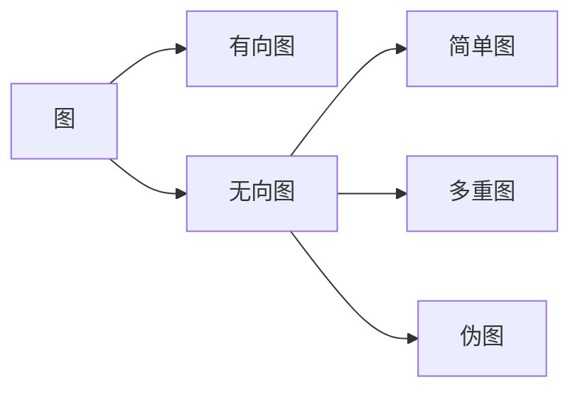

# 离散数学II

## 经典小习题儿

### 图

#### 有关度的证明

- 在至少含有两个顶点的简单图中，一定有两个顶点的度相同

  > 分类进行讨论。1）当所有顶点度数都不为0时，则$n$个节点的度数只能在$1,\cdots,n-1$之间选择，鸽巢原理说明了一定会有重复的度数；2）如果有一个不为$0$，则其他节点的度数不可能为$n-1$，同样可以通过鸽巢证明；3）如果有两个以上度为0的节点，则这两个结点度相同

#### 同构

- 证明两个图同构

  > 证明同构是很困难的，我们可以构造一个一一映射函数$f$保证节点间的邻接关系不变。

#### 欧拉图和哈密顿图

- 欧拉回路的充要条件：每个顶点的度数都为偶数

  > 必要性：从一个顶点开始遍历，这个顶点度数先增加1，之后这条通路每经过一个顶点都会使这个顶点的度数增加2，最后回到该顶点使得度数又增加1
  >
  > 充分性：归纳构造一个回路，见下文

- 狄拉克定理的证明

  取一个$G$为最大哈密顿图，可以证明添加$uv$可以构成一个哈密顿图。关键在于构建集合$S$和$T$，证明$d(u)+d(v)=|S|+|T|=|S\cup T|\lt n$

- 对一个平面图，证明#$v-e+r=\omega+1$

#### 连通性

- $G$中每个顶点的度数至少为2，则$G$中必有圈

  > 任取一个顶点开始，总能找到下一个顶点；由于顶点集是有限的，所以能取到最后一个顶点$v_n$，而$v_n$度数不满足大于等于2，所以$v_n$一定会连接一个顶点形成回路。

- 最小度为3的简单圈必为偶圈

- $一个图G是二分图\Leftrightarrow G中不含奇圈$

  > 必要性可以根据二分图的性质，反证假设下发现矛盾；充分性有两种情况，一是没有圈只有通路那么可以直接着色，若有偶圈可以对一半节点着色

- 连通无向图的每一对不同顶点之间都存在简单通路

  > 取$u{x_1}{x_2}\cdot{x_{n-1}}v$作为一条通路，若他不是简单通路，则可以通过删除其中的回路得到更短的通路

- 证明边和连通分支数关系的不等式

  > 考虑边数最少时，每个连通分支只有一个通路；边最多时，每个连通分支都是完全图。

- 证明点连通度和边连通度的不等式

- $v_i$到$v_j$的长度为$r$的不同通路的数目等于$A^r$的第$(i,j)$项

  > 使用归纳法证明。对于每一次归纳步，有$A^{r+1}={A^r}A=BA$，其中$(i,j)$项为${b_{i1}a_{1j}}+{b_{i2}a_{2j}}+\cdots+{b_{in}a_{nj}}$，也就是从$v_i$开始到$1,2,\cdots,n$再到$v_j$的方法个数。

- 有向图$G=<V,E>$，$V$中两个顶点$u$和$v$所在的强连通分支要么相同要么不相交

  > 分情况讨论，1）如果$u,v$在是互相可达的，那么二者属于同一个强连通分支；2）不是互相可达的，假设存在却$w$使得两个顶点连通，那么二者可以合并为一个强连通分支

- 连通有向图的一个强连通分支中，两个顶点的有向通路所访问的所有顶点也都在这个强连通分支中。

  > 对$u$到$v$的通路和$v$到$u$的通路分类讨论，1）两条通路完全相同，都处于同一个强连通分支；2）完全不同，形成一个回路，对回路上的顶点都互相可达，符合要求；3）否则可以区分部分段。

- 带有$n$个顶点的连通图至少具有$n-1$条边

  > 归纳证明，与树的这个性质证明是一样的

- **在任何简单图中，任何度为奇数的顶点都与其他某些度为奇数的顶点之间有通路**

  > 有握手定理的推论，在一个无向图中，如果存在奇数度顶点则肯定存在偶数个奇数度顶点，同理在某个简单图的某个连通分支子图中，比存在偶数个奇数度的顶点。

- $v$是一个割边端点，证明$v是割点\Leftrightarrow v不是悬挂点$

  > 必要性：若$v$是割点，根据定义$v$不是一个悬挂点
  >
  > 充分性：$v$不是悬挂点所以$deg(v)\geq 2$，因为$v$是一个割边端点，所以$deg(v)-1 \geq 1$，也就是至少还有一条边$e$连接到点$u$，此时割边另一端点与$u$是连通的，所以删除$v$后不再属于同一连通分支，$v$是一个割点。

- 在连通简单图$G$中，$顶点c是割点\Leftrightarrow 存在于c不同的点u，v且u，v之间每条通路都经过c$

  > 必要性：$c$是割点，假设删除后$u,v$存在于两个连通分支，那么$u,v$之间所有的通路都经过$c$
  >
  > 充分性：都经过$c$，删后连通分支增加

- 在至少两个点的简单图中，至少有两个点不是割点

  > 使用距离进行证明，当两点之间距离最大时，假设有一个是割点，那么删除该点后后可以在与原顶点不同的连通分支中找到一个顶点，他原本通过该割点与另一顶点相连，这也就意味着它到另一顶点的距离更远，原假设出现矛盾。

- $简单图中的一条边是割边\Leftrightarrow 该边不属于该通路任一条简单回路$

  > 必要性：反证，若存在于一个简单回路，删除后仍可达，不符合割边的定义
  >
  > 充分性：若两点必须经过该边，由于她不属于任何一个简单回路，那么删除之后两个点会形成新的连通分支

- 若带有$n$个顶点的简单图$G$具有超过$\frac{(n-1)(n-2)}{2}$条边，则它是连通的

  > 当他不连通时，至少有两个连通子图$k$和$n-k$，当这两个连通子图是完全图时边最多，有基本不等式可以得出边界为$\frac{(n-1)(n-2)}{2}$条边，此时若有更多的边则一定会连通两个连通子图。

- $G$是一个连通图，$则有可能删除顶点使G不连通\Leftrightarrow G不是完全图$

  > 必要性：若删除后不连通，即存在两点没有直接相连的边，不是完全图
  >
  > 充分性：若不是完全图，存在顶点通过另一顶点构成通路，删除之后产生新的连通分支

- $u,v$之间存在无相同边的简单通路$P_1,P_2$，则$G中存在简单回路$

  > 分类讨论，1）没有重合顶点，构成回路2）取最近的公共点构成回路

#### 特殊图、二分图

- 完全图$K_n$顶点集的非空子集导出的子图也是完全图。

  > 对于其非空子集的所有点，其在$K_n$中有边，那么由导出子图的定义可以得知在其导出子图中也有这条边，所以任意两边都会有边相连。

- 对简单二分图$G<V,E>$，有$e\leq\frac{v^2}{4}$

  > 根据定义设$V_1，V_2$两个点集，有关系$v_1+v_2=v$。当$G$是一个完全二分图时边是最多的，此时$e_{max}={v_1}{v_2}$，代入后使用基本不等式可以得到结果

- $简单图G是二分图\Leftrightarrow G没有包含奇数边的回路$

  > 必要性：易得
  >
  > 充分性：涂色

#### 着色问题

- 二分图都是可以二着色的

  > 根据定义分为两个顶点集即可

- 具有包含奇数个顶点的回路的简单图，不能用两种颜色来着色

  > 遍历这个回路即可，会发现第一个节点被着色两次

### 树

#### 等价定义

- 没有简单回路的连通无向图成为树，其中度数等于1的结点成为树叶，大于1的成为内点

- 一棵树中至少有两个结点度数为1

  > 由于树是一个连通图简单图，所以$\sum{deg(v_i)}=2(|V|-1)$若没有结点度数为1，即所有节点的度数都大于等于2，那么$\sum{deg(v_i)}\geq{2(|V|)}$矛盾；只有一个结点度数为1时同理

- 一个无向图是树当且仅当在他的每对顶点之间存在唯一简单通路

  > 必要性：对任意的两个顶点，能找到一条他们之间的通路且仅有一条，因为若还有另一条通路就可以构成回路。
  >
  > 充分性：存在唯一通路则这个图是连通的，我们只需要证明他没有简单回路。假如存在回路，那么就会有两个通路，引出矛盾。

- $简单图是树\Leftrightarrow 它是连通的，但删除他任何一条边就产生不连通的图$

  > 必要性：树是连通的，连通性的定义
  >
  > 充分性：删除任一条边都会产生不连通的图，说明每条边都是割边，说明图中不含回路

#### 树的性质

- 带有$n$个顶点的树含有$n-1$条边

  > 归纳法证明

- 高度为$h$的$m$叉树中至多有$m^h$个树叶。若一个高度为¥$h$的$m$叉树有$l$个树叶，则$h\geq{\lceil{log_ml}\rceil}$

### 计数

#### 基本计数

6.1： 23，26，37，**50，51**，55，61，65

##### 字符串

- 有多少个10位二进制串是以1开头以1结束的？

  > $2^8$种

- 长度为10的连续0恰好有5位的二进制串？

  > 

- 在1到300中选三个不同的数，并且这三个数之和能被3整除，问有多少种方式？

  > ****

- Each user on a computer system has a password, which is six to eight characters long, where each character is an uppercase letter or a digit. Each password must contain at least one digit. How many possible passwords are there?

  > 

- 以1开始或者以00结束的8位位串有多少个？

  

- 有多少个10位位串包含5个连续的0或5个连续的1？

- 有多少个8位位串包含3个连续的0或者4个连续的1？

  

- dasda

#### 鸽巢原理

##### 对数的讨论

- **证明**：对每个整数$n$，存在一个数是$n$的倍数且在他的十进制表示中只出现0和1

  > 整体思路是构造一个长度为$n+1$的序列，并证明存在一个数对$n$求余有$n$种可能的余数，使用鸽巢得到必有两个情况下有相同的余数，将这两个数作差即可得到结果。
  >
  > 令$n$是正整数。考虑$n+1个$整数$1，11，111，…，11 … 1$(在这个表中，最后一个整数的十进制表示中具有$n +1$个1)。注意当一个整数被n整除时存在n个可能的余数。因为这个表中有n +1个整数，由鸽巢原理，必有两个整数在除以n时有相同的余数。这两个整数之差的十进制表示中只含有0和1，且它能被n整除。

- 证明**一般化的鸽巢原理**

  > 计算集合内元素的总数并使用上取整不等式放缩

- **经典**：证明在不超过$2n$的任意$n＋1$个正整数中一定存在一个正整数被另一个正整数整除。

  > 思路是借助$2n$去设计一个只有偶数/奇数的表达形式，这样就可以使用鸽巢原理保证这种表达方式下偶数/奇数会出现重复。
  >
  > 对这些整数$a_1, a_2,\cdots,a_{n+1}$，书写成形式${2^{k_i}}{q_i}，其中{q_i}是一个奇数$（数的表示和分解）。此时就可以借助分析的结论证明了。

- 每个由$n^2＋1$个不同实数构成的序列都包含一个长为$n+1$的严格递增子序列或严格递减子序列

  > 矛盾点在于当结论不成立，也就是最长为$n$的子序列，考虑对一个元素的递增、递减子序列长度构成的有序对可能出现的情况最多只有$n^2$种，由鸽巢原理可以判断出必定存在相同的有序对。
  >
  > 然而，由于序列中元素互不相同，所以即使项$a_s和a_t$具有相同的长度有序对，也一定有$a_s \lt a_t或者a_s \gt a_t$，这样就可以向其中一个项的序列中添加另一个项以构造更长的子序列。具体过程如下：
  >
  > 

- sss

##### 应用题

- 从一副标准的52张牌中选出多少张牌才能保证至少选出三张相同花色的牌?

  > 相当于将$N$个元素放入四个盒子，目标是至少有一个盒子内有三张牌，代入公式也就是${\lceil{\frac{N}{4}}\rceil} \geq 3$

- 要选多少颗才能保证至少选到三颗红桃?

  > 无法使用鸽巢，因为对某一个集合进行了讨论

- 假设一个实验室有15个工作站和10个服务器。工作站和服务器之间可以通过线缆直接连接。对于每个服务器，在任何时候只能激活一个到该服务器的直接连接。我们希望在任何时候，任何10个或更少工作站的集合都可以通过直接连接同时访问不同的服务器。实现这一目标所需的直接连接的最少数量是多少?

- **连续时间内的下限**：证明足球每天至少打一场，但是每周最多只能打12场，那么11周内一定有连续的若干天打了21场足球比赛。

  > 记${a_i},1\leq i \leq 77$为第$i$天及之前打过的比赛的数量，有$1 \leq {a_1} \leq {a_2} \leq \cdots \leq {a_{77}} \leq 12*11=132$。还可以构造出$1+21 \leq {a_1+21} \leq {a_2+21} \leq \cdots \leq {a_{77}+21} \leq 12*11+21=153$。可以看到两个序列总共有$77*2=154$个元素，但是拼接在一起范围也只是$1-153$只有153个数字，所以必定存在两个相同的元素。而这两个序列又分别是递增的，所以存在${a_i}={a_j}+21$，也就是$j到i$天内打了21场比赛。

- 拉姆齐理论（集合元素的子集分配问题）：假定一组有6个人，任两个人或者是朋友或者是敌人。证明在这组人中或存在3个人彼此都是朋友，或存在3个人彼此都是敌人。

  > 对于任一个人$A$，根据广义鸽巢原理，现在要将剩余五个人分配到两个集合内，也就是其中一个集合内至少有$\lceil \frac{5}{2} \rceil \geq 3$个人，假设这三个人$B，C，D$是$A$的朋友。如果这三人互相都是敌人，那么我们获得了一个敌人集合；否则，三人之间至少有两人互喂朋友，此时与$A$构成了三个朋友的集合。同理可证相反的情况

- xxx、

##### 更复杂的情况

- 证明25个男孩和25个女孩围坐一个圆桌旁边总会有一个人的邻座都是男孩
- 假设有21个女生和21个男生参加数学竞赛，设每一个参赛值解出了至少6个题目，对每一对男生女生他们至少解出了一个相同的题目。证明有一个题目至少被3个女生和3个男生解答出来

#### 排列组合

- 有多少种方式使得8个男士和5个女士站成一排并且没有两个女士彼此相邻

  > 共有9个空，从中取出5个位置$C(9,5)$

#### 二项式定理

##### 恒等式和不等式的证明

- 直接赋值证明

- 证明帕斯卡恒等式

  > 帕斯卡恒等式描述的是在$n+1$个元素中取出$k$个的方法有两种情况。对一个特殊元素$a$，当我们取出$a$时，只需要在剩余$n$个元素的集合中再取出$k-1$个元素，也就是$C(n-1,k)$；若没有取出$a$，则需要在$n$个元素中取出$k$个，即$C(n,k)$

- 范德蒙德恒等式

  > 范德蒙德恒等式描述的是对一个总共有$m+n$个元素的集合中取出$k$个元素时，可以根据加法原理分解为从$m$个元素中取出$r$个，$n$个元素中取出$k-r$个，其中$0\leq{r}\leq{k}$。特别的，当$m=n$时仍可以使用这种方式证明

- 证明定理4:$C(n+1,r+1)={\sum_{j=r}^n}C(j,r)$

  > 等式左边是在$n+1$个元素中取出$r+1$个元素的方法数，右式考虑取出的最后一个元素即第$r+1$个元素，可能出现在第$r+1,r+2,\cdots,n+1$的位置上。这也意味着当这个元素出现在$k+1$时，前面$k$个位置有$r$个元素。将这些情况加起来就是$\sum_{k+1=r+1}^{n+1}C(k,r)=\sum_{j=r}^nC(j,r)$种。

- 证明$1\leq{k\leq{n}}时，C(n,k)\leq\frac{n^k}{2^{k-1}}$

  > 将二项式展开，得到$C(n,k)=\frac{n(n-1)(n-2)\cdots(n-k+1)}{k(k-1)\cdots{2}}\leq\frac{n^k}{k(k-1)\cdots{2}}\leq\frac{n^k}{2^{k-1}}$

- sasd

### 高级计数

#### 递推关系

- 对于不含2个连续0的n位二进制位串的个数，找出递推关系和初始条件。

  > 对于项$a_n$来说，它可能以1或0结尾。如果以1结尾，那么只需要在一个$n-1$长度的符合条件位串后面加一个$1$，共有$a_{n-1}$种；如果以$0$结尾，则$n-2$位不能是$0$，也就是可以通过在长度为$n-2$的位串后面加一个$10$，共$a_{n-2}$种。

- 编码字的枚举 一个计算机系统把一个十进制数字串。作为一个编码字，如果它包含偶数个$0$，就是有效的。设$a_n$是有效地$n$位编码字的个数，找出一个关于$a_n$的递推关系。

  > 两种，一种是在复合条件的$n-1$项后面加上非0的数字，有$9{a_{n-1}}$种；另一种是在不符合条件的$n-1$位后面加上一个$0$，有$10^{n-1}-a_{n-1}$种。

- 使用树图分析递推公式

- dasd

#### 解线性递推关系

- 线性齐次最一般化情况：假设线性齐次递推关系的特征方程的根是2、2、2、5、5、9，通解形式为？

  > 对于每个根所属的项，其形式为$P(n)r^n，其中P(n)是一个m-1次的多项式，m是根r的重数$。所以这个通解的形式为${a_n}=(a_0+{a_1}n+{a_2}{n^2})2^n+({b_0}+{b_1}n){5^n}+c{9^n}$

- 求解常系数线性非齐次递推关系：$a_n=3{a_{n-1}+2n}$的所有解

  > 根据定理，任何一个常系数线性非齐次递推关系的解都是一个特解与其相伴的线性齐次递推关系的一个解的和。
  >
  > 易得这个相伴的线性齐次方程的解为$a_{n}^{(h)}=\alpha{3^n}$。考虑到这里是一个线性函数，可以构造$p_n=cn+d$来尝试求解特解。

- 特解的确定形式（$F(n)$为$n$的多项式与一个常数的$n$次幂的积时）：

  > 需要注意当这个常数是特征方程的根，重数为$m$，还需要在特解中乘上$n^m$。事实上我们也可以理解为这一系数始终存在，只是$m=0$

#### 生成函数

## 应试总结

### 套路

### 图与树

#### 图的基本概念辨析

- 有向图、无向图、简单图等
- 通路、回路、强连通弱连通

#### 度与握手定理

- 握手定理：$\sum{deg(v)}=2e$及推论。

  > 证明每个

- 边的握手定理：$\sum{deg(r)}=2e$。对简单平面图每个边的度至少为3。

#### 二分图和涂色问题

- 二分图没有奇数个顶点的回路
- 四色定理和五色定理

#### 图的同构

- 选择不变量并证明

#### 连通性问题

- 割点、割边
- 连通分支，连通图的定义（只有一个连通分支）

#### 欧拉图与哈密顿图

#### 平面图与欧拉公式

#### 树的等价定义

- 使用定义：树是没有**简单回路**的**连通**无向图。

#### 生成树的证明

- 无连通回路的简单图恰好只有一颗生成树
- 连通简单图的割边一定在该图的每颗生成树中
- 涉及权的证明分析，例如最小权的边一定在任何一个最小生成树中

### 计数（高级计数）

#### 基础方法

#### 鸽巢原理

- vanilla鸽巢原理
- 推论
- 典型例题

#### 排列组合

- 去重
- 隔板法

#### 二项式与恒等式

- 二项展开式
- 使用生成函数推广到实数的二项式定理
- 帕斯卡恒等式
- 范德蒙德恒等式

#### 递推关系与递推式

- 构造递推关系和递推公式：构造字符串、添加括号、利息和收入、爬楼梯
- 使用特征方程求解线性递推方程：常规情况、二重特征根（重根）、多重根
- 使用特解求解线性非齐次递推方程

#### 生成函数

- 给定$\sum{x_i}=k$和$x_i$的范围，书写生成函数并求值
- 根据情况编写生成函数解决问题

## 图

Key point：

- [ ] 基本概念和名词、图的分类
- [ ] 关于度的性质，握手定理

### 图的概述（P540）

图G=(V,E)是由非空顶点集V和边集E构成。每条边有一个或两个顶点与它相连，称为边的端点。

图的分类：

#### 无向图, Undirected Graph

|         类型         |  环  | 多重边 |
| :------------------: | :--: | :----: |
| 简单图(Simple graph) |  无  |   无   |
|  多重图(Multigraph)  |  无  |   有   |
|  伪图(Pseudograph)   |  有  |   有   |

#### 有向图, Directed Graph

有向图根据是否有**多重边**也可以分为**简单有向图(simple directed graph)**和**有向多重图(dir.Multigraph)**。

### 图的术语, Graph Terminology

常用术语表：

|     汉语      |            英语             |                             定义                             |    备注    |
| :-----------: | :-------------------------: | :----------------------------------------------------------: | :--------: |
|     顶点      |           Vertex            |                                                              |            |
|      边       |            Edge             |                                                              |            |
| 邻接的/相邻的 |      adjacent/neighbor      | 若{u, v}是无向图G的边，则两个顶点u和v称为在G里邻接(或相邻)。 |            |
|     关联      |          incident           |            边e称为关联点u和v，也可以说边e连接u和v            |            |
|     端点      |          endpoint           |                  顶点u和v称为边{u, v}的端点                  |            |
|  顶点v的邻居  |    The neighborhood of v    |                  v的所有邻居，用$N(v)$表示                   |            |
|   顶点的度    |     degree of a vertex      | 在无向图里顶点的度是与该顶点关联的边的数目，例外的情形是，顶点上的环为顶点的度做出双倍贡献. | 见下面备注 |
|  入度、出度   |   in-degree, out-degreee    | 入度记作$deg^-(v)$是以v作为终点的边数，出度记作$deg^+(v)$是以v作为起点的边数 |            |
|  基本无向图   | underlying undirected graph |           忽略边的方向后得到的无向图称为基本无向图           |            |

#### 关于度

对于度为0的顶点，我们称它为孤立的(Isolated)；度为1的顶点称为悬挂的(pendant)。

使用 $\Delta(G) = max\{ deg(v) | v \in V \}$ 表示一个图的最大度数，$\delta(G) = min\{ deg(v) | v \in V \}$ 表示最小度数。

**握手定理**：

> 即使出现**多重边和环仍成立**
>
> 只需要证明每条边都为顶点的度之和贡献为2.

根据握手定理，可以证明无向图有偶数个度为奇数的顶点。

对于有向图，由于入度和出度的区别，有这个性质

#### 特殊的简单图

|    图     | 记号  |                             性质                             |      英语      |
| :-------: | :---: | :----------------------------------------------------------: | :------------: |
|  完全图   | $K_n$ |             每对不同顶点之间都怡有一条边的简单图             | Complete Graph |
|   圈图    | $C_n$ |                             dddd                             |    Circles     |
|   轮图    | $W_n$ |                             dddd                             |     Wheels     |
| n立方体图 | $Q_n$ | 用顶点表示$2^n$个长度为n的位串的图。两个顶点相邻，当且仅当它们所表示的位串恰怡有一位不同。 |     n-Cube     |
|  正则图   |       | 如果一个简单图的每个顶点都有相同的度，那么这个图就称为正则图。 | regular graph  |

#### 二分图，Bipartite Graph

若把简单图$G$的顶点集分成两个不相交的非空集合$V_1$和$V_2$，使得图里的每一条边都连接着$V_1$里的一个顶点与$V_2$里的一个顶点，则$G$称为二分图。

**二分图的判定（涂色）**：

一个简单图是二分图，**当且仅当**能够对图中的每个顶点赋予两种不同的颜色，并使得没有两个相邻的顶点被赋予相同的颜色。

**完全二分图**：顶点集分成分别含有$m$和$n$个顶点的两个子集的图，两个顶点之间有边当且仅当一个顶点属于第一个子集而另一个顶点属于第二个子集（也就是集合内顶点之间没有边）。

二部划分可以被应用到匹配（matching）问题上。简单图 $G = (V,E)$ 中的匹配 $M$ (匹配)是图的边集 $E$ 的子集，使得没有两条边与同一顶点相关联。**最大匹配**(maximum matching)是边数最大的匹配。从$V_1$到V2的完全匹配(complete matching)，如果$V_1$中的每个顶点都是匹配中的一条边的端点，或者等效地，如果$|M| = |V_1|$。

霍尔婚姻定理提供了一组存在完全匹配的充分必要条件（P555）：

### 匹配

A matching $M$ (匹配) in a simple graph $G = (V ,E)$ is a subset of the set $E$ of edges of the graph such that **no two edges are incident with the same vertex**.

- **最大匹配（Maximum Matching）**：A maximum matching (最大匹配) is a matching with the **largest number of edges**.
- **完全匹配（Complete Matching）**：A complete matching (完全匹配) from $V_1$ to $V_2$, if every vertex in $V_1$ is the endpoint of an edge in the matching, or equivalently, if $|M| = |V_1|$.

**完全匹配的充要条件（霍尔婚姻定理，P555）**：

#### 新图的产生(P558)

产生新图的方式很多，有：

- **子图(subgraph)**：点集和边集是原图子集的图。特别的，还有真子图(proper subgraph)

- **生成子图(spanning subgraph)**：**顶点与原图完全相同**，边集是原图子集的子图。

- **导出子图(subgraph induced by a subset)**：分为点导出子图和边导出子图

  > 设$V_1\subseteq V$，以$V_1$为顶点集，以端点均在$V_1$中的$E$中的边的全体为边集$E_1$，构成的子图，称为由$V1$导出的$G$的子图(点导出子图)，记为$G(V_1)$。设$E_1 \subseteq E$，以$E_1$为边集，以$E_1$中边的端点全体为顶点集构成的子图，称为由$E_1$导出的$G$的子图(边导出子图)，记为$G(E_1)$。

通过操作边和顶点还有：

- 从图中删除或增加边

  

- 边的收缩(Edge contraction)

  

- 从图中删除顶点

  

**并图**（The Union of graph $G_1 and G_2$）：两个简单图 $G1 = (V_1, E_1)$ 和 $G2 = (V_2, E_2)$ 的并集是顶点集 $V = V_1 \cup V_2$和边集 $E = E_1 \cup E_2$ 的简单图。

**补图**（Complementary graph $\bar{G}$ of a simple graph $G$）：设 $G$ 是具有 $n$ 个顶点的简单图，从这 $n$ 个顶点构成的完全图 $K_n$中删去 $G$ 的所有边，但保留顶点集 $V(G)$ 所得到的图称为 $G$ 的补图， 记为 $\bar{G}$。

### 图的表示和同构, Graph Isomorphism

#### 图的表示

图的表示有几种常用的方法：

- 邻接表，Adjacency list

- 邻接矩阵，Adjacency matrice：一种类型是基于顶点的邻接关系；另一种类型是基于顶点与边的关联关系。

  > 无向图的邻接矩阵总是对称的（包括伪图和多重图）
  > 图的邻接矩阵依赖于所选择的顶点的顺序
  > 对无向图来说，邻接矩阵每一行各个位置上数字之和代表与顶点 $i$ 关联的边数, 等于顶点 $i$ 的度减去在顶点 $i$ 上的环数（本质上是去重）；对于有向图而言，邻接矩阵每一行各个位置上数字之和代表该顶点的出度，每一列代表该顶点的入度。

- 关联矩阵，Incidence matrice

  > 在无向图中的关联矩阵中，每列中有两个 $1$ 的表明这条边与这两个顶点相连接，每列有一个 $1$ 的表明存在环

对于无向图来讲，邻接矩阵上每一行各个位置上数字的和表示与该顶点关联的边数，也就是他的度减去环的数量（去掉重复的贡献）；对于有向图来讲，每行的和表示该顶点的出度，每列的和表示入度。

#### 图的同构

当两个简单图同构时，两个图的顶点之间具有保持邻接关系的一一对应。

在两个带 $n$ 个顶点的简单图顶点集之间有 $n!$ 种可能的一一对应，通过检验每一种对应来看它是否保持邻接关系和不邻接关系是不可行的。 然而，可以通过*说明两个简单图不具有同构的图所必须具有的性质来说明 它们不同构*，把这样的性质称为对简单图的同构来说的**不变量**(invariants)。

重要的不变量包括：

- 相同的**顶点数**
- 相同的**边数**
- 相同的**顶点度**
- 相同的二分能力
- 当且仅当都是完成图
- 当且仅当都是轮图
- **连通分支的数目及大小**
- 当且仅当都具有相同长度的简单回路

> 图同构算法己知的最好的判定两个图是否同构的算法*具有指数的最坏情形时间复杂度* (对图的顶点数来说）。不过，解决这个问题的线性平均情形时间复杂度的算法已经找到，而且有希望，即使仍有怀疑，找到判定两个图是否同构的多项式最坏情形时间复杂度的算法。

### 连通性问题, Connectivity

术语区分（此处术语可能并不通用，括号是另一套术语）：

|       汉       |          英          |                             定义                             |                  备注                  |
| :------------: | :------------------: | :----------------------------------------------------------: | :------------------------------------: |
|   通路(路径)   |      path(walk)      | 图$G$的一个*非空点、边交替序列*称为一条从$v_0$到$v_k$的通路  |                                        |
|       迹       |        trail         |                  如果一个路径的顶点互不相同                  |                                        |
| 回路(闭合路径) | circuit(closed walk) |         如果$v_0=v_k$，且长度大于$0$，则称为一条回路         |                                        |
| 路线/简单通路  |        trail         |  若通路或回路不重复地包含相同的边，则称为简单通路或简单回路  |                                        |
|      端点      |                      |                                                              |        端点又可以分为起点和终点        |
|      内点      |                      |                                                              |                                        |
|      路长      |                      |                                                              |                                        |
|   路径的逆转   |                      | 记$W$是一条$v_0, v_k$的路径，逆转后的路径一定是一条$v_k,v_0$的路径，记作$W^{-1}$ |                                        |
|       节       |                      | 通路$W$的部分相连项构成的子序列也必构成一条路径，这条路径称为$W$的节 |                                        |
|    新的路径    |                      |  $W$可以与另一条路径$W'$衔接在一起便得一条新路径，记为$WW'$  |                                        |
|       圈       |        Circle        | 设$v_0,e_1,v_1,e_2,v_2,…,e_k,v_0$是一条简单回路/闭迹，如果$v_0，v_1，…，v_{k-1}$互不相同，则称该闭迹为圈或k圈 | 当k为偶数时称为偶圈；k为奇数时称为奇圈 |

名词重整：

- 通路（path）：一个顶点和边的交替序列
- 回路（circuit）：回路
- 简单通路/迹（trail）：不包含重复边的通路
- 初级通路/路：不包含重复顶点的通路

**圈的性质定理**：

1. 若图$G$中每个顶点度数至少为２，则$G$中必含有圈。
2. $图G为二分图\Leftrightarrow G中不含奇圈$
   

距离：设$u, v \in V(G)$，若$u，v$连通，则称最短$(u, v)$路的长为$u, v$距离，记为$d(u, v)$。

> 当$u，v$不连通时，认为$u，v$的距离是啊$\infty$

在**连通无向图**的每一对不同顶点之间都**存在简单通路**。

#### 分割与点、边连通度（P576）

- **割点(cut vertices)**：如果删除一个顶点和它所关联的边，就产生*比原图更多的连通分支的子图*时，这样的顶点称为割点(cut vertices)或关节点。从连通图里删除割点，就产生**不连通的子图**。
- **割边或桥(cut edge or bridge)**：如果删除一条边，就产生比原图更多的连通分支的子图时，这样的边称为割边或桥(cut edge or bridge)。

没有割点的图（例如完全图），被称为**不可分割图**（nonseparable graph）

设$V'$是顶点集$V$的子集，如果$G‒V'$是不连通的，则称$V'$是**点割集或分割集**(vertex cut, or separating set)。**除了完全图之外，每一个连通图都有一个点割集**。

- 一个图的点割集中*最小的顶点数*，称为**点连通度**(vertex connectivity)，记为$K(G)$，满足$0 \leq K(G) \leq n‒1$。K(G)是使G变成不连通的图*或只含有一个顶点的图*，所需删除的最小的顶点数。当$K(G)>=k$，则称图G是**k连通**的(k-connected)。

  > 对于不连通图和$K_1$，$K(G)=0$；对于含割点的连通图或$K_2$，$K(G) = 1$。

- 设$E'$是图G的边集$E$的子集，如果$G‒E'$是不连通的，则称$E'$是**边割集**(edge cut)。一个图的边割集中最小的边数，称为**边连通度**(edge connectivity)，记为$\lambda(G)$.

  > 对于不连通图和$K_1$，$\lambda(G)=0$；对于含割点的连通图或$K_2$，$\lambda(G) = 1$。

我们可以主观的看到，**点、边连通度越大整体的连通性越强**。

点连通度和边连通度的不等式（P578）：

#### 连通性

如果图的每对不同顶点之间都有一条**路径**，则无向图称为连通图(connected)。不连通的无向图称为不连通图(disconnected)。

**基本定理**：在连通无向图的每一对不同顶点之间都存在**简单通路**（使用反证法证明）。

图G中顶点之间的连通关系是一个等价关系。图G的连通分支(connected componet)是G的连通子图，且不是G的另一个连通子图的真子图。也就是说，图G的连通分量是G的**极大连通子图**。通常用$\omega(G)表示$连通分支的个数，也就是说：

**连通分支个数的性质**：$G是连通的 \Leftrightarrow \omega(G) = 1$

> 显然，不连通的图具有两个或两个以上不相交的联通子图。
> 根据该关系可将顶点集合V划分成一些等价类$V_1，V_2，…，V_n$，每个$V_i$导出的子图$G(V_i)$称就是$G$的一个连通分支。

顶点、边与连通分支个数的关系：

设G是具有$n$个顶点的简单图，若G有$\epsilon$条边，$\omega$个连通分支，则

$$
n - \omega \leq \epsilon \leq \frac{1}{2}(n - \omega)(n - \omega + 1)
$$

> 当G的一个连通分支是$n－\omega＋1$个点的完全图，其余$\omega－1$个连通分支均是弧立点时边最多。
> 当ω＝1时，$\omega≥n－1$边最少。即$n$个顶点的连通图至少有$n－1$条边，这种连通图被称为**最小连通图**。

在一个图中两个顶点之间通路的数目，可以用这个图的**邻接矩阵**来确定(P580)。

#### 有向图中的连通

由于有向图带有方向，所以会分为强弱连通性：

- **强联通性(strongly connected)**：有向图是强连通的，如果有$a$到$b$和从$b$到$a$的路径。
- 弱连通性(weakly connected)：如果简单无向图的每两个顶点之间都有一条路径，则有向图是弱连通的。
- 存在有向$(u, v)$路，则称$v$是从$u$**可达的**。若$u,v$互相可达，则称$u,v$是**双向连通**的
- 若对$D$中任何两顶点，至少有一顶点可从另一顶点可达，则称$D$是**单向连通图**
- 若$D$中任何两顶点都是双向连通的，则称$D$是**双向连通图或强连通图**
- **强连通分支(strongly connected component)**：The maximal strongly connected subgraphs, are called the strongly connected components or strong components of $G$.

$$
有向图G强连通 \Leftrightarrow 有向图G恰有一个强连通分枝
$$

### 欧拉通路和哈密顿通路, Euler and Hamilton Paths

#### 欧拉的图

> 欧拉xxx的图都是包含了**所有边**的图

- **欧拉回路（Euler Circuit）**：是包含着G的每一条边的简单回路
- **欧拉通路（Euler Path）**：包含着G的每一条边的简单通路
- **欧拉图（Euler Graph）**：包含欧拉回路的图

欧拉回路和欧拉通路的**充要条件**：连通多重图具有欧拉回路当且仅当它的**每个顶点的度都为偶数**。连通多重图具有欧拉通路而无欧拉回路，当且仅当它**恰有两个奇数度顶点**。

> **欧拉回路充要条件的证明**：首先，我们来证明充分性，即存在欧拉回路则图中的所有顶点的度数必然为偶数。在图中任取一点，以该点作为起点，沿着欧拉回路走，当前顶点的出度为1，然后经过其它的顶点，注意到如果欧拉路径经过一个顶点（包括起点），它必然离开这个点，这样出入度之和为偶数，直到所有的边逐一被走过，回路的终点在起点处结束，使得起点的入度加1，这样经过起点的度数和变成偶数，欧拉回路结束（注意到我们未加说明的假设了边的个数是有穷的，因此这个过程必然结束）。
>
> 其次，我们来证明必要性，即如果连通图中所有顶点的度数为偶数，则必然存在欧拉回路。我们通过构造性的存在性证明来说明这一点。首先，我们在连通图中找寻一条回路（回路的选取是任意的并且总是能找到的，由上述充分性的证明可以有效的说明这一点），如果这条回路就是欧拉回路，那么结论已然成立了，否则，我们删除掉该回路中的所有边，出现孤立的顶点就忽略它，那么子图（不一定是连通的，并且仍然满足所有顶点的度数都是偶数的性质）与删除掉的回路一定有公共顶点（图的连通性保证了这一点），以该点作为起点继续找寻回路，然后删除，续行此法，直到所有的边都被删除为止（同上述充分性的证明中一样，边的个数的有穷性保证了这个过程必然结束），所有这些删除的回路连接起来就构成了一条欧拉回路。
>
> **欧拉通路充要条件的证明**：先来证明充分性，即存在欧拉通路则图中有且只有两个顶点的度数为奇数，其他顶点的度数皆为偶数，注意到由于起点和终点是不同的，因此欧拉通路的起点和终点必然是两个奇数度的顶点，此外，不可能再有其他的奇数度的顶点了，因为我们沿着欧拉通路的起点走开来，只要经过一个顶点必然离开该顶点，一条入度边搭配一条出度边，共同为该顶点贡献偶数度，直到到达终点为止（当然，也可能再离开，只要终点还有边没有被走过）。
>
> 接下来，我们来证明必要性，即连通图中有且只有两个奇数度顶点，则必然存在欧拉通路，怎么来证明这一点呢？一种非常巧妙的方式是把欧拉通路做成欧拉回路，换句话说，我们连接两个奇数度顶点，这样连通图中所有顶点的度数均为偶数，由刚刚证明的定理1可知，该连通图存在欧拉回路，注意到只需把我们自己增加的那条辅助边删除，便证明了欧拉通路的存在性，我们再一次借助构造性的存在性证明来证明了这一点。

**有向图**中的条件：

- 没有孤立顶点的有向多重图含有**欧拉回路**的充要条件：**弱连通**且每个顶点的**出度和入度相等**。
- 没有孤立顶点的有向多重图含有**欧拉通路但不含欧拉回路**的充要条件：**弱连通**且除去两个顶点外每个顶点的出度和入度相等，其中一个顶点的**出度比入度大1，另一个顶点的入度比出度大1**。

#### 哈密顿的图

> 哈密顿xxx的图都是包含了**所有顶点一次**的图

- 哈密顿通路(Hamilton Path)：访问图G中每个顶点次数有且仅有一次的通路。
- 哈密顿回路：仅访问每个顶点一次(始点除外)，始点同样也是终点。
- 哈密顿图

**狄拉克定理**：如果$G$是$n$个顶点的连通简单图，其中$n \geq 3$，且每个顶点的度都至少为$n/2$，则$G$有哈密顿回路。

**狄拉克定理的引理（哈密顿图的充分条件）**：设$G$是简单图，顶点$u$和$v$一对不相邻的顶点，且满足$deg(u)+deg(v) \geq n$，则$G$是哈密顿图当且仅当$G+uv$是哈密顿图。

**奥尔定理（哈密顿图的充分条件）**：如果$G$是含$n$个顶点的连通简单图，其中$n \geq 3$，并且对于$G$中每一对不相邻的顶点$u$和$v$来说，都有$deg(u)+deg(v) \geq n$，则$G$有哈密顿回路。

**闭包和哈密顿图**：简单图$G$是Hamilton图当且仅当$C(G)$是Hamilton图。

**推论**：

- 若$C(G)$是完全图，则$G$是Hamilton图。
- 若$G$中任意不相邻顶点$u，v$均满足$d(u)＋d(v) \geq v$，则$G$是Hamilton图。

> 设$G$是一个图，反复连接满足$d(u)＋d(v) \geq v$的不相邻顶点$u,v$，直到没有这样的顶点对为止，这样得到的图称作图G的**闭包**，记为$C(G)$。

**哈密顿图的必要条件**：设$G$是一个哈密顿图，则对于顶点集$V$的任一非空真子集$S$，均有$\omega{(G-S)} \leq |S|$。这里$G-S$表示从$G$中删去$S$中的所有顶点以及所关联的边。

有向图与哈密顿图：设$D$是有向图，$D$中包含所有顶点的有向圈称为**Hamilton有向圈**，含有Hamilton有向圈的有向图称为**Hamilton有向图**；$D$中包含所有顶点的有向路，称为**Hamilton有向路**，含有Hamilton有向路的有向图称为**半Hamilton有向图**。**Hamilton有向图必定是强连通的**。

若有向图D中每两个顶点之间恰有一条弧，则称D为竞赛图，存在以下性质：
$$
\begin{array}
D是竞赛图 \Leftrightarrow D是完全的定向图& \\
竞赛图必定是半Hamilton有向图	\\	
强连通的竞赛图必定是Hamilton有向图 \\
\end{array}
$$

### 最短通路问题, Shortest Path Problem

加权图（Weighted Graph）：对图的每一条边赋予一个权值。

#### Dijkstra

迪克斯特拉算法求出连通简单无向带权图里两个顶点之间最短通路的长度。

#### 最近邻居法

旅行商问题：设有$n$个城镇，其中每两个城镇之间的直接距离是已知的，一个旅行商自一城镇出发巡回售货，问这个旅行商应该如何选择路线，使每个城镇恰好经过一次，并且总的行程最短。显然，这个问题也就是要**在一个带权完全图中，找一个权最小的Hamilton圈**。

### 可平面图, Planar Graphs

如果一个图形**没有任何边交叉**，那么它就是**平面(planar)**的。

如果一个图能画在平面上，使得*它的边仅在端点相交*，则称这个图为**平面图**，或说它是**可平面嵌入**的，平面图$G$的这样一种画法，称为$G$的一个**平面嵌入**，平面图$G$的平面嵌入称为**平图**。

图的平面表示将平面划分为**面(region)**，包括**无界的面(unbounded region)**；其中恰有一个无界的面(an unbounded region)，称为**外部面**。

一条*连续的、自身不相交的封闭曲线*称为**Jordon曲线**。$J$的外部$extJ$，外点，$extJ$与$J$之并称为extJ的闭包，记为$ExtJ$；另一部分(不含曲线$J$)称为$J$的内部，记为$intJ$，$intJ$的点称为$J$的内点，$intJ$与$J$之并称为$intJ$的闭包，记为$IntJ$。

**引理**：设J是一条Jordon曲线，任何连接J的内点与外点的曲线必与J相交。

**欧拉公式**：

推论：

- 给定平面连通图G，则G的所有平面嵌入有**相同的面数**。

  > The concept of the degree of a region(面的度)：the number of edges on the boundary of this region.

- 如果$G$是一个连通平面简单图，有$e$条边和$v$个顶点，其中$v \geq 3$，那么$e \leq 3v - 6$。

  

- 如果$G$是一个连通平面简单图，有$e$条边和$v$个顶点，其中$v \geq 3$，且**没有长度为3**的圈，那么$e \leq 2v - 4$。

  

- 在连通平面简单图G中，至少存在一个顶点$v_0$，使$d(v_0) \leq 5$。

  

#### 库拉图斯基定理（KURATOWSKI'S Theorem）

若一个图是**平面图**，则通过删除一条边$\{u,v\}$并且添加一个新顶点$w$和两条边$\{u,w\}$与$\{v,w\}$获得的任何图也是平面图。这样的操作成为初等细分（elementary subdivision）。若可以从相同的图通过一系列处等细分来获得图$G_1 = (V_1,E_1)$和$G_2 = (V_2,E_2)$，则称他们是**同胚（homeomorphic**）的。

定理（判定非平面图的充要条件）：一个图是非平面图当且仅当它包含一个同胚于$K_{3,3}$或$K_5$的子图。

> 显然，含有$K_{3,3}$或$K_5$同胚子图的图是非平面的。然而，反向的证明是复杂的，这里就不给出了。

### 图着色, Graph Coloring

图$G$的着色为$G$的顶点分配颜色，以便相邻的顶点被赋予不同的颜色。记$\chi$为给图上色所需的最少颜色数。

> 完全图的最少颜色数为$n$，即$\chi(K_n)=n$。完全二分图只需要两种颜色（分别涂两个集合）即可。

一些特殊情况：

- $\chi(G)=1$当且仅当$G$为完全断开的（totally disconnected）

- $\chi(G)=3$当且仅当$G$是一个寄圈（odd cycle）

- $\chi(G) \leq \Delta(G)+1$

  > 往证 $G$是$1＋\Delta(G)$可着色的。对$G$的顶点数施行归纳法

五色定理：任何无自环的平面图G是5可着色的。

四色定理：任何平面图是4可着色的。

## 树

### 树的概述和应用

**没有简单回路的连通无向图**称为树。每个连通分支均为树的图称为森林。

定理：树中至**少有两个结点**的度数为1。

> 设树$T=<V,E>,|V|=v$，因为$T$是一个连通图，所以对于任意$v_i \in T$有$deg(v_i)\geq 1$且$\sum{deg(v_i)}=2(|V|-1)=2v-2$。若每个结点的度数都大于等于2，那么$\sum{deg(v_i)} \geq 2v$与前文矛盾；若只有一个结点度数为1，则$\sum{deg(v_i)} \geq 2(v-1)+1=2v-1$也矛盾。所以至少有两个结点的度数为$1$.

树的等价定义：

- 无回路的连通图
- 没有回路且$e=v-1$
- 连通且$e=v-1$
- 没有回路，但增加一条新边，得到一个且仅有一个回路
- 连通，但删去任一边后便不再连通
- 每一对结点之间有一条且仅有一条路

无向图是树的充要条件：一个无向图是树当且仅当在他的**每对顶点之间存在唯一简单通路**。

**有根树(Rooted tree)**是指定一个顶点作为根并且每条边的方向都离开根的树。

A rooted tree is called an **m-ary tree(m叉树)** if every internal vertex has no more than m children. The tree is called a **full m-ary tree (满m叉树)** if every internal vertex has exactly m children. An m-ary tree with m = 2 is  called a **binary tree(二叉树).**

**顶点与边的关系**：带有$n$个顶点的**树**含有$n-1$条边。
$$
\begin{align}
&	使用数学归纳法证明\\
&	基础步骤：当n=1时，有n=1个顶点的树没有边。对n=1时定理为真。\\
& 归纳步骤：归纳假设对有n=k个顶点的树定理成立，即n=k个顶点的树有k-1个边。\\
&	对n=k+1的树T，且v是T的树叶（因为树有穷所以v必定存在）。	\\
& 设w是v的父母，从T中删除顶点v以及连接w和v的边，产生的图仍然连通且没有简单回路，所以能够产生有k个顶点的树T'。\\
& 根据归纳条件，树T'有k-1条边，而T比T'多\{v,w\}这一条边，所以n=k+1个顶点的树有k条边。
\end{align}
$$
内点和顶点的关系：带有$i$个内点的满$m$叉树有$n=m \cdot i+1$个顶点。
$$
\begin{align}
& 对于满m叉树，除了根之外的每个顶点都是内点的孩子。\\
& 因为每个内点有m个孩子，所以在树中除了根还有mi个顶点。\\
& P.S. 这里不会存在重复计算。每个内点有m个子孙，而这个内点本身是其父母的子孙之一\\
& 因此该树含有n=mi+1个顶点。
\end{align}
$$
对于一个满m叉树，当他的顶点$n$，内点$i$和叶子节点$l$有一个确定的，就可以推出另两个，公式整理为：
$$
\begin{align}
&	已知n，i=\frac{n-1}{m},l = \frac{[(m-1)n+1]}{m}\\
& 已知i, n = mi+1, l = (m-1)i+1	\\
& 已知l, n = \frac{ml-1}{m-1}, i = \frac{l-1}{m-1}
\end{align}
$$
高度为$h$的m叉树至多有$m^h$个树叶。

### 树的遍历, Tree Traversal

前序遍历、中序遍历和后序遍历

### 生成树, Spanning Trees

若图$G$的生成子图$T$是树，则称$T$为$G$的生成树。

**基本定理**：G是连通图当且仅当G有生成树。

>  证明：首先，假设G有生成树，则G是连通的。假设G是连通的 => 产生一个生成树。
>
>  

### 最小生成树, Minimum Spanning Trees

Kruskal算法和Prim算法。

最小生成树**不一定唯一**。

## 计数

### 计数基础

加减法、除法原理，树图等。

### 鸽巢原理, The Pigeonhole Principle

**鸽巢原理**：如果$k$是一个正整数，$k+1$个对象被放入$k$个盒子，那么至少一个*盒子包含*两个或两个以上的对象。

**推论**：一个从有$k+1$甚至更多的元素的集合到$k$个元素集合的函数$f$不是一对一函数。

鸽巢原理指出当物体比盒子多时一定至少有2个物体在同一个盒子里。但是**当物体数超过盒子数的倍数时**可以得出更多的结果。例如，在任意21个十进制数字中一定有3个是相同的。

广义鸽巢原理：如果$N$个物体放入$k$个盒子，那么至少有一个盒子包含了至少$\lceil \frac{N}{k} \rceil$个物体。
$$
\begin{align}
& 假如每个盒子都不多于{\lceil \frac{N}{k} \rceil}-1个元素，那么最多有\\
& k \cdot ({\lceil \frac{N}{k} \rceil}-1) \lt k \cdot ((\frac{N}{k}+1)-1)=N	\\
&	也就是说取不到等号，因此必有至少一个盒子多于{\lceil \frac{N}{k} \rceil}-1个即{\lceil \frac{N}{k} \rceil}个元素。
\end{align}
$$

#### 背背背

1. 证明对每个整数$n$，存在一个数是$n$的倍数且在它的十进制表示中只出现$0$和$1$。

### 排列与组合, Permutations and Combinations

### 二项式系数和恒等式, Binomial Coefficients and Identities

在涉及二项式定理的证明中，可以通过给$x,y$赋值的方式直接证明或构造多个多项式相加减以证明。

二项式定理推论：

$$
\begin{align}
&	n \geq 0时，\sum_{k=1}^{n}\binom{n}{k}=2^n	\\
&	证明：2^n = (1+1)^n = \sum_{k=0}^n \binom{n}{k}{1^k}{1^{n-k}}=\sum_{k=1}^{n}\binom{n}{k}=2^n\\
&	n \gt 0, \sum_{k=1}^{n}{(-1)^k}\binom{n}{k}=0	\\
&	证明：0^n = ((-1)+1)^n	\\
&	引出 \binom{n}{0} + \binom{n}{2} + \binom{n}{4} + \cdots=\binom{n}{1}+\binom{n}{3}+\binom{n}{5}+\cdots	\\
& n \geq 0, {\sum_{k=1}^n}{2^k}{\binom{n}{k}}=3^n	\\
& 将3^n = (1+2)^n展开即可	\\
\end{align}
$$

#### 帕斯卡恒等式

$$
\begin{align}
& n,k \gt 0 且 n \geq k，有：	\\
& {\binom{n+1}{k}}={\binom{n}{k-1}}+{\binom{n}{k}} \\
& 证明：	\\
& 假设集合T有n+1个元素，从中取出k个元素共有{\binom{n+1}{k}}种方法。	\\
&	设a为集合T中的一个元素，令S = T-{a}，S为一个含有n个元素的集合	\\
& 此时从T中取k个元素，要么1)包含a，从S中取出k-1个元素；2）不包含a，从S中取出k个元素\\
& 所以{\binom{n+1}{k}}={\binom{n}{k-1}}+{\binom{n}{k}}
\end{align}
$$

#### 范德蒙德恒等式

$$
\begin{align}
& m,n,r \geq 0，r不超过m或n，那么 \\
& {\binom{m+n}{r}} = {\sum_{k=0}^r}{\binom{m}{r-k}}{\binom{n}{k}}	\\
& 特别的，m=n时，{\binom{2n}{n}}{\sum_{k=0}^n}{\binom{n}{k}}^2\\
& 证明：\\
& 假设集合T中共有m+n个元素，从中取出r个元素有{\binom{m+n}{r}} 种方法。	\\
& 将集合分为m个元素的集合R和n个元素的集合S，设从S中取出k个元素（0\leq k \leq r）有{\binom{n}{k}}种方法\\
& 此时S中取出{r-k}个元素有{\binom{m}{r-k}}种方法。\\
& 由乘法原理，可以得到k=k_0时，取出的方法共有{\binom{n}{k_0}}\cdot {\binom{m}{r-k_0}}种		\\
& 结论得证
\end{align}
$$

$$
\begin{align}
& r \leq n,那么\\
& {\binom{n+1}{r+1}} = {\sum_{j=r}^n}{\binom{j}{r}}
\end{align}
$$

### 广义排列与组合, Generalized Peruitations and Combinations

**隔板法**的一般化：
$$
\begin{align}
& 对于n个元素的集合中允许重复的r组合有C(n+r-1, r)=C(n+r-1,n-1)个。\\
& 其中n个元素是指要分出来的种类数量，在n+r-1个元素中作为n-1个隔板出现；r组合是指共有r个元素。
\end{align}
$$
**去重**的一般化：
$$
& 假设第一种物体有{n_1}个，第二种物体有{n_2}个，\cdots，所有物体总共有n个，那么不同排列数为\\
& \frac{n!}{{n_1!}{n_2!}{\cdots}{n_k!}}
$$

## 高级计数

### 数论补充

#### 整除

整除具有传递性、加法运算、整系数线性组合。

### 递推关系, Recurrence Relations

### 线性递推, Linear Recurrence Relations

### 分治算法, Divide-and-Conquer Algorihtms and Recurrence Relations

### 生成函数,Generating Function

### 容斥原理, Inclusion-xclusion

容斥原理：
$$
\begin{align}
& 设{A_1},{A_2},{A_3},\cdots,{A_n}都是有穷集，那么：\\
& |{A_1}\cup{A_2}\cup{A_3}\cdots\cup{A_n}| = {\sum_{1\leq i \leq n}|{A_i}|}-{\sum_{1\leq i \leq j \leq n}|{A_i}\cap{A_j}|}+{\sum_{1\leq i \leq j \leq k \leq n}|{A_i}\cap{A_j}\cap{A_k}|}+\cdots+{(-1)^{n+1}}|{A_1}\cap{A_2}\cdots\cap{A_n}|	\\
& 证明如下（目标是证明每个元素都恰好被计数一次）：\\
& 设元素a恰好是{A_1}，{A_2}，\cdots {A_n}中r个集合的成员，也就是说有r个集合包含a。\\
& 那么在第一项{\sum|A_i|}中他被计数{C(r,1)}次，也就是在这r个集合中每次取出一个集合（他是包含a的）并记一次数；同理，在第二项{\sum|{A_i}\cap{A_j}|}中，a被计数了C(r,2)次。一般来讲，对于m个集合的交集，也就是要从r个集合中取出m个集合取交集，可以知道a被计数了C(r,m)次。		\\
& 因此a总共被等式右边计数了 {C(r,1)}-{C(r,2)}+{C(r,3)}-\cdots+(-1)^{r+1}{C(r,r)}\\
& 由于C(r,1)+C(r,3)+\cdots = C(r,0)+C(r,2)+\cdots\\
& 所以C(r,0)-C(r,1)+C(r,2)-\cdots+(-1)^rC(r,r)=0	\\
& C(r,0) = {C(r,1)}-{C(r,2)}+{C(r,3)}-\cdots+(-1)^{r+1}{C(r,r)} = 1
\end{align}
$$

#### 另一种形式的容斥原理

$$
\begin{align}
& 设A_i是具有某种性质P_i的子集，具有一系列性质{P_{i_1}},{P_{i_2}},\cdots,{P_{i_k}}的元素个数计作N({P_{i_1}}{P_{i_2}}\cdots{P_{i_k}})，存在等式：\\
& |{A_{i_1}}\cap{A_{i_2}}\cap\cdots{A_{i_k}}|= N({P_{i_1}}{P_{i_2}}\cdots{P_{i_k}})	\\
& 记集合中元素的总数为N，不满足一系列性质中任一性质的元素个数计为N({P'_{i_1}}{P'_{i_2}}\cdots{P'_{i_k}})，则有\\
& N({P'_{i_1}}{P'_{i_2}}\cdots{P'_{i_k}})=N-|{A_{i_1}}\cup{A_{i_2}}\cup\cdots{A_{i_k}}|\\
& 注意到右式的形式，使用容斥原理可以得到结论。
\end{align}
$$

以错位排序问题为例演示如何使用这种容斥原理：