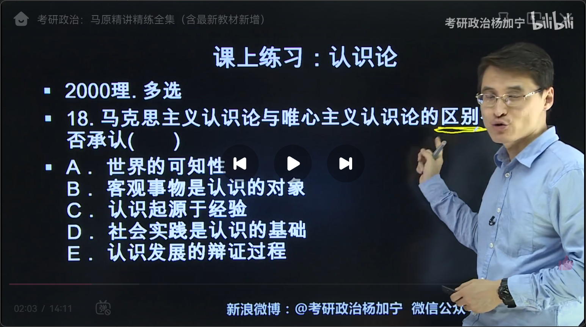
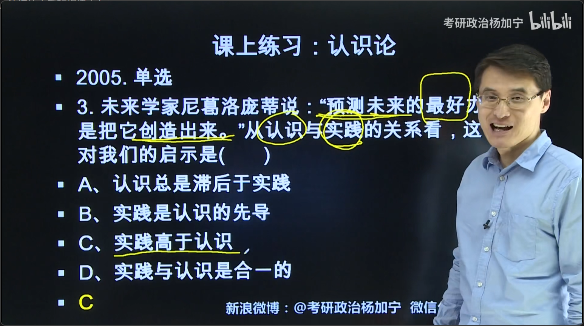
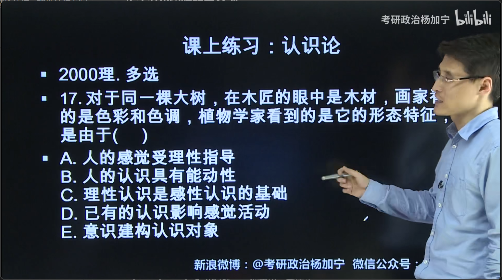
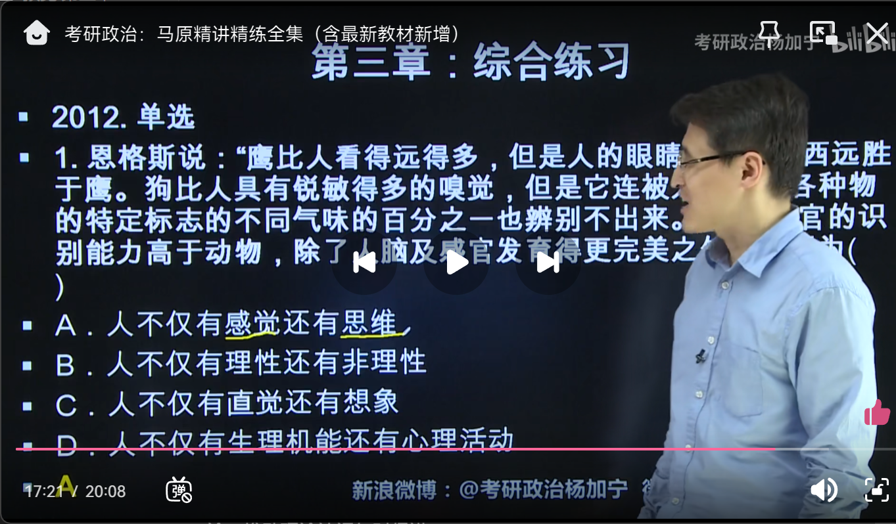
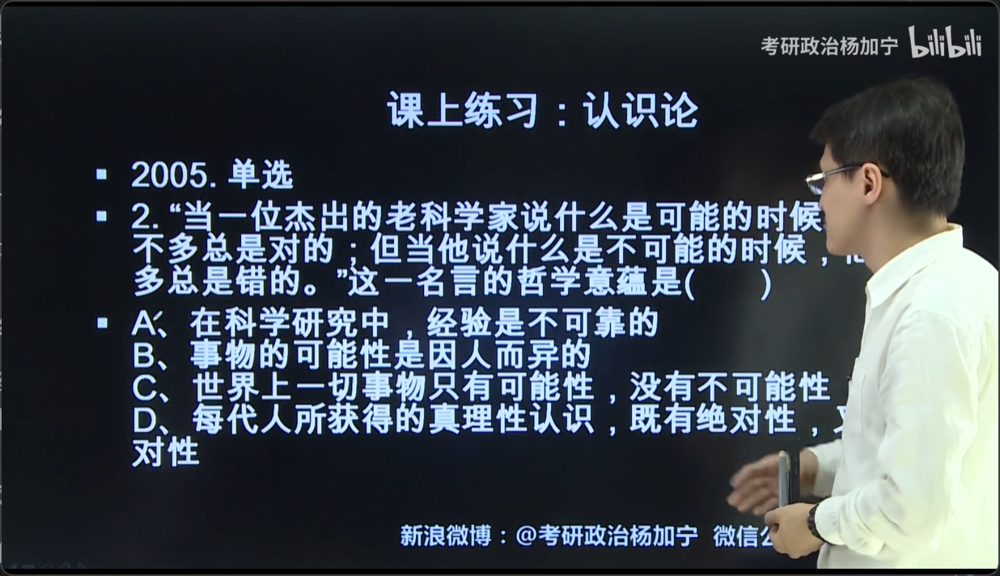
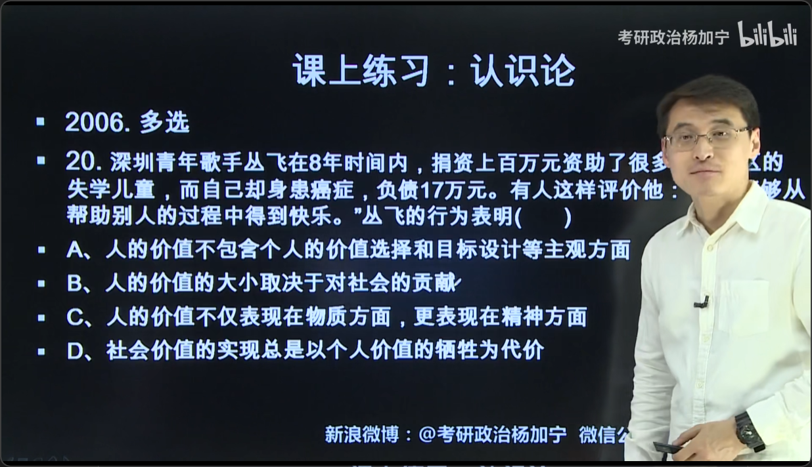

# 第三章 认识论
## 一、认识的本质和规律
### 1.主体与客体的交互作用 ※
- #### 客体制约主体
    - 客体为主
- #### 主体又能动地打破客体的限定，超越现实客体
    - i.主体获取、加工和处理客体信息的过程（信息选择、信息重构）
    - ii.主体的价值取向、思维方式和知识背景不同
### 2.认识和实践的关系 ※
- #### 实践对认识的决定作用
    - 实践是认识的基础（来源）、动力、归宿和检验标准
- #### 认识对实践的指导作用
    - 正确的认识：促进实践顺利发展，使实践达到目的
    - 错误的认识：阻碍实践活动顺利进行，甚至使实践归于失败
- #### 知行观
    - 坚持马克思主义认识论（反映论），反对唯心主义认识论（先验论）
        - 知先行后（知易行难）错误的
            - 主观唯心主义认识论：认识头脑自生（“内省”、心灵创造）
            - 客观唯心主义认识论：上帝启示
        - 行先知后（行易知难）
        - 知行合一：王阳明
            - 是错误的，虽然有知行，但抹杀了区别
        - 知行统一：孙中山、毛泽东  

### 3.认识运动的基本规律：实践->认识->实践
- #### 感性认识vs理性认识 ※※
    - 区别
        - 认识的初级阶段vs高级阶段（生动、具体vs抽象、概括）
    - 联系：两者相互依存
        - i.理性认识离不开感性认识（坚持唯物主义，反对唯心主义）
        - ii.感性认识离不开理性认识（坚持辩证法，反对形而上学）
    - 实现从感性认识到理性认识的飞跃
        - i.获取丰富实际的感性材料
        - ii.科学地加工制作，上升为理性认识：“去粗取精”、“去伪存真”、“由此及彼”、“由表及里”
    - 实现从理性认识到感性认识的飞跃：检验认识
    - 怎么干：
        - i.坚持一切从实际出发，要具体问题具体分析
        - ii.把理论和实践不断地加以结合，在理论中指导实践，在实践中检验理论，推动理性认识与时俱进
        
        
        
    - 辨析“感性认识与理性认识”和“现象与本质”
        - 材料中的两种观点由两种人持有，则“现象与本质”，一对一错
        - 由同一种人在不同时间持有，则“感性认识理性认识”
- #### 认识中的理性因素与非理性因素 ※※
    - 理性因素的作用：
        - 指导未来实践、解释发生的事、预见未来
    - 非理性因素作用：
        - 动力、诱发
    - 两者关系
        - 在认识中，理性因素是主导，理性因素制约非理性因素
        - 但是我们也承认，非理性因素在认识中的重要作用
    - 怎么干：
        - 科学研究是理性因素和非理性因素的共同作用的结果
        - 我们在科研中既要有严密的论证、严谨的分析和量化的计算、精确的公式
        - 又要有发散思维、自信、联想和怀疑一切的科学精神
        - 敢于打破常规，勇于探索，创立全新的工作方法
- #### 识别“认识的理性因素非理性因素”
    - 材料一定是两种截然不同的学科（专家）的对立：
        - 自然科学vs社会科学，理科vs文科
## 二、真理与价值
### 1.真理的特征：
- #### 客观性————凡是真理都是客观真理
    - 内容客观、检验真理的标准客观
- #### 真理的绝对性和相对性 ※※
    - 绝对性：客观性、无条件性
    - 相对性：有待扩展、有待深化
- #### 真理绝对性和相对性的联系 ※※
    - 任何真理都是绝对真理和相对真理的统一：两者相互包含、相互转化
    - 以科学的态度对待真理：反对绝对主义和相对主义
        - 绝对主义：教条主义、机械僵化————认为真理是绝对的
        - 相对主义：怀疑科学、诡辩论
- #### 怎么办？※※※
    - 同“感性认识和理性认识”
- #### 识别“真理的绝对性和相对性”
    - 材料一定会体现出原先奏效的方法
    - 在新条件下无效、失灵

- #### 认识论：真理与谬误原理（优先考察）
    - 材料会表现出坏事（失误、问题）转化为好事（精彩、亮点）
- #### 辩证法：“必然性与偶然性”原理
    - 表现出罕见的坏事（失误、问题）转化为常态化的好事（精彩、亮点）
### 马哲选择题考察两种模式：
- #### 发展的无限模式：A->B->A正确
    - 错误：B->A->B
- #### 有限模式：A->B
    - 错误：B->A
### 2.价值
- #### 定义：
    - 一定特征的客体对主体的意义
- #### 树立社会主义核心价值观：
    - “人人为我，我为人人”：个人价值+社会价值，以社会价值为主
