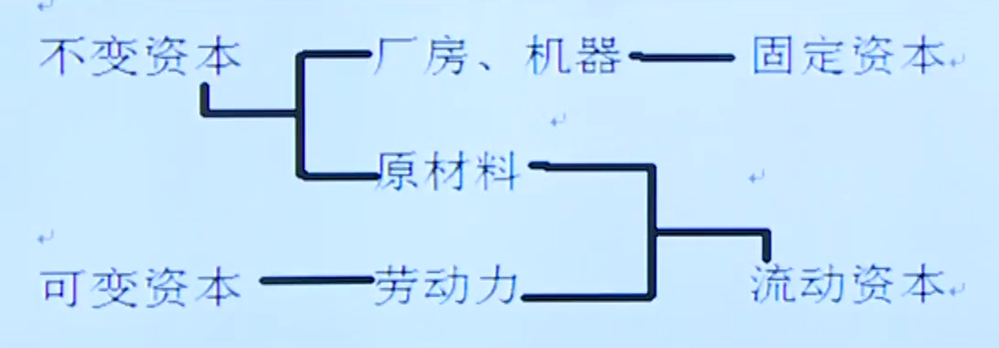
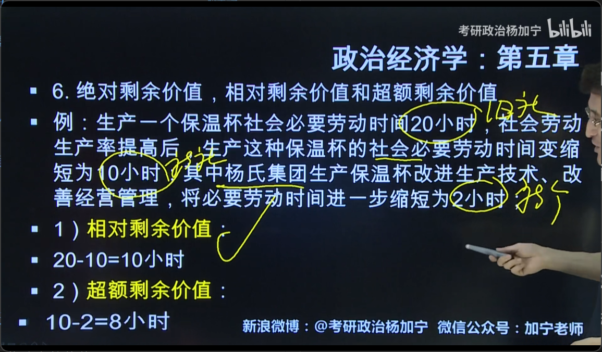
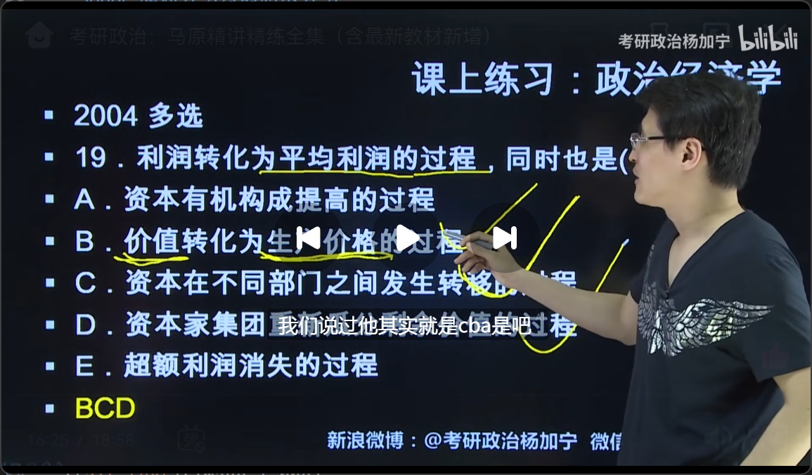

# 第五章 政治经济学
## 一、劳动的二重性
### 1.劳动的二重性：具体劳动vs抽象劳动
### 2.商品的二重性：使用价值vs价值（“无差别”、“一般”的劳动）
### 3.第一个二重性决定了第二个二重性
### 4.地位：劳动二重性理论是理解政治经济学的枢纽
## 二、商品价值量的决定
### 1.社会必要劳动时间（全社会生产同种商品的必要劳动时间的平均值）
- 社会劳动生产率：与社会必要劳动时间成反比
### 2.商品交换（基础：价值量；原则：等价交换）
### 3.价值规律表现形式：
- #### 价格围绕价值上下波动（价格的影响因素：价值量、供求关系）
- #### 市场价格围绕生产价格上下波动
### 4.货币的基本职能：一般等价物（特殊商品，也有价值）
- #### 价值尺度：商品标价的标准（虚拟概念）
- #### 流通手段：商品到商品 变为 商品到货币到商品
- #### 贮藏手段：购买力储备，财富的象征
- #### 支付手段：先拿走再给钱（“赊”）
    - 比如，还债、租金、利息、税款、工资
- #### 世界货币：国外商品流通、国际收支差额支付
## 三、资本主义生产过程的二重性
### 1.物质资料生产过程（价值转移）+剩余价值生产过程（价值增值）
### 2.剩余价值产生的前提
- 资本家购买的劳动力在生产过程中创造的新价值>补偿劳动力的价值
### 3.剩余价值体现了：剥削与被剥削的关系
## 四、不变资本和可变资本
### 1.二者区别：能否增加商品的价值量
- #### 不变资本：厂房、机器、原材料
    - 只转移物质状态，不产生价值增值
- #### 可变资本：补偿劳动力的价值
    - =工人创造的新价值-剩余价值
### 2.固定资本vs流动资本
- #### 两者区别：是否能一次性将自身价值转移到商品上

### 3.揭示了剩余价值产生的唯一源泉：
- #### 雇佣劳动力的剩余劳动
### 4.剩余价值率：衡量资本家对工人的剥削程度
- m`=m/v
- m=剩余价值
- v=可变资本=工人创造的新价值-剩余价值量
## 五、资本的有机构成
### 1.自然形式：资本的技术构成
- #### 生产资料与劳动力的数量比例
- #### 由生产的技术水平决定
### 2.价值形式：资本的价值构成
- 不变资本/可变资本=c/v
## 六、绝对剩余价值，相对剩余价值和超额剩余价值
### 1.绝对剩余价值
- #### 延长劳动时间、提高劳动强度
### 2.相对剩余价值：社会层面
- #### =旧社会必要劳动时间-新社会必要劳动时间
### 3.超额剩余价值：个体层面
- #### =新社会必要劳动时间-新个体必要劳动时间

## 七、资本的周转与循环
### 1.折旧：
- #### 物理折旧vs技术折旧
    - 技术折旧的原因：
        - 新技术应用、生产率提高
### 2.资本周转速度
- #### 影响因素
    - 资本周转时间（成反比）
    - 资本构成（流动资本在总资本中的比例）正比
### 3.资本循环的三种职能形式
- #### 货币资本->生产资本->商品资本->...
## 八、社会再生产
### 1.简单再生产vs扩大再生产
- #### 简单再生产：重复，投入也一样
- #### 扩大再生产：部分剩余价值转化为资本（将获利再投资）
### 2.社会再生产的核心问题：
- #### 社会总产品的实现
### 3.社会总产品的价值形态：
- #### 社会总价值：c+v+m（生产资料的转移价值+凝结在产品中的工人必要劳动价值v+剩余价值m）
### 4.两大部类：社会再生产的物质形态
- #### 第一部类：生产生产资料的部门
- #### 第二部类：生产消费资料的部门
## 九、资本积累
### 1.资本积累的源泉：剩余价值
### 2.资本积累的必然结果：两极分化
## 十、利润和平均利润
### 1.利润与剩余价值的关系
- #### 剩余价值是可变资本的产物（资本家看成利润）
- #### 剩余价值是利润的本质，利润是剩余价值的转化形式
### 2.平均利润的产生
- #### 由于资本家间激烈的竞争
- #### 资本流动：利润率低的部门流向利润率高的部门，导致利润率的平均化（产生平均利润率）
- #### 使得生产价格=成本价格+平均利润
- #### 平均利润形成后，价值规律表现为
    - 市场价格围绕生产价格上下波动
### 3.地租（资本主义地租）
- #### 定义：农业资本家为了土地使用权付给土地所有者的报酬
- #### 分类
    - 级差地租I：双方签约时已约定好
    - 级差地租II：属于农业资本家的追加投资，是双方争夺的对象
### 4.土地价格
- 地租收入的资本化（未来N次地租收入折现之和）
- #### 影响土地价格的两个因素
    - 地租、存款利息率
- #### 土地价格=地租/存款利息率

## 十一、资本主义基本矛盾与经济危机
### 1.基本矛盾：生产资料私有制vs生产社会化
### 2.经济危机的周期性：生产与消费的对立->强制性平衡（破坏生产）
- #### 萧条->危机->复苏->高涨（繁荣）->萧条