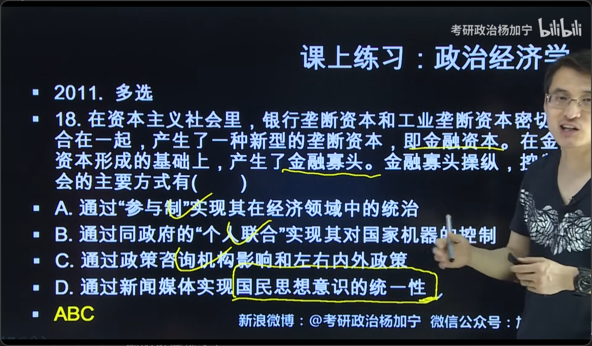

# 第六章 资本主义发展的历史进程
## 一、当代资本主义的新变化
### 1.变化的具体内容：
- #### 生产资料所有制的变化：
    - 私人股份资本、法人资本
- #### 劳资和分配关系的变化
    - 职工参与决策、终身雇佣、职工持股、健全社会福利
- #### 社会阶层、社会结构的变化：
    - 资本家↓、高级职业经理↑、知识型和服务型劳动者↑
- #### 经济调节机制与政治制度的变化
### 2.变化的实质
- 只是缓和了分配关系的矛盾
- 并不意味着资本主义生产关系的根本转变
- 双方关系仍然是剥削与被剥削的对立关系
## 二、垄断的本质
### 1.控制生产和销售
### 2.操纵垄断价格，赚取垄断利润
### 3.垄断下的价值规律：
- 市场价格围绕垄断价格上下波动
## 三、金融资本与金融寡头
### 1.金融资本的含义：
- 工业垄断资本+银行垄断资本
### 2.金融寡头操纵控制的公式
- #### 经济上：“参与制”
- #### 政治上：与政府代理人“个人联合”
- #### 外交上：建立政策咨询机构
- #### 社会生活上：控制新闻媒体和科教文化
## 四、国家垄断资本主义的实质
### 1.含义：
- 工业垄断资本+国家政权
### 2.形式
- #### 国有企业
- #### 国家与私人资本合资企业
- #### 国家与私人企业合作生产
- #### 国家宏观调控
    - 货币政策（利率，公开市场）、财政政策（税率，政府购买，补贴）
- #### 国家法律规范
### 3.实质
- #### 并未消除资本主义的基本矛盾
- #### 维护垄断统治和获取高额的垄断利润
