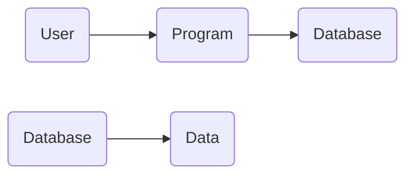
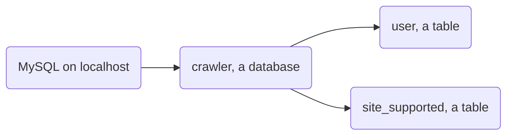

# 培训三：基于 Spring boot 的数据库操作

>   “我一边踉跄前行，一边重整旗鼓。” —— 太宰治

*对了，并没有指望大家一节课学明白这玩意，所以放轻松。一方面，你可以大胆复制，能跑就行；另一方面，这些东西以后还会再用到，与其把现在投入到和它死磕，不如把学校课程学好了，来日方长。*

**但是不许摆烂！😡😡😡**

PS：我趣，emoji 在导出 pdf 的时候居然不能渲染，bbzl；

又：大家可以先看 Ending 部分再回头开始看捏。

## 前置工作

### 在本地安装 MySQL 

Windows 用户请参考：https://www.sjkjc.com/mysql/install-on-windows/

MacOS 用户请参考：https://www.sjkjc.com/mysql/install-on-macos/

Deb 系 linux 用户请参考：https://www.sjkjc.com/mysql/install-on-ubuntu/

### 安装可视化的数据库管理软件

推荐使用 DBeaver。Navicat 等等也可以。

DBeaver 用社区版即可，免费。下载地址：https://dbeaver.io/download/

Navicat 需要破解，亲自行搜索。

### Look, I'm totally confused...🤨

这都啥啊？

Look, 曾经我们是这样访问数据的。


或者，这样：


总之很直接，数据和程序强耦合。所谓强耦合，说人话就是关系太密切，不能够适应现代软件分层分离编写的需要。

那么，设想一种结构：



这样一来，程序事实上只关心和数据库的交互就可以了。至于数据库怎么管理数据，增删查改等等，只需要数据库提供接口就可以了。

### 检验你的前置工作

MySQL 安装完成后，在命令行中输入 `mysql -u {username} -p` 即可，其中 `username` 是你的用户名。


见到形如 `mysql>` 的提示符，即证明 MySQL 已部署。

你可以输入 `show global variables like 'port';` 来查看端口号。


通常来说，默认端口号是 3306。在**平时**做做小工程的时候，并没有更改端口的必要。

------

"But hey", you might say, "I don't wanna check my command line to use MySQL! "

这就是为什么我们也需要 GUI，图形用户界面。

DBeaver 社区版是个免费好用的可视化数据库管理软件。现在，我们尝试在 DBeaver 中加入对本机 MySQL 的 connection。

在左边栏右击，选择 `Create -> Connection`。


接下来，你将进入选择数据库种类的页面。


选择 MySQL 即可。


伺服器当然是 `localhost`，端口号在绝大多数情况下是 `3306`。

在下面填入用户名和密码。你可以在左下角选择 “Test Connection ...” 以查看是否能正确连接到本机的 MySQL 服务。最后点 “Finish” 即可。


如果你看到这样的一条，即说明你已经在 DBeaver 中正确地连接到了本地的 MySQL 服务，你之前的步骤都没有问题。

现在，allow me to use an example to show you how we use MySQL database.

## 一个例子：建立数据表

如果把你的 MySQL 服务想象成一台电脑，那么数据库就是电脑上的一个个文件夹，数据表就是文件夹里的文件。

在一个数据表中，它可能长得像这样：

| id   | test_content |
| ---- | ------------ |
| 1    | Hello        |
| 2    | World        |
| 3    | Shinohara    |

其中，`id` 和 `test_content` 是这张数据表的两个**字段**（field），`{id=1, test_content="Hello"}` 是这张数据表的第一条**记录**（record）。这张表中目前有三条记录。

让我们先讲讲命名规范，然后再开始这个例子。

命名规范请查看：https://icooper.cc/archives/280

翻译一下，就是：

**数据库命名规范**

-   可用的字符：英文字母（大小写敏感），数字，下划线
-   命名保持简单直观
-   用下划线分隔单词（例如，`first_mysql`）
-   **总是**使用小写
-   不能使用数据库关键词，如 `name`，`time`等
-   不要使用复数。例如，使用 `employee` 而不是 `employees`
-   字符集选择 `utf8mb4`，排序规则选择 `utf8mb4_general_ci`

**字段命名规范**

-   可用的字符：英文字母（大小写敏感），数字，下划线
-   命名保持简单直观，通常不多于三个单词
-   用下划线分隔单词
-   **总是**使用小写
-   **不要**重复数据表的名称
-   不要用缩写

------

让我们回到例子里来。

譬如说罢，你为你上一次的爬虫（不妨假定它叫 Crawler）建立了一个数据库，名为 `crawler`。那么，也许你做了一个登录系统，只有指定用户才能用这个爬虫，那么你会做一张 `user` 表，用来记录注册用户和权限；也许你做了一个支持网站的列表，来记录这个爬虫在哪些小说网站可以用，那么你会做一张 `site_supported` 表。

这样一来，数据的结构就是：



------

相信你已经对数据库有了个初步的认识。让我们上手吧！**行きますよ！**

在 DBeaver 中右击 `Databases`，选择 `Create New Database`，输入数据库的名称，选择字符集和排序规则即可。

例如，将数据库命名为 `first_mysql`：


右击 `Tables`，选择 `Create New Table`。


在这个例子里，这张表的名字将会是 `Test`。修改 `Table Name`即可。

在下方的 `Columns` 一栏中，我们加入字段。右击选择 `Create New Column`。我们首先添加 `id` 字段，于是：


注意在 `Data Type` 一栏中输入 `int`，表示它是个整数值。至于更多的 MySQL 中的数据类型，请自行搜索。

勾选 `Not Null` 和 `Auto Increment`，也就是 “非空” 和 “自增”。对于 `id` 这样特殊的字段，有这两个特性是好的。

类似地，增加 `test_content` 字段。


存内容用类似于字符串的玩意就行了，所以是 `Text`。Again，更多的 MySQL 中的数据类型，请自行搜索。

然后按下 `Ctrl + S` 保存修改（More specifically, we call it 持久化，persistence）。

Oops, 怎么报错了？

```markdown
Incorrect table definition; there can be only one auto column and it must be defined as a key
```

“错误的表定义；只能有一个自增列，它必须被定义为**主键**。”

A *key*，*主键*。顾名思义就是非常关键的字段。也确实，内容之类的可以留空可以是随便什么东西，但是 `id` 却不一样。

那么，如何将它设置为主键呢？

答：对 `id` 右键，选择 `New Constraints from Selection`。


你将看到一个设置页面。显然，主键是某一种 *Constraint*。选择 *Primary Key* 即可。

最后按下 `Ctrl + S` 持久化。你应当看到：


太棒了！你已经成功通过 *DBeaver* 添加了一个数据库，并在数据库里加入了一张数据表！

在上方，选择 `Data` 而非 `Properties`，你就能看到这张表了。至于 `ER Diagram`，欢迎自行探索。


是空的！Of course, of course, 你还没有想里面加入任何数据呢。让我们右击选择 `Edit`，向里面添加数据吧。


像操作 `Excel` 一样，向里面加入数据吧。

当你的数据添加完成后，不要忘了持久化，来保存你所做的一切修改。


## 用 Spring boot 操作数据库

### 新建项目

Finally! 我们要开始写代码了！

还是像之前那样新建 Spring boot 项目，只不过这一次，我们用的可就不仅仅是 `Spring Web` 那么简单了。


然后直奔 `pom.xml`。

在 `<dependencies> ... </dependencies>` 中加入：

```xml
    <dependency>
        <groupId>com.baomidou</groupId>
        <artifactId>mybatis-plus-boot-starter</artifactId>
        <version>3.5.1</version>
    </dependency>
```

没戳，在这个例子里我们用 `Mybatis-plus` ~~真·国货之光~~。

> 在书写本wiki的时候，还不存在Spring boot 3，因此如果是现在照着上面的流程来而使用Spring Boot 3，则会导致错误。对于Spring Boot 3，正确的做法是导入对应新版本的依赖：
{.is-danger}
```xml
<dependency>
    <groupId>com.baomidou</groupId>
    <artifactId>mybatis-plus-spring-boot3-starter</artifactId>
    <version>3.5.7</version>
</dependency>
```

### 连接 MySQL

下一步，将 `./src/main/resources/application.properties` 改名为 `application.yml`。


按 `Shift + F6` 也是可以的。

接着，填入：

```yaml
spring:
  datasource:
    driver-class-name: com.mysql.cj.jdbc.Driver
    url: jdbc:mysql://localhost:3306/first_mysql?useUnicode=true&characterEncoding=utf-8&useSSL=true&jdbcCompliantTruncation=false
    username: root
    password: 
server:
  port: 
```

我们要修改的是：

-   是否为 `localhost:3306`？如果不是，修改为自己的 MySQL 服务的地址
-   数据库是否名为 `first_mysql`？如果不是，修改为要连接的自己的数据库名称
-   输入用户名和密码
-   将 `port` 修改为你想要程序运行的那个端口。这里 `8080` 也就可以了

现在，同本地 MySQL 服务的连接已经配置好了。

### 增删查该

数据库的四大基本功能就是**增删查改**，即：

-   增加记录
-   删除记录
-   查找记录
-   修改记录

一般缩写为 *CURD* 或 *CRUD*，即：

-   Create
-   Update
-   Read
-   Delete

A *CURD* guy 就是说那些天天只会基本的增删查改的程序员，~~这样的人是最没用的（bushi~~

CURD 是每个后端程序员的基本功，是必须要会的。那么，现在让我们开始吧。

#### PO


首先，新建 Package。直接在`com.example.firstmysql` 后输入 `data.po`。相信大家也知道，点号 `.` 相当于表示文件夹的层级关系。

至于 `po` 是啥意思呢？PO, namely ***Persistent Object***，也就是**持久化对象**。我们用它来对应数据库里的记录。

还记得上面我们例子里的记录吗？


所以，在 `po` 下新建一个 class，把这个 PO 命名为 `Test`，每个 `Test` 实例对应一条记录，很合理吧。


很快啊！起手式 - 三个注解。

```java
@Data
@NoArgsConstructor
@AllArgsConstructor
```

它们啥意思呢？~~其实我不打算写。。。~~

它们设计出来就是为了简化我们的编程的，所以你只要知道一般对 PO，我们就这么起手就完了。想了解的请自行搜索。

然后就是丰富一点内容。


加了一个注解，写了表的名称，合理；

加了两个变量，分别对应数据表中的两个字段，合理；

注意这里的命名规范是小驼峰，也就是每个单词（除了第一个）首字母大写，中间不用下划线连接。

**为了做到这一点**，你需要在 `application.yml` 后追加一点内容，**切记切记！**😎

```yaml
mybatis-plus:
  configuration:
    map-underscore-to-camel-case: true
```

映射-下划线-至-驼峰命名法，合理。

#### VO

磨刀不误砍柴工，该新建 `vo` 这个包了。

でも、vo は何ですか？（但是，vo 又是什么东西呢？）😖

VO, namely ***View Object***，视图对象。我就不自己解释了，引用一篇知乎回答：

>   谢邀
>
>   view object，又叫做视图对象，与之对应的是实体对象 entity object.
>
>   entity object 通常都是表的一一对应的映射，什么意思呢？ 就是表里面有什么字段，实体对象就有什么属性。
>
>   既然有实体对象了，为什么还需要 view object 呢？
>
>   这是因为有的时候，没有必要把所有的信息都呈现给客户，只需要呈现部分数据给客户，这个时候，就会把这些必要的数据，封装在 view object 里抛到页面上去显示。
>
>   就好比你路过发廊，映入眼帘的那修长的大腿，魅惑的眼神，还有那白花花的。。。。。。。。膝盖，这些都是 view object 包含的信息。
>
>   而今天你是第 8 个买主，她精美的手提包里的聚甲酚磺醛栓，这些信息就是属于实体对象的，没有必要。。。都让你知道嘛
>
>   
>
>   作者：meepo
>   链接：https://www.zhihu.com/question/56959887/answer/151063736
>   来源：知乎
>   著作权归作者所有。商业转载请联系作者获得授权，非商业转载请注明出处。

也就是包装了一层，只给用户（对于你来说，很可能是其他非后端的程序员）他们要的数据。


我觉得没有什么好解释的（

VO 的写法在各种项目里都大差不差。

### Mapper

~~你没有玩过的船新版本wwww~~

这 package 我们是第一次见，不是吗？

“映射器”，它究竟映射了个啥啊？


如图，Mapper 实际上映射的是 Java 程序语言和 SQL 语句。这个 SQL 语句就是我们用来操纵数据库的东西。

SQL 语法可以见：https://www.w3school.com.cn/sql/sql_syntax.asp

不过这里我们不会用太多复杂的，我们应该只会涉及 `SELECT`，`where` 等基础中的基础。

------

新建名为`TestMapper`的接口：


新建完成以后，补充一点细节。


用 `@Mapper` 注解来标注它是一个 Mapper，合理；

`@Select(XXX)`表明了对应的 MySQL 语法是 `Select`，选择出来什么东西。`Select *` 表示将记录里全部字段的信息全部提取出来。

总之，光凭英语，你也能把这代码读个大概，仿写也差不多。

### Controller & Service

先建好两个包，`controller` 以及 `service`，然后再听我慢慢道来（

之前呢，我们把全部的逻辑全写在 Controller 里，确实可行。不过呢，有一个坏处，就是我不能清晰明了地视察各个接口了。（你想想，写个 `a+b` 都那么多行代码，能好看吗？）

所以我们把逻辑部分写在 Service 中，让 Controller 调用 Service，这样不仅将逻辑和接口分离开，非常好看，也方便了之后的调试。

#### Service

我们先从服务开始。在这个例子中，我们新建一个名为 `MainService` 的 Class，再加一点点细节。


`@Service` 注解标注了这是一个服务。

下面引入了 TestMapper，合理，因为我们就是要对数据库操作。

`@Autowired` 意为“自动装配”。~~说实话我不想解释这个东西因为会涉及到 bean 然后blah blah blah 一大堆~~ 你只需要把它当作起手式一样记住就可以了。

通常，IDEA 会对 `@Autowired` 报黄色波浪线，不用管它。（倘若你真的不想看到它，自行搜索解决）

------

为了让程序能扫描到这个 Mapper，你需要在 `FirstMySqlApplication` 中加入 `@MapperScan`注解。


当然，你需要按照自己实际的包名修改路径。

##### 增加记录

现在我们要做的，就是添加一个**增加记录**的接口（Or rather, 服务）。


很明显，加入了返回值为 `Result` 的方法 `addRecord`。还记得 VO 吗？`Result` 是 VO，`Test` 是 PO，不是吗？

欸，为什么这里的 `id` 填 `null` 就可以了？

为什么捏？

为什么捏？

因为在建表的时候我们勾选了自动增加，所以 `id` 是不需要我们自己填的。

用 “Test 的映射器” “插入” “新的记录”，很合理吧。

#### Controller

现在我们来写 Controller。想必大家对这个比较熟悉，我就不多啰嗦了。


在 Controller 中用 Service，仍然要 `@Autowired`。~~起手式，起手式~~

这一次我们用 `@PostMapping`，因为传入数据库的 `test_content` 不是很适合能直接写在 url 中。（*用户，你也不想你的小秘密被写在 url 里吧*）

仍然大差不差，只不过参数从 `@RequestParam` 变成了 `@RequestHeader`。确实，如果不从 url 那里走，你的信息也还是要换条道走的，只不过不会被直接看到罢了。

##### 用 Postman 发送 POST 请求

那么，如何让信息走 Header 传过去呢？

一个简单的方式是：**Postman**！

左边栏，按“➕”添加一个 collection，在这个 collection 中，“Add request”，也就是增加一个请求。


像这样，你随时可以按 “Send” 发送这个请求。

### 测试一下！

现在你该干的都已经完成了，虽然只加入了一个增加记录的接口，但是这已经是相当大的一步了。

让 Postman 发送请求，你应当可以看到：


非常完美。还是看看远处的 DBeaver 吧家人们。

在 DBeaver 中，按下 `F5` 刷新，即可看到结果。


很成功。至于为什么 `id` 是 6，因为测试时加入了几条记录，然后又删除了。自增是不会因为记录删除，而把 `id` 也退回到之前的水平的。

## Ending

はい、以上です。

写累了，不想多 bb。跟着 step-by-step 做就行了，不会的再搜索。

这篇文档可能和培训时的内容有一些不同，但是 both OK，因为条条大路通罗马，同样的事情也有很多不同的实现方式。

ありがとうございました。
